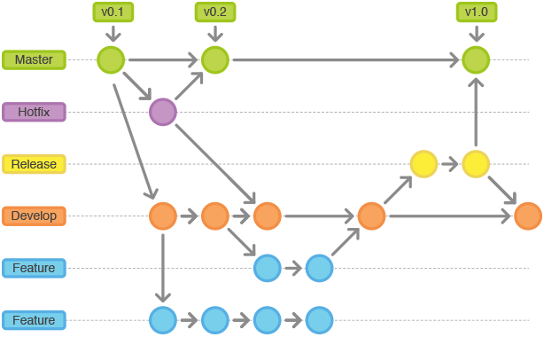

# Git

## gitflow

主要分为以下分支：

- master：正式分支
- develop：开发分支，所有功能都在其上
- Feature：fork的develop分支，不同功能有不同feature
- release：可以发布的分支，处理develop分支的bug，然后合并到master中
- hotflix：修改master分支上的bug




### 命令🌰

#### 创建develop

```git
git branch develop  
git push -u origin develop
```


#### 开始feature

```git
# 通过develop新建feaeure分支
git checkout -b feature develop
# 或者, 推送至远程服务器:
git push -u origin feature    

# 修改md文件   
git status
git add .
git commit    
```


#### 完成feature

```
git pull origin develop
git checkout develop 

#--no-ff：不使用fast-forward方式合并，保留分支的commit历史
#--squash：使用squash方式合并，把多次分支commit历史压缩为一次

git merge --no-ff feature
git push origin develop

git branch -d feature

# 如果需要删除远程feature分支:
git push origin --delete feature   
```


#### 开始release

```
git checkout -b release-0.1.0 develop

```


#### 完成release

```
git checkout master
git merge --no-ff release-0.1.0
git push

git checkout develop
git merge --no-ff release-0.1.0
git push


git branch -d release-0.1.0
git push origin --delete release-0.1.0   

# 合并master/devlop分支之后，打上tag 
git tag -a v0.1.0 master
git push --tags
```


#### 开始hotlifx

```
git checkout -b hotfix-0.1.1 master  
```


#### 完成hotflix

```
git checkout master
git merge --no-ff hotfix-0.1.1
git push


git checkout develop
git merge --no-ff hotfix-0.1.1
git push

git branch -d hotfix-0.1.1
git push origin --delete  hotfix-0.1.1 


git tag -a v0.1.1 master
git push --tags
```

