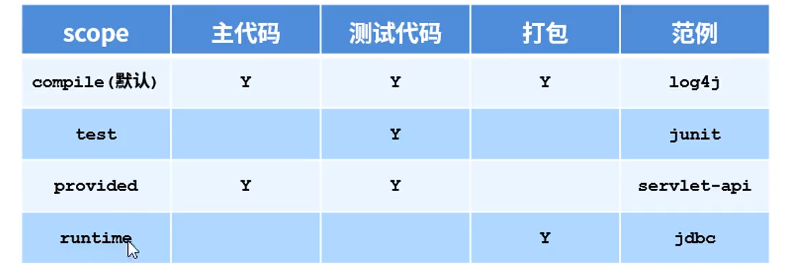

# Maven

## 是什么？

- 本质是一个项目管理工具，将项目开发和管理过程抽形成了项目对象模型(POM)
- POM（Project Object Model）

## 仓库

仓库用于存储jar包的

**分类**

- 本地仓库：自己电脑上的仓库
- 远程仓库：非本电脑的仓库
  - 中央仓库：maven团队自己维护的仓库
  - 私服：公司范围内维护的仓库，从中央仓库获取资源

**私服作用**：

- 仅对内部开放，对外部关闭
- 保存自主研发的jar包

## 坐标

**maven中定位资源的位置**

maven坐标组成

- groupId：定义当前的隶属组织名称
- artifactId：定义当前maven项目名称
- version：当前版本号

## 命令

- mvn compile 编译
- mvn clean 清理
- mvn test 测试
- mvn package 打包
- mvn install 安装到本地仓库

## 依赖

- 依赖的jar默认情况可以在任何地方使用，可以用个scope标签设定其范围

- 作用范围

  - main主程序范围有效
  - test测试程序范围内有效
  - package是否参与打包

  

## 生命周期与插件

生命周期分为三个：

- clean：清理工作
- default：核心工作例如编译、测试、打包和部署
- site：产生报告、发布站点

插件与生命周期绑定，执行对应插件就执行到对应生命周期

