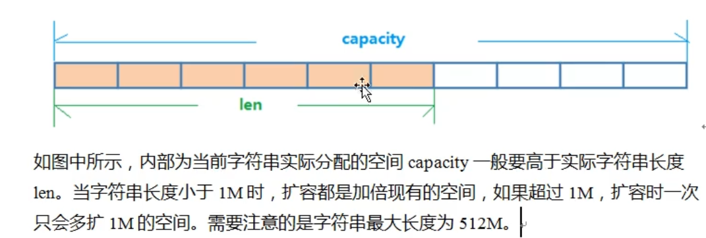
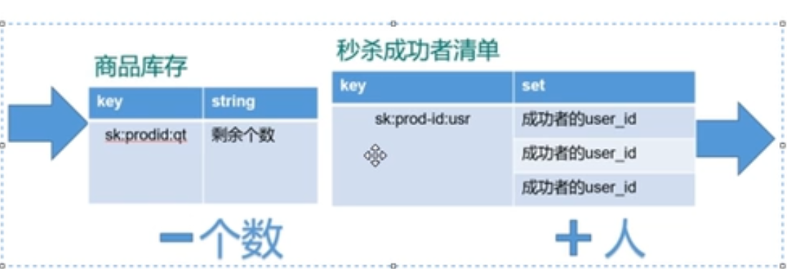
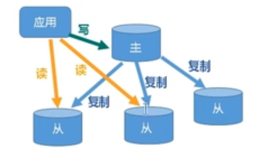
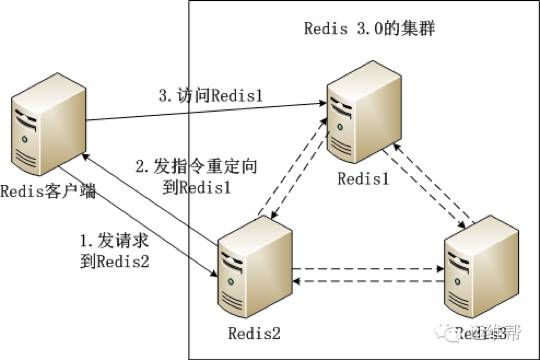
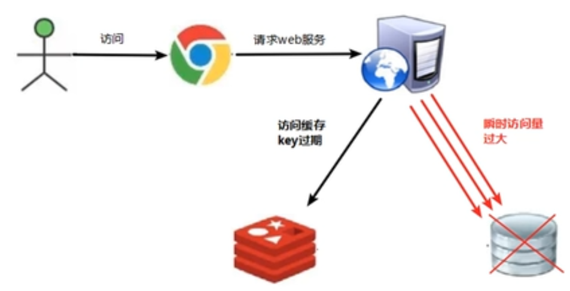
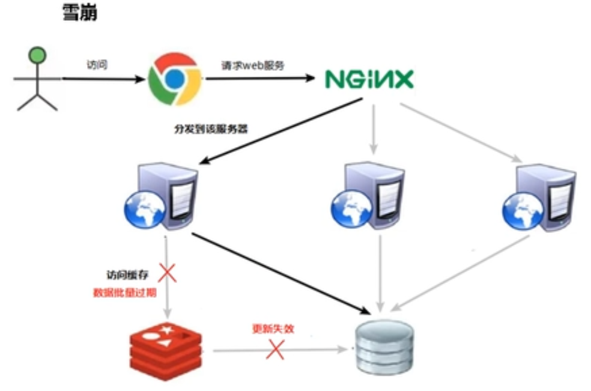

# Redis

redis是单线程+多路IO复用


## 基本数据类型

### String

是二进制安全的，可以包含任何数据包括图片和序列化对象


对应命令为set

#### 底层

采用简单动态字符串(SDS)，内部结构类似java的ArrayList




### List

单键多值

底层是双向链表，可以从头或从尾操作


#### 底层

采用快速链表

当列表元素少的时候使用一块连续的内存区域，该结构称为ziplist，当数据多的时候才会变为快速链表


### Set

与list类似，但可以自动去重

底层是hash表


### hash

redis的hash是一个String类型的的field和value的映射表，特别适合存储对象


### zset

有序集合，没有重复元素，根据评分来排序


## 原子性

跟数据库原子性不是一个意思，该原子操作指不会被线程打断，直到该线程执行完毕

- incr加1命令
- msetnx 同时设置多个keyvalue


## 发布和订阅

发布者通过频道发送给订阅该频道的客户端


## docker启动redis

```dockerfile
docker run -d --privileged=true -p 6379:6379 --restart always -v /usr/local/redis/conf/redis.conf:/etc/redis/redis.conf -v /usr/local/redis/data:/data --name myredis redis redis-server /etc/redis/redis.conf --appendonly yes
```


## 事务

redis事务是一个单独的隔离操作：事务中所有的命令都会序列化，按顺序的执行

主要作用在于串联多个命令，防止其他命令插队


不具有完整的原子性

出错分两种:

- 组队阶段部分出错，都不能执行
- 执行阶段部分出错，出错的部分不能执行


==三特性：==

1. 单独的隔离操作
2. 没有隔离级别
3. 不保证原子性


## 锁

- 悲观锁：传统的关系型数据库在用，每次操作都要上锁
- 乐观锁：根据版本号来，必须版本号一致才能操作（适用于多读的场景）


## 秒杀案例



当请求和并发过多的时候会出现连接超时和超卖问题

- 连接超时通过使用jedis连接池来解决
- 超卖通过加乐观锁watch方法来解决
  - ==但是会出现少买的情况===,乐观锁造成的库存遗留问题
  - 通过lua脚本代替乐观锁来解决


## 持久化

把内存的数据放到磁盘上

两种类型RDB和AOF


### RDB

在指定时间间隔将内存中的数据中的快照存入磁盘


通过创建一个子进程来进行持久化，会将数据写入到一个临时文件，待持久化结束后，在用临时文件替换上次持久化的文件。整个过程主进程不参与IO操作，所以RDB比AOF更高效，但==缺点==是可能会丢失最后一次持久化的数据，并且性能消耗更高。


### AOF

以日志的形式来记录每个写操作，将redis执行过的写记录写下来，只许追加文件但不可以改写文件，redis启动后会根据文件中指令执行恢复工作


==如果AOF和RDB同时开启，会优先使用AOF==


流程：

1. 客户端的写命令会被append到AOF缓冲区
2. AOF缓存区根据持久化策略将操作同步到磁盘的AOF文件中
3. AOF文件大小超过重写策略后，把AOF文件重写压缩，默认是大于64M的2倍
4. redis服务重启后加载AOF文件恢复


缺点：

- 占用更多磁盘空间
- 恢复备份慢


## 主从复制

1、读写分离，提高性能

2、容灾快速回复



通过配置文件来设置每个redis

```txt
include E:\redis\myredis\redis.windows.conf
port 6379
dbfilename dump6379.rdb
```

使用slaveof host port来让当前redis作为host的仆从


同步步骤：

1. 当从服务器连接主服务器后，从服务器向主服务器发送进行消息同步
2. 主服务器接到从服务器后，会把当前数据持久化，然后把持久化文件发送给从服务器。
3. 主服务器进行写操作后，和从服务器同步数据


### 哨兵模式

反客为主的自动版，能够后台监控主机是否故障，如果故障了就根据投票数自动将从库变为主库

编写sentinel.conf配置文件

监视6379,1代表了只需要1个从服务器同意就能更换主服务器

```txt
sentinel monitor mymaster 127.0.0.1 6379 1
```


哨兵模式下redis的master ip可能一直变化，java如何才能连接

用nginx作为代理服务器

==redis3.0提出了无中心化集群（节点平均分数据）==



## 缓存穿透

缓存穿透

1. 应用服务器压力变大
2. redis命中率降低
3. 一直查询数据库（出现许多不正常的url请求）

解决：

- 对空值缓存：缓存时间设置不超过五分钟
- 设置白名单：使用bitmaps每个位来作为用户id
- 采用布隆过滤器：类似bitmap，效率更高


## 缓存击穿

1、数据库压力瞬间增大

2、redis里面没有出现大量key过期

3、redis正常运行



问题在：

1. redis某个key过期，大量请求访问该key


解决：

- 预先设置热门数据：加大热门数据key的时长
- 实时调整
- 使用锁

## 缓存雪崩

1. 数据库压力变大



问题：

1. 极少时间内，大量key集中过期

解决：

1. 构建多级缓存：nginx+redis+ehcache 非常复杂
2. 使用锁或队列：不适合高并发
3. 将缓存时间分散开，加随机值


## 分布式锁

为了解决跨JVM的互斥机制来控制功效资源

解决方案：

1. 基于数据库实现分布式锁
2. 基于Redis
3. 基于Zookeeper

redis性最高，zookeeper可用性最大


问题：

redis可以使用setnx上锁，del释放锁

1、锁长期不释放：

​		一般也可以用expire来过期锁解决锁不释放的问题

2、上锁后出现异常没有设置过期时间

​		上锁和过期时间同时进行set  users 10 nx ex 12

3、锁有过期时间，A业务上了锁后执行业务时间（卡顿）超过了锁的过期时间，锁被自动释放，然后被B业务抢到，A业务苏醒后通知服务器释放锁，这里A就释放了B的锁

​		为锁的值设置唯一的UUID，释放所得时候判断UUID与锁UUID是否一样

4、删除操作缺乏原子性，碰巧比较了UUID一样，要删除锁的时候锁过期了，出现于上面相同的问题

​	可以使用lua脚本 

​	

```lua
if redis.call('get',KETS[1])==ARGV[1] then return redis.call('del',KEYS[1]) else return 0 end
```


确保锁同步的四个条件：

- 互斥性
- 不会发生死锁
- 加锁和解锁需要同一个客户端
- 加锁和解锁必须确保原子性


## redis面试

1. 分布式锁的实现有哪些，分别怎么实现的，redis的具体实现以及操作

   1. setnx和del配合

2. 设置分布式锁的时候，setnx 和 expire如果不能同时执行完会有什么影响

3. 如何实现setnx 和 expire的原子性操作

4. redis在删除锁的时候会发生什么，有什么操作需要执行

5. redis查找很慢如何排查问题

6. redis有哪些数据结构，分别在什么情况下使用

7. mysql数据库和redis缓存如何进行同步，数据库和redis缓存如何保证一致，同步过程中mysql宕机或者redis宕机怎么办，分布式锁

8. redis数据结构， key的过期时间是怎么设定的（原理）

9. zset在哪些场景下会使用

10. 跳表讲一下，源码看过吗

11. redis如何实现高可用，为什么采用单线程，跳表

12. 读多写少什么数据结构，读少写多什么数据结构

13. redis集群模式，内存淘汰机制，lfu，分片集群模式

14. 缓存穿透、缓存击穿、缓存雪崩

    

    

