# Redis

redis是单线程+多路IO复用


## 基本数据类型


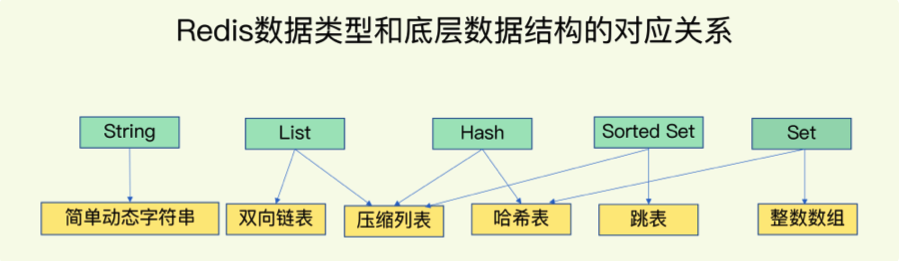

### String

是二进制安全的，可以包含任何数据包括图片和序列化对象


对应命令为set

#### 底层

采用简单动态字符串(SDS)，内部结构类似java的ArrayList


### List

单键多值

底层是双向链表，可以从头或从尾操作


#### 底层

采用ziplist或者linkedlist

当列表元素少的时候使用一块连续的内存区域，该结构称为ziplist，当数据多的时候才会变为快速链表


### Set

与list类似，但可以自动去重

底层是hash表


### hash

底层hash表或者ziplist实现

如果使用ziplist，那么所有键值对是紧挨着存储的，数据量一般少于512个的时候用ziplist

redis的hash是一个String类型的的field和value的映射表，特别适合存储对象


### zset

有序集合，没有重复元素，根据评分来排序

底层采用跳跃表或者ziplist实现


使用跳跃表结构的话包含了一个字典和跳跃表

跳跃表包含了从小到大的所有集合元素

而字典映射了键值对，方便通过Zscore命令查询对应元素的score，时间复杂度为O（1）


redis同时使用上面两个数据结构，保证了redis查询单个元素O（1）的复杂度，又保证了范围查询log（n）的复杂度


### 集合操作常见复杂度

1. 单元素操作
   1. hash操作HGET\HGET\HDEL是o(1)
   2. set操作是SADD\SREM\SRANDMEMBER
2. 范围操作时间复杂度o(n)
   1. hash的HGETALL
   2. set的SMEMBERS
   3. list的LRANGE
   4. zset的ZRANGE
   5. 但redis后面提出了scan操作渐进式遍历要比上面操作好
3. 统计操作O(1)
   1. LLEN或SCARD


## rehash

当冲突元素过多，导致一个hash桶里链表长度过长问题，采用rehash解决

具体是用两个hash表，一个用来接受数据，一个为空，当rehash时候把空的长度分配为另一个的2倍，然后复制数据到新的上面

**但上面有个问题**：rehash的时候redis等于待机状态不能处理请求


redis最终采用了渐进式rehash：当有请求来的时候，从hash1中索引第一位复制数据到hash2，并且更新操作两个hash表，新添加的数据只会放在hash2中，避免了一次性拷贝的开销


## 数据的选择

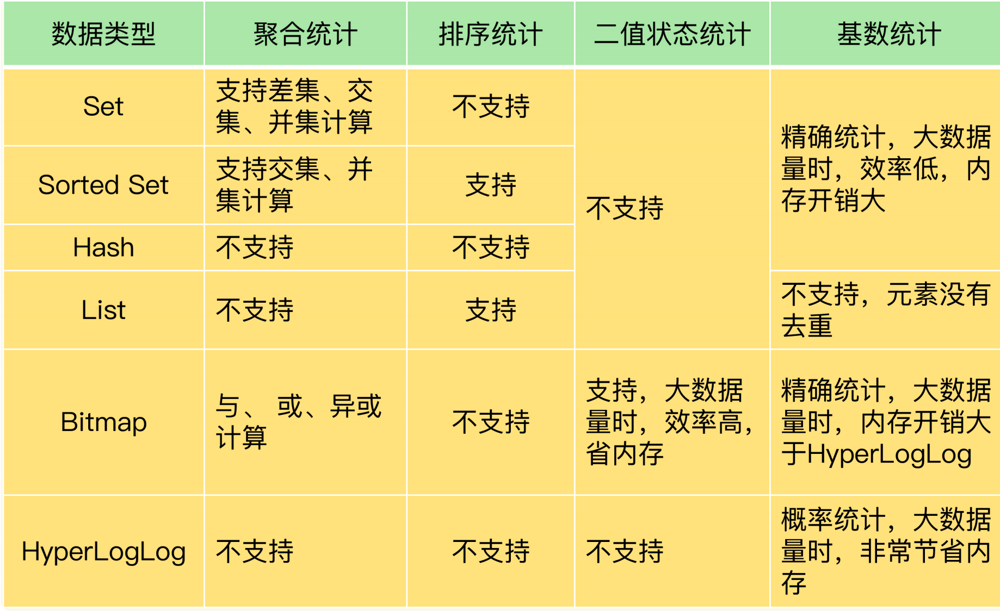


### RedisTimeSerials

> 是Redis的扩展模块，他专门用来面向时间序列数据提供了数据类型和访问接口，并且支持再Redis实力上直接对数据进行按时间范围的聚合运算

主要命令如下：

1. TS.ADD
2. TS.CREATE
3. TS.GET
4. TS.MGET  查询数据集合
5. TS.RANGE 聚合运算范围查询


这套方案要比Hash和SortedSet减少存储开销，因为需要Hash和SortedSet各自存储一份，一个用来聚合运算，一个用来范围查询。并且在网络传输中数据量也大，进行聚合运算需要返回给客户端。用RedisTimeSerials减少了上面的问题，其会在实例上进行部分聚合运算


## 内存回收

redis内存回收使用了引用计数器来实现

每个redis对象内部都有一个引用计数字段来保证当前对象的状态


### 共享对象

redis使用共享对象来减少内存的占用

如果两个对象所使用的值都一样，那么他们都会指向该对象，并且该对象引用计数相应增加


redis在初始化服务器的时候会默认创建0～9999的整数对象，可以当作一个常量池


## 过期时间

redis的过期时间也是键值对，键存储了对应数据的指针，而值是键的过期时间


### 过期键删除策略

- 惰性删除：放任键不管，直到去获取他的时候才判断是否过期，过期就删除
  - 对cpu友好，但对内存压力较大
- 定期删除：每隔一段时间，删除过期键
  - 对cpu和内存都好，但如何确定删除频率和时长是个问题


## 原子性

跟数据库原子性不是一个意思，该原子操作指不会被线程打断，直到该线程执行完毕

- incr加1命令
- msetnx 同时设置多个keyvalue


## 发布和订阅

发布者通过频道发送给订阅该频道的客户端


## docker启动redis

```dockerfile
docker run -d --privileged=true -p 6379:6379 --restart always -v /usr/local/redis/conf/redis.conf:/etc/redis/redis.conf -v /usr/local/redis/data:/data --name myredis redis redis-server /etc/redis/redis.conf --appendonly yes
```


## 事务

redis事务是一个单独的隔离操作：事务中所有的命令都会序列化，按顺序的执行

主要作用在于串联多个命令，防止其他命令插队


不具有完整的原子性

出错分两种:

- 组队阶段部分出错，都不能执行
- 执行阶段部分出错，出错的部分不能执行


==三特性：==

1. 单独的隔离操作
2. 没有隔离级别
3. 不保证原子性


## 锁

- 悲观锁：传统的关系型数据库在用，每次操作都要上锁
- 乐观锁：根据版本号来，必须版本号一致才能操作（适用于多读的场景）


## 秒杀案例


当请求和并发过多的时候会出现连接超时和超卖问题

- 连接超时通过使用jedis连接池来解决
- 超卖通过加乐观锁watch方法来解决
  - ==但是会出现少买的情况===,乐观锁造成的库存遗留问题
  - 通过lua脚本代替乐观锁来解决


## 持久化

把内存的数据放到磁盘上

两种类型RDB和AOF


### RDB

在指定时间间隔将内存中的数据中的快照存入磁盘，该文件是进行过压缩的二进制文件


使用BGSAVE会创建子进程来处理备份

为了保证备份时候不影响主进程的读写，当只有读操作时候只对共享内存进行备份，当写操作发生时候会利用copy-on-write复制一份准备被修改的数据的拷贝，bgsave子进程去读备份，主进程正常修改原数据

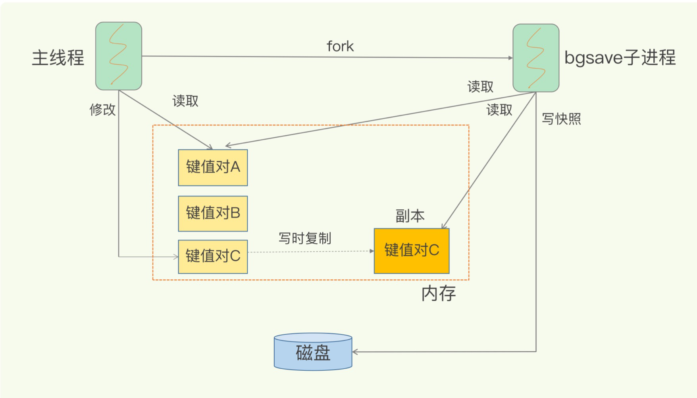

通过创建一个子进程来进行持久化，会将数据写入到一个临时文件，待持久化结束后，在用临时文件替换上次持久化的文件。整个过程主进程不参与IO操作，所以RDB比AOF更高效，但==缺点==是可能会丢失最后一次持久化的数据，并且性能消耗更高。


### AOF

以日志的形式来记录每个写操作，将redis执行过的写记录写下来，只许追加文件但不可以改写文件，redis启动后会根据文件中指令执行恢复工作，使用redis请求协议格式保存文件


追加文件频率：

1. always：一直
   1. 安全性最高，每次事件循环都会追加文件，但效率最低
2. everysec：每一秒
   1. 从效率来说是最高的，最多丢失一秒的数据


但AOF如果过大的话，会影响数据还

AOF**重写**

当体积过大，AOF将重写到新文件中，新文件体积要小的多，他会合并多个冗余命令为一个命令

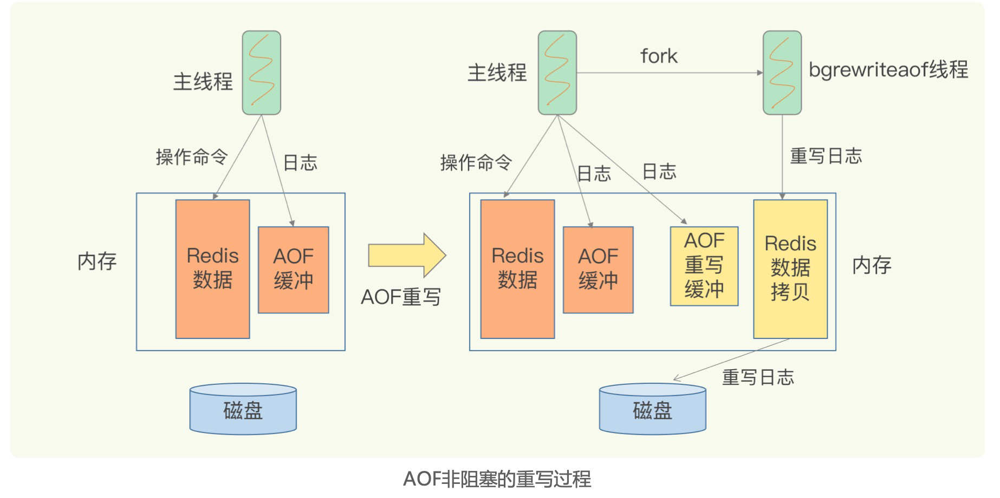


==如果AOF和RDB同时开启，会优先使用AOF==


流程：

1. 客户端的写命令会被append到AOF缓冲区
2. AOF缓存区根据持久化策略将操作同步到磁盘的AOF文件中
3. AOF文件大小超过重写策略后，把AOF文件重写压缩，默认是大于64M的2倍
4. redis服务重启后加载AOF文件恢复


缺点：

- 占用更多磁盘空间
- 恢复备份慢
- 因为aof是写后备份，可能会还没来及写入日志，机器挂了，丢失数据


### aof和rdb合作

为了解决rdb丢失部分增量数据，aof**恢复数据满问题**

可以考虑两者合并：用rdb全量备份，在两次rdb中间用aof记录增量数据的操作


## 事件处理

什么是I/O多路复用

​	一种可以监视多个描述符，一旦某个描述符就绪，能够通知程序进行相应读写操作的机制

- 设计多个linux命令 select、poll、epoll
- select是无差别轮询socket的fds（fds是文件描述符数组，通过描述符能找到socket）
  - 缺点：不知道哪个socket有操作，每次被唤醒都需要复制fds从用户态到内核态
- poll与select相似，但没有最大连接数限制，底层fds是链表
- epoll在select缺点上提出了新的方法
  - 会用一个readyList的链表维护可以操作的socket，当一个socket有操作的时候就会被添加到list中
  - 内核维护socket集合


redis底层把套接字操作封装为事件，然后I/O多路复用程序监控事件，如果发现有事件出现，那么会放在I/O的队列中

有序的、同步的、每次一个的发送给文件事件派发器


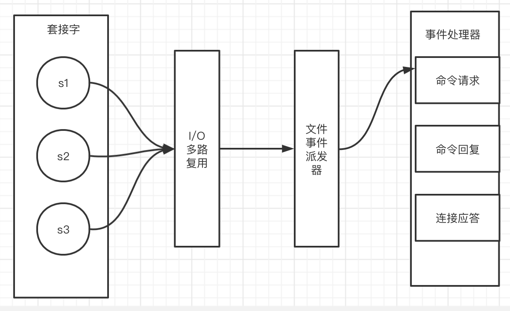


## 主从复制

***redis的高可靠包含两层含义：1是数据尽量少丢失；2服务尽量少中断；***

***AOF和RDB保证了前者，而增加副本冗余保证了后者***


1、读写分离，提高性能

2、容灾快速回复


通过配置文件来设置每个redis

```txt
include E:\redis\myredis\redis.windows.conf
port 6379
dbfilename dump6379.rdb
```

使用slaveof host port来让当前redis作为host的仆从


同步步骤：

1. 当从服务器连接主服务器后，从服务器向主服务器发送进行消息同步
2. 主服务器接到从服务器后，会把当前数据持久化，然后把持久化文件发送给从服务器。
3. 主服务器进行写操作后，和从服务器同步数据


### 哨兵模式

**哨兵的任务**：

1. 监控：判断主从库下线
2. 选主：选出新主库
3. 通知：通吃从库跟从新主库


redis的高可用的解决方案

反客为主的自动版，能够后台监控主机是否故障，如果故障了就根据投票数自动将从库变为主库

编写sentinel.conf配置文件

监视6379,1代表了只需要1个从服务器同意就能更换主服务器

```txt
sentinel monitor mymaster 127.0.0.1 6379 1
```


**有个问题：哨兵模式的集群是如何建立的，因为配置文件中只配置了监听的主库ip：port**

答案是根据主库的发布和订阅模式，哨兵发布自己的地址端口，然后订阅其他哨兵信息，主库会发送其他哨兵消息给他。这样所有哨兵就能相互连接

并且可以从主库中获取所有从库的信息


哨兵模式下redis的master ip可能一直变化，java如何才能连接

用nginx作为代理服务器

==redis3.0提出了无中心化集群（节点平均分数据）==


## redis集群模式

redis集群是redis提供的分布式方案，集群通过分片来进行数据共享，并提供复制和故障转移

哨兵模式缺点是只有一个节点可以写入，成为了一个性能瓶颈


### 节点

通过命令可以把ip：port对应节点添加到集群中

```redis
cluster meet ip port
```

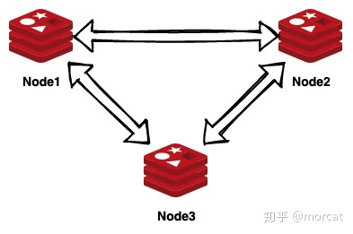

节点之间通过Gossip协议交换状态


#### Gossip

Gossip协议：是一个最终一致性算法，保证在最终所有节点一致

基本思想：一个节点想分享信息给网络中其他节点，于是周期性的随机选择一些节点，并把信息传递给他们，收到信息的节点也会做相同的事情


### 数据的分片

集群会将数据库分成16384个哈希槽，每个键对应某个哈希槽中


计算某个键在那个槽中是通过下面的公式

```python
def slot_number(key):
    return CRC16(key) & 16383

```


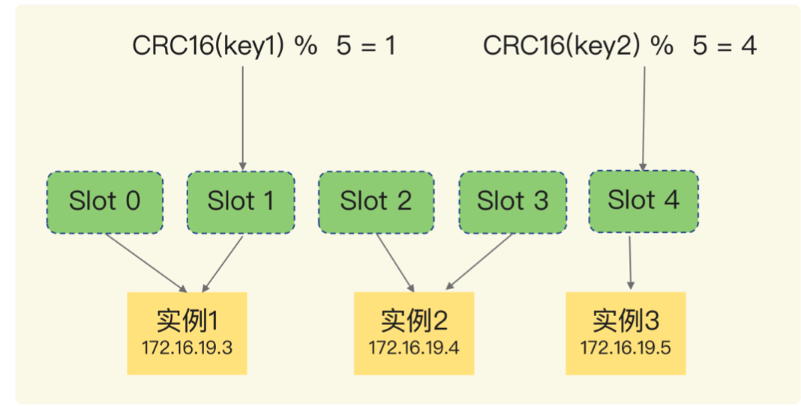

分片查找流程：

1. 客户端访问某个键，随机分配一个节点
2. 节点计算键对应的槽
3. 判断当前节点是否有这个槽
4. 如果是的话执行命令
5. 不是的话，向客户端返回正确的节点的地址和端口号，客户端转向到正确节点


#### 节点数据迁移

当有实例上的槽转移数据，客户端如何访问呢？

如实例2上的slot2转移到实例3上，那客户端先访问实例2，因为slot2正在迁移，那会返回一个**ASK**命令并附带迁移的目的地地址，之后客户端再发送**ASKING**，告知目标服务器想要访问数据，然后再执行操作命令。


### 高可用

每个主节点负责计算槽，从节点负责复制，以防主节点下线

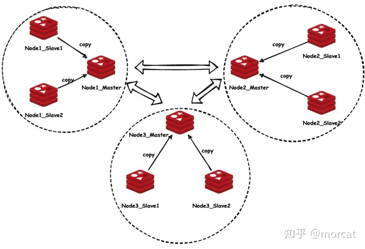


## 缓存

### 缓存穿透

1. 应用服务器压力变大
2. redis命中率降低
3. 一直查询数据库（出现许多不正常的url请求）

解决：

- 对空值缓存：缓存时间设置不超过五分钟
- 设置白名单：使用bitmaps每个位来作为用户id
- 采用布隆过滤器：类似bitmap，效率更高


### 缓存击穿

1、数据库压力瞬间增大

2、redis里面没有出现大量key过期

3、redis正常运行


问题在：

1. redis某个key过期，大量请求访问该key


解决：

- 预先设置热门数据：加大热门数据key的时长
- 实时调整
- 使用锁

### 缓存雪崩

1. 数据库压力变大


问题：

1. 极少时间内，大量key集中过期

解决：

1. 构建多级缓存：nginx+redis+ehcache 非常复杂
2. 使用锁或队列：不适合高并发
3. 将缓存时间分散开，加随机值


## 分布式锁

为了解决跨JVM的互斥机制来控制功效资源

解决方案：

1. 基于数据库实现分布式锁
2. 基于Redis
3. 基于Zookeeper

redis性最高，zookeeper可用性最大


问题：

redis可以使用setnx上锁，del释放锁

1、锁长期不释放：

​		一般也可以用expire来过期锁解决锁不释放的问题

2、上锁后出现异常没有设置过期时间

​		上锁和过期时间同时进行set  users 10 nx ex 12

3、锁有过期时间，A业务上了锁后执行业务时间（卡顿）超过了锁的过期时间，锁被自动释放，然后被B业务抢到，A业务苏醒后通知服务器释放锁，这里A就释放了B的锁

​		为锁的值设置唯一的UUID，释放所得时候判断UUID与锁UUID是否一样

4、删除操作缺乏原子性，碰巧比较了UUID一样，要删除锁的时候锁过期了，出现于上面相同的问题

​	可以使用lua脚本 

​	

```lua
if redis.call('get',KETS[1])==ARGV[1] then return redis.call('del',KEYS[1]) else return 0 end
```


确保锁同步的四个条件：

- 互斥性
- 不会发生死锁
- 加锁和解锁需要同一个客户端
- 加锁和解锁必须确保原子性


### redission

> 是一个基于Redis实现的Java驻内存数据网格，对redis数据结构进行封装为java对应的结构，并且网络传输采用Netty
>
> 提供了分布式锁

使用起来跟AQS的可重入锁基本类似

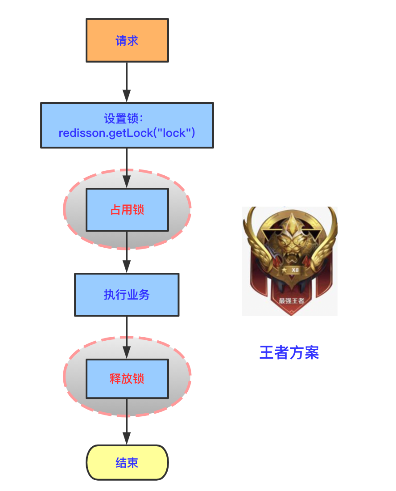


### redlock

目的：对共享资源做互斥访问。

因此antirez提出了新的分布式锁的算法Redlock，它基于N个完全独立的Redis节点（通常情况下N可以设置成5）。

运行Redlock算法的客户端依次执行下面各个步骤，来完成 获取锁 的操作：

获取当前时间（毫秒数）。
按顺序依次向N个Redis节点执行 获取锁 的操作。这个获取操作跟前面基于单Redis节点的 获取锁 的过程相同，包含value driverId ，也包含过期时间(比如 PX 30000 ，即锁的有效时间)。为了保证在某个Redis节点不可用的时候算法能够继续运行，这个 获取锁 的操作还有一个超时时间(time out)，它要远小于锁的有效时间（几十毫秒量级）。客户端在向某个Redis节点获取锁失败以后，应该立即尝试下一个Redis节点。这里的失败，应该包含任何类型的失败，比如该Redis节点不可用，或者该Redis节点上的锁已经被其它客户端持有（注：Redlock原文中这里只提到了Redis节点不可用的情况，但也应该包含其它的失败情况）。
计算整个获取锁的过程总共消耗了多长时间，计算方法是用当前时间减去第1步记录的时间。如果客户端从大多数Redis节点（>= N/2+1）成功获取到了锁，并且获取锁总共消耗的时间没有超过锁的有效时间(lock validity time)，那么这时客户端才认为最终获取锁成功；否则，认为最终获取锁失败。
如果最终获取锁成功了，那么这个锁的有效时间应该重新计算，它等于最初的锁的有效时间减去第3步计算出来的获取锁消耗的时间。
如果最终获取锁失败了（可能由于获取到锁的Redis节点个数少于N/2+1，或者整个获取锁的过程消耗的时间超过了锁的最初有效时间），那么客户端应该立即向所有Redis节点发起 释放锁 的操作。

当然，上面描述的只是 获取锁 的过程，而 释放锁 的过程比较简单：客户端向所有Redis节点发起 释放锁 的操作，不管这些节点当时在获取锁的时候成功与否。

问题：

由于N个Redis节点中的大多数能正常工作就能保证Redlock正常工作，因此理论上它的可用性更高。我们前面讨论的单Redis节点的分布式锁在failover的时候锁失效的问题，在Redlock中不存在了，但如果有节点发生崩溃重启，还是会对锁的安全性有影响的。具体的影响程度跟Redis对数据的持久化程度有关。

假设一共有5个Redis节点：A, B, C, D, E。设想发生了如下的事件序列：

客户端1成功锁住了A, B, C， 获取锁 成功（但D和E没有锁住）。
节点C崩溃重启了，但客户端1在C上加的锁没有持久化下来，丢失了。
节点C重启后，客户端2锁住了C, D, E， 获取锁 成功。
这样，客户端1和客户端2同时获得了锁（针对同一资源）。

述中特别强调，客户端应该向所有Redis节点发起 释放锁 的操作。也就是说，即使当时向某个节点获取锁没有成功，在释放锁的时候也不应该漏掉这个节点。这是为什么呢？设想这样一种情况，客户端发给某个Redis节点的 获取锁 的请求成功到达了该Redis节点，这个节点也成功执行了 SET操作，但是它返回给客户端的响应包却丢失了。这在客户端看来，获取锁的请求由于超时而失败了，但在Redis这边看来，加锁已经成功了。因此，释放锁的时候，客户端也应该对当时获取锁失败的那些Redis节点同样发起请求。实际上，这种情况在异步通信模型中是有可能发生的：客户端向服务器通信是正常的，但反方向却是有问题的。


## 消息队列

消息队列基本要求：消息保序、消息可靠和处理重复

### 基于List实现

通过LPUSH和RPOP来实现队列生产和消费

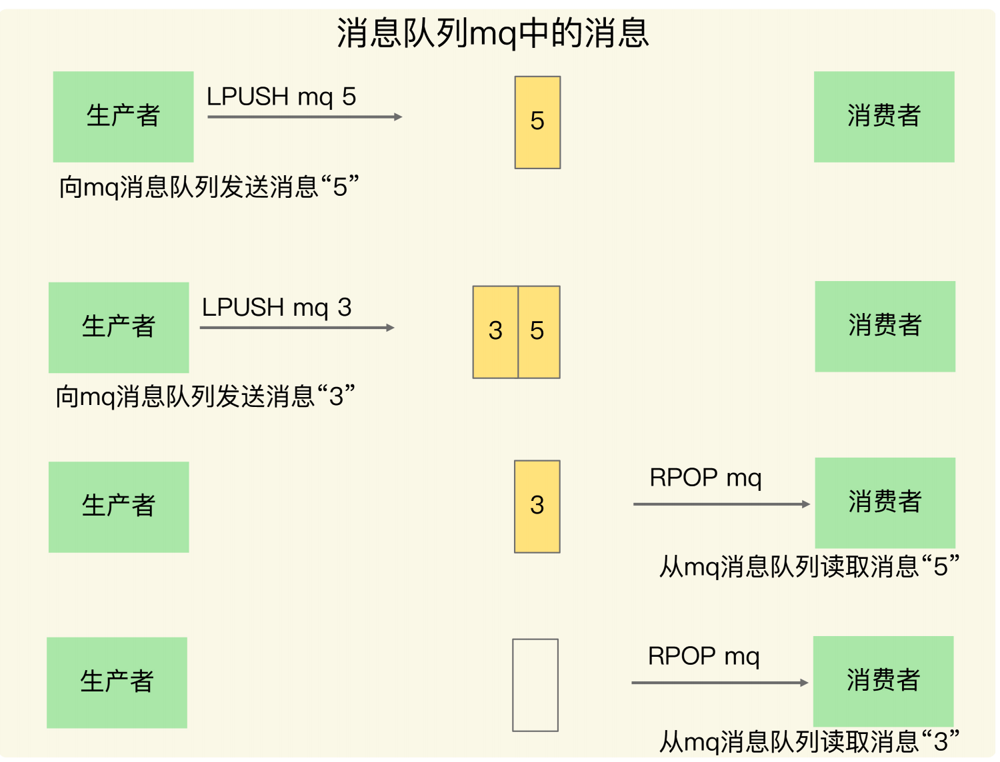


#### 消息保序

通过LPUSH和RPOP实现消息报序，但RPOP需要一直调用，消费者才能知道有消息可以消费

Redis额外提供了BRPOP也称为阻塞式读取，没有数据时候自动阻塞，减少CPU开销


#### 重复消费

用户自己提供全局ID，消费者根据全局ID判断是否重复消费，消费者端需要额外存储已经消费的全局ID


#### 消息可靠

当消费者处理时候故障需要机制，就会导致消息没有处理完成。为了留存消息，List类型提供了BRPOPLPUSH命令，让消费者程序读取消息的时候，会把该消息备份到另外一个List中，这样一来消费者恢复后可以重新完成消息消费。

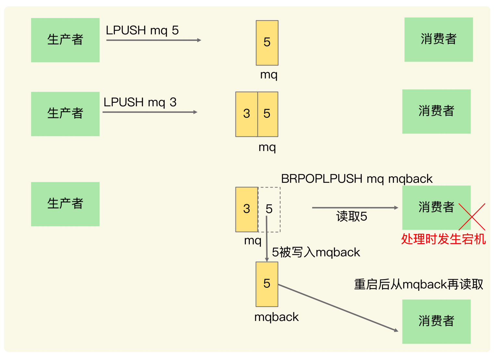


#### 缺点

生产者发送消息太快，导致消费者跟不上，消息队列数据堆积过多，redis内存相应占用就多，这个时候希望启动消费者组去一起分担处理List消息，但List组并不提供。**Redis5.0开始提供的Streams数据类型解决了上述问题。**


### 基于Streams消息队列解决方案

> 是Redis专门处理消息队列的数据结构
>
> XADD：插入消息保证有序，自动生成全局ID
>
> XREAD：按ID读取消息
>
> XREADGROUP：按消费组形式读取消息
>
> XPENDING和XACK：一个是查询每个消费组内所有消费者已读取但尚未确认的消息，一个用于向消息队列确认消息已完成


#### 消息可靠

消息队列通过XPENDING命令保存没收到确认消费成功的消息。如果收到对应消息的XACK就不用再保存了，因为消费者端已经确认消费完成了。


## Redis性能潜在因素

1. Redis内部阻塞
2. CPU影响
3. Redis关键系统配置
4. 内部碎片
5. 缓冲区


### 内部阻塞


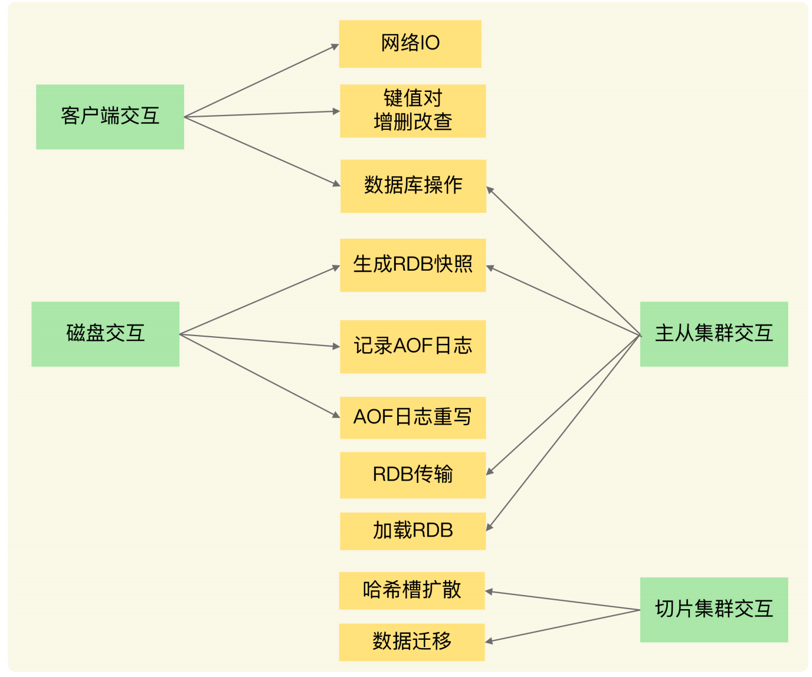


1. 和客户端交互的阻塞，显示连接网络不会阻塞主线程。但增删改查会影响主线程执行，一般时间复杂度为o（n）的都会有影响，比如集合元素的操作，HGETALL、SMEMBERS或者集合聚合操作。**这是第一个阻塞点**。一般删除操作的bigkey也会影响，因为删除操作涉及到释放内存，释放内存会把释放掉的放入空闲列表中，该过程操作耗时，**这是第二个阻塞点**。清空数据库也是，因为涉及到删除大量key和释放内存，**这是第三个阻塞点**
2. IO交互，AOF日志写时，如果有大量写操作并同步写回也会阻塞，**这是第四个阻塞点**
3. 主从节点交互，从库接受RDB文件时候需要删除库数据，这也是我们的第三个阻塞点，并且加载RDB文件到内存也会阻塞从库，**这是第五个阻塞点**


#### 异步

这五个阻塞点如果可以用异步，创建子线程来解决的话就不会阻塞主线程了。

但问题来了，他们都可以用异步解决吗？

不能解决的：

1、一般来说第一个阻塞点涉及到读操作，读操作需要返回数据，所以不能用异步来解决。

2、从库加载RDB文件也不能异步，因为只有数据加载到内存了，他才能正常对外提供服务。


可以解决的：

1、而上面bigkey的删除是可以用异步来解决的，主线程直接返回OK，

2、清空数据库与上面同理

3、AOF写同步到磁盘，只需要启动子线程去处理落盘

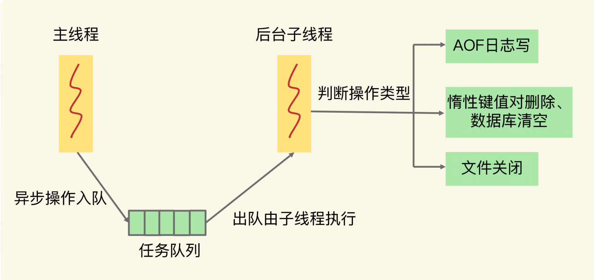


### redis自身影响

慢查询和过期Key操作


#### 慢查询

比如前面提到的集合查询所有元素和聚合操作

通过Redis日志和latency monitor工具来

**两种解决方案**

1. 用高效命令代替：如不要使用HGETALL而改用HSCAN，每次获取部分数据，避免大量时间阻塞
2. 需要聚合操作时候在客户端完成，而不要用SORT、SUNION等


##### 如何排查慢查询

需要设置两个参数

1. **slowlog-log-slower-than**：慢查询日志对执行时间大于多少微妙的命令进行记录
2. **slowlog-max-len**：慢查询日志最多能记录多少条命令记录，底层是先进先出队列

慢查询就会按上面参数来添加命令


#### 过期key

默认每100毫秒删除一些过期key，算法如下：

1. 采样**ACTIVE_EXPIRE_CYCLE_LOOKUPS_PER_LOOP**个数的key，并将其中过期key全部删除
2. 如果超过25%key过期，则重复删除过程，直到过期key下降到25%以下

ACTIVE_EXPIRE_CYCLE_LOOKUPS_PER_LOOP默认为20，上面如果触发频发出发第二条，将会导致长时间的阻塞，频繁触发原因大多是因为大量key设置了相同的过期时间，业务上应该根据实际添加一定范围的随机时间


### 文件系统和操作系统

当排查问题不是Redis的自身延迟问题时候，就需要考虑文件系统和操作系统了

> 因为一方面Redis需要持久化数据到磁盘，这就需要文件系统配合，文件系统写回到磁盘的机制会影响Redis持久化性能，进而影响Redis处理请求性能
>
> 另外一方面，Redis是内存数据库，内存操作频繁，操作系统内存机制会影响数据的修改


Redis AOF写会策略会对性能有影响。一般everysec可以异步启动子线程来进行fsync，而always需要确认每个操作都调用fsync，不能启动子线程。

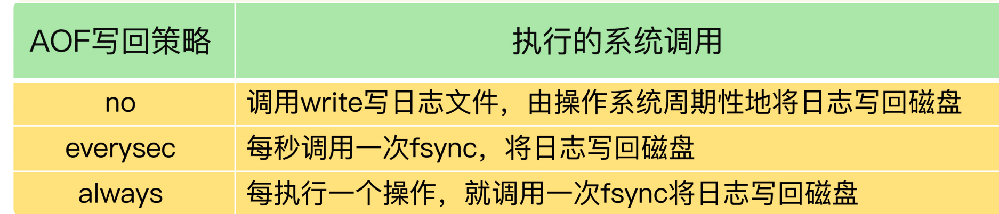

并且AOF在文件特别大时候需要重写日志，重写使用大量IO后会阻塞fsync的操作，而主线程又在监控fsync的操作，上一个fsync阻塞，那下一个fsync也会阻塞等待，进而阻塞主线程

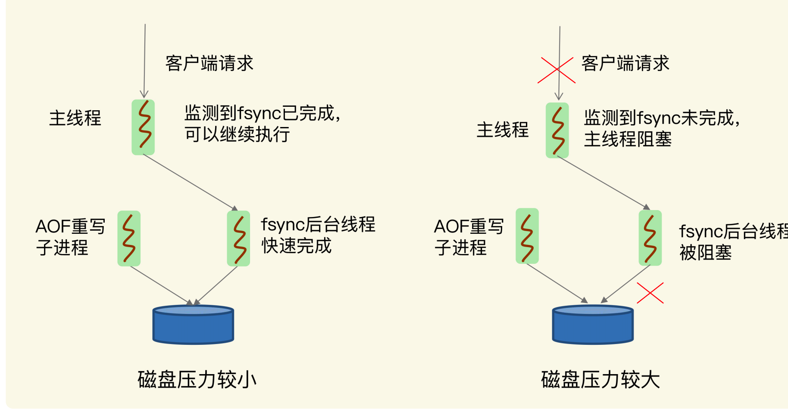

如果允许一定程度丢失数据，那么可以设置**no-appendsync-on-rewrite yes**这样当AOF重写时候，新数据写到内存后不会调用fsync去同步日志到磁盘

当然如果需要更高性能，可以更换磁盘为高速的固态硬盘


如果上述没有采用AOF而出现性能问题，**那可能是操作系统的内存调度出了问题**

潜在瓶颈：操作系统内存`swap`

内存的swap涉及到数据在内存和磁盘的换入和还出，涉及到磁盘的读写性能，并且Redis触发swap**后会直接影响到主线程性能**


触发swap原因

> 物理内存不足
>
> 常见如：
>
> 1、Redis消耗了机器大量内存
>
> 2、Redis实例所在主机其他进程消耗掉大量内存

一般就是增加机器内存或者Redis实例


## redis面试

1. 分布式锁的实现有哪些，分别怎么实现的，redis的具体实现以及操作

   1. setnx和del配合

2. 设置分布式锁的时候，setnx 和 expire如果不能同时执行完会有什么影响

3. 如何实现setnx 和 expire的原子性操作

4. redis在删除锁的时候会发生什么，有什么操作需要执行

5. redis查找很慢如何排查问题

6. redis有哪些数据结构，分别在什么情况下使用

7. mysql数据库和redis缓存如何进行同步，数据库和redis缓存如何保证一致，同步过程中mysql宕机或者redis宕机怎么办，分布式锁

8. redis数据结构， key的过期时间是怎么设定的（原理）

9. zset在哪些场景下会使用

10. 跳表讲一下，源码看过吗

11. redis如何实现高可用，为什么采用单线程，跳表

12. 读多写少什么数据结构，读少写多什么数据结构

13. redis集群模式，内存淘汰机制，lfu，分片集群模式

14. 缓存穿透、缓存击穿、缓存雪崩

    

    

