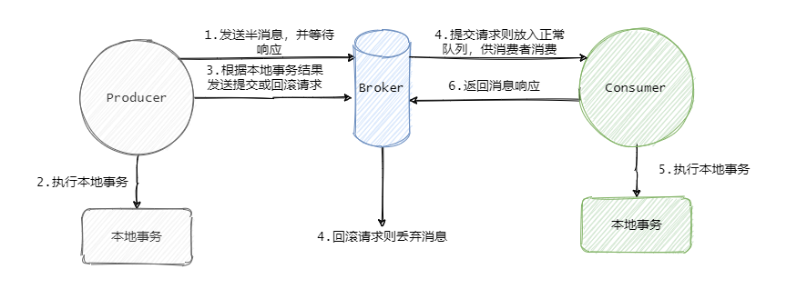

# 中间件

## Kafka

kafka是一个分布式的基于发布/订阅的消息队列

主要应用场景缓存/消峰、解耦和异步通信

### 两种模式区别

### 基本架构

1、为方便拓展，提高吞吐量，一个topic分为多个partition，每个partition在不同的server上

2、为配合分区，提出消费者组，每个组只消费一个partition

3、为提高可用性，每个partition增加若干副本，消费者只消费leader副本，follower只做备份

4、ZK来记录节点信息，kafka在2.8以后不采用zookeeper了

### 基础问题

#### 消息队列作用

1. 解耦：消息队列作为两个系统之间的通讯方式，两个系统不再相互依赖
2. 异步：系统A发送消息到消息队列后继续做其他事情
3. 流量消峰：由消费者段来控制消费速度

#### 消息队列缺点

1. 增加系统复杂度，需要把下面的问题考虑进来
2. 系统可用性降低，mq故障，影响系统
3. 一致性问题

#### 消息队列对比

kafka比rockermq吞吐量高

其producer发送消息的时候会把小消息缓存下来待到一定程度时候发送给broker，减少了网络io

rocketmq用java语言如果缓存过多就会频繁gc，batch.size参数

rocketmq功能特性更多，偏业务，kafka吞吐量高，偏日志

#### 如何保证消费不丢失

- 生产者发送消息要有回调，如果回调返回的是失败那么生产者应该重试发送，一般三次机会
- broker应该做好多重备份
- 消费者如果是多线程消费应该手动commit而不是自动
- 参数设置acks=all要求所有副本都要接受到消息

#### 如何保证消息不被重复消费

消费端保证幂等性

幂等性如何实现：

- 如果是写reids，用set天然幂等性 
- 生产者发送消息带上全局唯一id，消费者拿到后去redis或者mysql中查询，如果存在就忽略，如果不存在就消费，并把id写到redis中
- 基于数据库的唯一键，生产者发送id给消费者，消费者把id尝试插入mysql中，插入成功则进行业务逻辑

#### 死信队列

用来存放那些没有成功消费的消息的消息队列，通常用来作为重试

#### 高性能

顺序写和零拷贝

kafka数据存在磁盘上，采用顺序写直接追加数据到末尾

零拷贝删除内核态与用户态的交换，磁盘文件拷贝到内核buffer后直接发送给网卡buffer

#### 副本同步

kafka是主备模式而不是主从模式

#### 事务消息

> 用在一次事务中需要发送多个消息的情况，保证多个消息之间的事务约束

而RocketMQ的事务解决了本地事务的执行和发消息两个动作满足事务的约束

## Zookeeper

解决了分布式下主节点选举、崩溃检测、组成员关系管理和元数据管理

### CAP

一致性、可用性和分区容错性

zookeeper保证了一致性和分区容错性

### 其他框架比较

多机为了提供可靠服务所以需要冗余数据因而会存在分区容忍性Ｐ

zookeeper 和 eureka分别是注册中心CP AP 的两种的实践

eureka各个节点都是平等

而zookeeper有leader

### 监视与通知

替代客户端本来需要轮询的关注节点

通过watcher机制，当节点发生变化，zookeeper会通知客户端发送变化并且客户端做相应的逻辑操作，但因为watcher是一次性的，需要每次都添加watcher

为了保证客户端不错失信息，需要再添加watcher的时候查询对应节点

### 版本号

znode都有版本，通过版本号来保证并行操作的一致性

### 客户端与仲裁模式

客户端因为断线重连后，如何选定服务器来连接

1. 客户端每次操作成功后会获得服务器的zxid事务id
2. 客户端重连后根据zxid与服务器的zxid比较，选择更新的zxid连接

zxid由时间戳和计数器组成

#### leader选举

每个服务器会向其他服务器发送投票（服务器标识sid，事务zxid）

服务器收到各个投票消息进行判断：

1. 如果别人的zxid大于自己的或者别人的zxid等于自己的但sid大于自己的话，接受别人的投票
2. 否则投票给自己

一般来说只有最新的服务器才能成为leader，最后投票多的就是leader

#### ZAB

zookeeper原子广播协议

包括三步：

1. 发现leader
2. 同步数据
3. 广播proposal

类似于二阶段提交

1. leader向所有的follower发送proposal
2. follower发送ack确认收到
3. leader收到半数以上ack后，广播commit消息，事务提交

