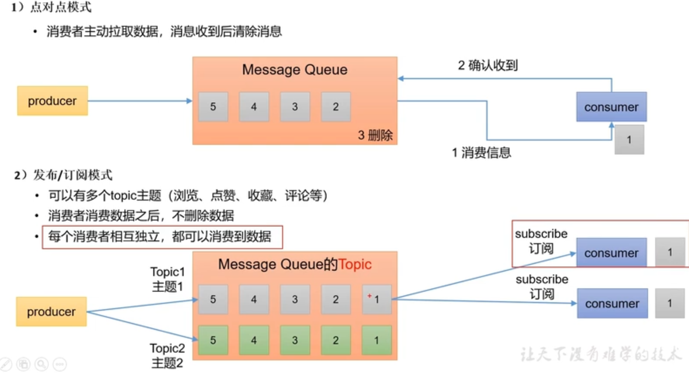
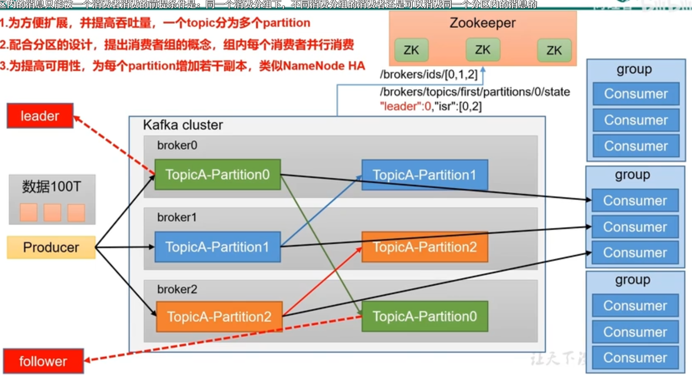

# Kafka

kafka是一个分布式的基于发布/订阅的消息队列

主要应用场景缓存/消峰、解耦和异步通信

## 两种模式区别

## 基本架构

1、为方便拓展，提高吞吐量，一个topic分为多个partition，每个partition在不同的server上

2、为配合分区，提出消费者组，每个组只消费一个partition

3、为提高可用性，每个partition增加若干副本，消费者只消费leader副本，follower只做备份

4、ZK来记录节点信息，kafka在2.8以后不采用zookeeper了

