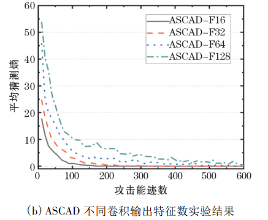
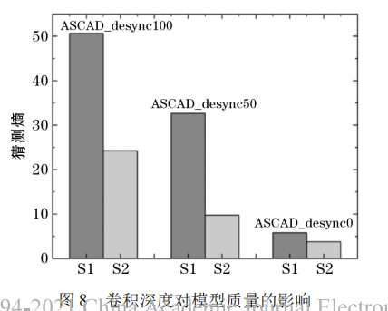
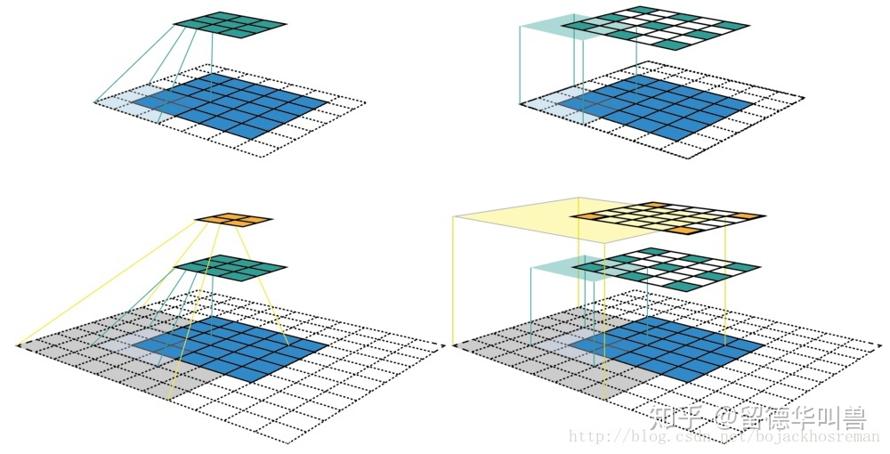

## 11.22周笔记

1、提出了什么问题

2、解决了什么问题

3、用了什么样的方法

***Template Attacks*** *--Chari 2002*

**1、提出了什么问题**

SPA（单条曲线无法看出能量迹与操作相关性）、DPA在很多场景下（不能从被攻击设备获得足够泄露信息）都不能成功攻击

**2、解决了什么问题**

模板攻击可以从被攻击设备采取少量曲线就能获得密钥

但模板攻击需要拥有一个与被攻击设备完全相同可控制的设备

**3、用了什么样的方法**

1、模板构建

建立噪声的均值向量和协方差矩阵称为一个模板，对应假设中间值为或者能量模型为x个，则需要建立相应x个模板。下面公式（1）的(m,c)di,kj代表了明文i密钥j建立的模板，其中m为均值向量，c为协方差矩阵。t为被攻击设备的能量轨迹。随后得到对应的概率密度函数。
$$
p(t;(m,c)d_i,k_j)=\frac{exp(-\frac{1}{2}(t-m)‘*C^{-1}*(t-m))}{\sqrt{(2*\pi)^T}*det(C)}      			\tag 1
$$
从被攻击设备获得q条能量迹线（密钥都相同），输入到模板中，对同一模板，每条输出的概率值与前面的概率值累乘得到某个模板的联合概率
$$
p(k_i)=\prod_{j=1}^{q}{p(t;(m,c)d_i,k_j)}\tag 2
$$
比对所有模板的联合概率，根据极大似然法则，概率最高的模板对应的密钥就是正确密钥
$$
k=argmaxP(T|O_k) \tag 3
$$

------

***Convolutional Neur al Networks with Data Augmentation against Jitter-Based Countermeasures***   *--Eleonora Cagli, Cécile Dumas, Emmanuel Prouff 2016*

**1、提出了什么问题**

传统模板攻击认为能量服从高斯分布，然而能迹的不对齐和高纬度数据使得攻击者需要采用各种预处理

**2、解决了什么问题**

简化了攻击路线，不再需要能迹对其和兴趣点选取的预处理方法，提高了CNN性能。

**3、用了什么样的方法**

使用卷积神经网络来解决并使用了经典的数据增强方法对抗不同的抖动策略

使用了shifting和add-remove的数据增强方法

对抗的不同抖动策略包括

1、随机时延

随机时延文中是由循环nop指令，下图为随机时延的效果。

下面是利用shifting数据增强来攻击带随机时延的数据，shifting包括0,100,500,

我们可以看到随着数据增强强度的增加，验证集准确率是在明显的上升的，在0-100程度上，有着明显的过拟合，在500的时候验证集准确率逼近训练集

2、时钟抖动

一种在硬件上实现的非对齐策略

使用SH和Add-remove

------

**适用于侧信道分析的卷积神经网络结构的实验研究** -*-黄洁、王燚 2019*

**1、提出了什么问题**

当前神经网络应用于侧信道非常广泛，但神经网络的超参数之多，前人要么没有给出准确的超参数，要么需要花较多时间进行调参，如果单纯对参数使用排列组合那么复杂度不敢想象，并且侧信道数据特征波动与图片处理相比过于小，信噪比过于低，因此，作者提出有没有对侧信道能耗数据通用卷积设计经验

作者针对ASCAD文章给出的cnn结构做出了评判：

- 结构复杂，参数众多容易过拟合
- 极低信噪比数据使用小批数据容易是网络找不到正确梯度优化放心
- 该实验的平均排名，是仅攻击能迹一次的正确位置，多次攻击一条能迹的平均位置
- 该实验中超参数的选择是控制变量法，只变动一个参数，其他相同，问题在于超参数互相之间是存在着影响的，而实验默认忽略了这种影响

**2、解决了什么问题**

作者总结了侧信道分析中卷积神经网络的一些经验原则，帮助后续研究人员设计网络结构

**3、用了什么样的方法**

通过对比实验，选择某一超参数来对比，其余超参数寻优。

总结出4项原则

1. *能迹的信噪比越低，卷积输出特征应该越小（指的全连接输入特征数量）*

  *2.能迹泄露信息越少，首层卷积核需要越大*

  *3.对能迹建模，不宜采用过深的卷积网络*

1. s1步长为1，卷积层数为7，s2步长为2，卷积层数为4
2. 

*4.对抖动严重能迹，卷积网络应该采用最大池化，而不是最小池化*

------

**感受野和特征图**

特征图就是每层输入图像大小

感受野就是当层像素点对应原输入图像多少像素

如下图绿色像素对应感受野为
$$
3*3
$$
而橙色对应感受野
$$
7*7
$$

