# 实验报告

## 参数优化

 ==网格寻优==一般用于在随机寻优后，根据发现的一些超参数的规律，将部分超参数设置为固定值，测试另一些超参数对模型质量的影响时使用。

一般开始时采用==随机寻优==，如果能够得到相当好的模型，就不必进一步使用网格寻优了。否则，根据随机寻优中各种推荐的模型得分，分析各结构超参数对模型训练的影响。重新设置超参数范围和离散化方法，使用网格寻优进一步优化模型

## 12.1

本来是在aisca平台上测试，但显卡经常挂掉，超参数寻优时间又长，改为了用ASCAD上没有超参数寻优

cnn模型

卷积和池化步长都2，池化使用最大池化

卷积核大小32/11/11/11

==抖动50==

下图fc代表包括输出层由3个全连接

rmfc2删除第二个全连接

rmfcall删除两个全连接

## 12.5

tensorboard --logdir=D:\LOG\logs --host=127.0.0.1

CNN1D交叉熵为23.9

POI 2,9995

13层池化和13层卷积

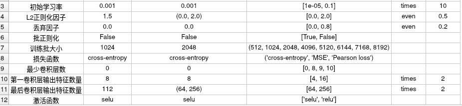

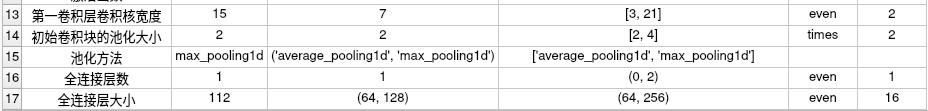

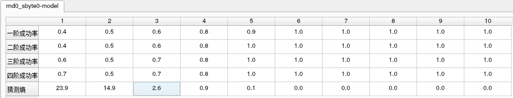

能迹取2500-7500范围的点

12层卷积12层池化

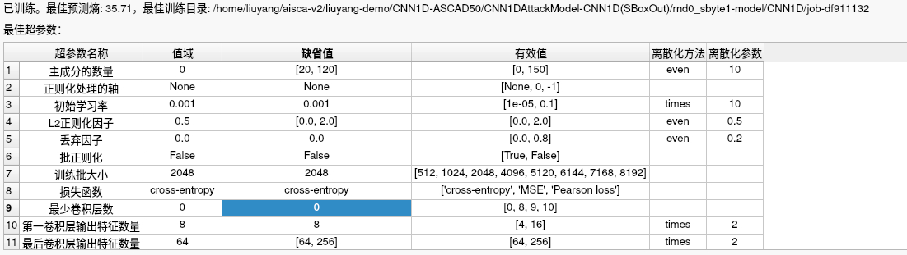

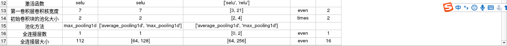

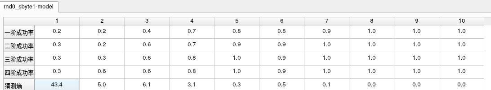

能迹取2500-7500范围的点

12层卷积12层池化

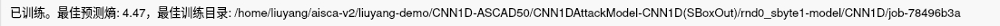

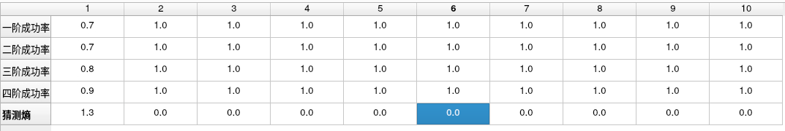

在卷积核和输出特征数量较大的时候猜测熵比前一个好，且两者都是12层卷积和12层池化

==下面都是采用大卷积核的寻优==

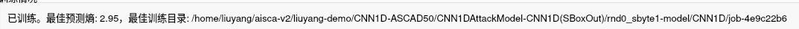

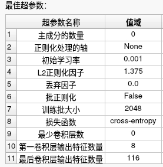

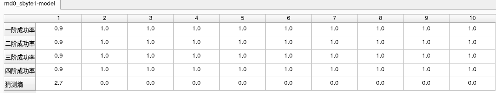

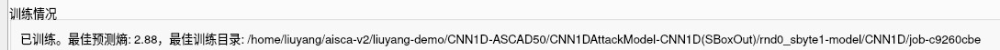

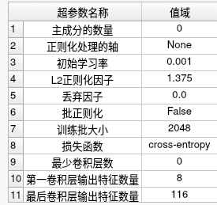

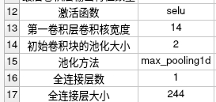

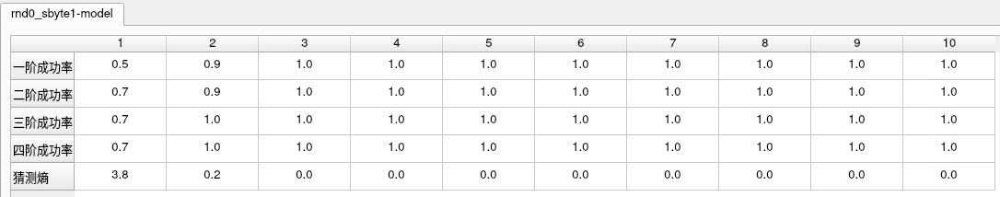

这里我们固定卷积核为7来寻优，发现效果极差，图中蓝色的是保存的前阶段的最佳结果

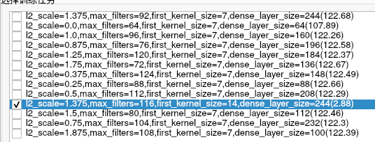

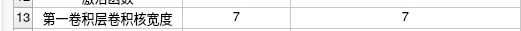

‘

