#  数据库


## 基础

### 分组函数

如max(),min(),count()等，分组函数自动过滤NULL

==count(*)和count(字段)的区别==

count(*)是把所有行的计算出来，而另一个是把该列不为空的计算出来


==group by和having==

**group by是按照某些字段进行分组**

​	分组函数一般与group by联合使用,没有group的时候整张表自成一组

```sql
select max(price) from item group by type
```

注意

```sql
select * from item where sal>avg(sal)
会报错
```

==因为使用分组函数前需要分组，而分组group by是在where之后执行的，那么没有分组怎么可能用分组函数，所以where后不能接分组函数==

当使用group by的时候，select后只能跟被分组的字段和分组函数

```sql
select id,max(price),type from item group by type
该条语句是错误的，id没有参加分组
```


**having是对分组过后的数据再次过滤**

但这种方式效率没有where高，能够用where就用where

如果数据是在分组前就已经固定的，如最大的工资等，那么可以直接用where来先筛选

```sql
找出根据type分组后最高薪资大于1599的
select max(price),type from item GROUP BY type having max(price)>1599
用where来代替having，因为薪资是在分组前就已经固定,如果是算平均工资就不能用where，因为平均工资是需要分组后才能算
select max(price),type from item where price>1599 GROUP BY type
```


### **SQL语句模板**

select 

​	xxx 

from 

  xxx 

where

 xxx

 group by xxx having xxx order by xxx

limit startIndex,length;


### 查询语句去重

在字段前加distinct

如select distinct job from emp

==distinct只能在所有字段最前面==


### 连接查询

多张表联合查询，而不是单张表


根据表的连接方式分为内连接和外连接

#### 内连接

包括等值连接、非等值连接和自连接

- 等值连接：条件是等值关系  **SELECT * from item,typeN where item.type=typeN.id**老语法
  - **SELECT * from item join typeN on item.type=typeN.id**新语法
  - ==采用这个语法在于把表连接和过滤条件分离出来了，where是过滤条件，join on是表连接==
  - 默认是inner join
- 非等值连接：条件是非等值关系
  - select * from item join rank on item.price BETWEEN rank.minprice and rank.maxprice
- 自连接：自己连接自己的表

下图为员工表，mgr是对应领导编号

+----+--------+------+
| id | ename  | mgr  |
+----+--------+------+
|  1 | liquid |    2 |
|  2 | 大人   |    3 |
|  3 | 鞑靼人 | NULL |
|  4 | 小小人 |    1 |
+----+--------+------+
==使用自连接同张表建立两个子表e1和e2==

```sql
select e1.ename,e2.ename from emp e1 join emp e2 on e1.mgr=e2.id;
```

+--------+--------+
| ename  | ename  |
+--------+--------+
| 小小人 | liquid |
| liquid | 大人   |
| 大人   | 鞑靼人 |
+--------+--------+


#### 外连接

==外连接和内连接区别：==

- 内连接：两张表连接没有主副之分，凡是与两张表都能够匹配的才会查询出来

- 外连接：有一张表是主表，另外是副表，如果主表没有数据，副表有也不会显示，副表没有而主表有，副表会自动填充NULL，==就一般是主表比较重要会这样做==

  

左外连接和右外连接

**left outer join和right outer join**

outer可以省略

- 左外连接：左边的表是主表

  - ```sql
    select e1.ename,e2.ename from emp e1 left join emp e2 on e1.mgr=e2.id;
    ```

    我们会看到下面输出是有NULL值得，因为主表记录与副表没有匹配，但是以主表为主，副表填充NULL

  - | ename  | ename  |
    +--------+--------+
    | 小小人 | liquid |
    | liquid | 大人   |
    | 大人   | 鞑靼人 |
    | 鞑靼人 | NULL   |
    +--------+--------+

- 右外连接：右边的表是主表

  - ```sql
    select e2.ename,e1.ename from emp e1 right join emp e2 on e2.mgr=e1.id;
    ```

    

==多表查询==

显示员工名字部门名字和薪资登记

```sql
select e.ename,d.depname,r.id rank from emp e left join dep d on e.depart=d.id left join rank r on e.price between r.minprice and r.maxprice;
```

+--------+---------+------+
| ename  | depname | rank |
+--------+---------+------+
| 小小人 | 产品    |    1 |
| liquid | 测试    |    2 |
| 大人   | 研发    |    2 |
| 鞑靼人 | 产品    |    2 |
+--------+---------+------+


### 子查询

select语句嵌套select语句，被嵌套的select语句是子查询

子查询出现位置：

**select**

​	**..(select)**

**from**

​	**..(select)**

**where**

​	**..(select)**


==where子查询==

找出高于平均工资的员工

```sql
select * from emp where price>(select avg(price) from emp);
```

+----+-------+-----+----------+--------+
| id | ename | mgr | price    | depart |
+----+-------+-----+----------+--------+
|  2 | 大人  |   3 | 15000.00 |      2 |
+----+-------+-----+----------+--------+


==from子查询==

子查询作为临时表

找出每个部门的平均薪资的对应级别

```sql
 select rank.id from (select avg(price) as price from emp group by depart) p join rank on p.price between rank.minprice and rank.maxprice;
```


select子查询

找出员工名字和对应部门名字

```sql
select e.ename,(select d.depname from dep d where d.id=e.depart) depname from emp e;
```

+--------+---------+
| ename  | depname |
+--------+---------+
| liquid | 测试    |
| 大人   | 研发    |
| 鞑靼人 | 产品    |
| 小小人 | 产品    |
+--------+---------+

### union

并上查询结果

找出上级是2或3的员工

```sql
select * from emp where mgr=2 union select * from emp where mgr=3;
```


### limit分页*

limit是mysql特有的分页

==语法机制==

limit startIndex,length

​		startIndex起始位置

​		length取几个

取工资前2个员工

==注意order by desc是降序，默认是升序==

取前几个的话可以省略startIndex

==limit是sql语句执行的最后一个环节==

```sql
select * from emp order by emp.price desc limit 0,2;
```

+----+--------+-----+----------+--------+
| id | ename  | mgr | price    | depart |
+----+--------+-----+----------+--------+
|  2 | 大人   |   3 | 15000.00 |      2 |
|  1 | liquid |   2 | 5000.00  |      1 |
+----+--------+-----+----------+--------+

==通用的分页算法==

每页显示pageSize

第pageNo页显示


### 表

==怎么删除大表==

truncate table 表名     不可回滚永久丢失


#### 约束

保证数据合法性、正确性和完整性

- not null

- unique 唯一性，可以为NULL

  - ```sql
    CREATE table student(
    	id bigint,
    	s_name varchar(255),
    	sex char(1),
    	c_no varchar(255),
    	birth char(10),
    	unique(id,s_name)
    );
    ```

    id和s_name建立联合唯一性，这叫==表级约束==

    如果只在一个列加，叫==列级约束==

- primary key 主键，注意如果自己不设置主键，mysql会默认设置隐藏主键，不能为NULL

  - ```sql
    id bigint primary key auto_increment,
    ```

    

- foregin key

  这里class是主表，student是副表，student的c_no依赖于class主表的c_no字段

  foreign key(c_no) REFERENCES class(c_no)是外键约束

  外键引用的字段必须至少是unique

  ```sql
  CREATE table class(
    c_no varchar(255) primary key,
  	c_name varchar(255)
  );
  CREATE table student(
  	id bigint primary key,
  	s_name varchar(255),
  	c_no varchar(255),
  	foreign key(c_no) REFERENCES class(c_no)
  );
  ```

#### 索引

什么是索引？索引有什么用？

==相当于书的目录，通过目录可以快速查询相关资源==

查询表的检索方式有两种：

1. ​	全表扫描（慢）
2. ​    根据索引扫描（快）

索引减小了扫描的范围


**添加索引对象命令：**

**create index 索引名称 on 表名(字段名)**


什么时候应该给字段加索引？

- 数据量庞大
- 字段很少进行修改
- 字段经常出现在where子句中


但是索引不能随便乱加，对于数据经常改动的不推荐添加索引，因为添加删除数据会使得索引目录不断改变，增加索引维护成本，详情可以<a href="#B+树索引">B+树</a>


==主键和带unique的字段自动会添加索引==


索引什么时候失效

使用模糊查询的时候第一个字母是%，索引就会失效变成全表扫描

```
select enmae from emp where ename like '%A';
```


### 事务

一个事务是完整的逻辑单元，不可拆分

与事务相关的语句包括insert、update和delete

事务关系到多条语句的增删改，如果只有一条语句那么不用事务

#### 事务的特性

ACID

1. A 原子性：事务是最小的工作单元，不可再分
2. C 一致性：事务必须保证多条语句同时成功或同时失败
3. I 隔离性：各个事务相互不影响，关乎到==隔离级别==，隔离性太好，A事务修改了B事务不知道，就会出错，具体下面再说
4. D 持久性：一旦修改永久存储


#### 隔离级别

1. 读未提交（read uncommited）：能读到对方没有提交的事务，问题==存在脏数据==

2. 读已提交（read commited）：对方提交之后的数据可以读到。问题==不可重复读==，一个事务连续读多次，多次可能读到的数据不相同

3. 可重复读（repetable read）：读到的永远是事务刚开启获得的数据。问题==幻想==，其他事务操作了，该事务也不知道

4. 串行化（serilization）：事务挨着执行，别人执行完了下一个事务才能执行

   

==MYSQL默认是可重复读==


### 三大范式

所有范式的目的都是减小数据冗余 

1. 第一范式，所有表需要一个主键
2. 第二范式，不应该有联合主键，使得非主键字段产生部分依赖
   1. 如学生编号和老师编号在同一张表作为主键，学生姓名依赖于学生编号而不依赖于老师编号，老师姓名同理
   2. 解决办法：多对多问题，建立三张表，老师表、学生表和老师学生关系表
3. 第三范式，非主键字段不能有传递依赖
   1. 如一张表中有学生编号学生姓名，和班级编号和班级名字，班级名字依赖于班级编号，而班级编号依赖于学生编号，这就是传递依赖
   2. 解决办法：一对多问题，建立两张表，一张班级表，一张学生信息和班级对应表


## MYSQL

下图大体流程，客户端与服务器建立连接

然后把输入的文本信息

- 通过查询缓存（查看这个文本信息之前是不是查询过），如果有那么从缓存中拿，如果没有在进行下一步，但如果对文本信息中表存在修改操作那么缓存失效，==在MYSQL8.0中，查询缓存被删除==
- 语法解析，把判断语法合法和需要操作的表和各种查询条件解析出来
- 查询优化，对我们的语句进行优化生成一个可执行计划，可以使用==EXPALIN来查看可执行计划==

之后进入到存储引擎，这里是真正操作数据的地方了，存储引擎主要有Innodb和MyISAM，当前用的最多的是Innodb

- Innodb支持事务、行级锁和外键
- MyISAM主要是非事务处理

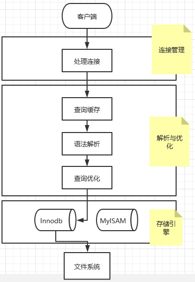


### 编码方案

- 编码：将字符映射为二进制
- 解码：将二进制转换为字符


==字符集：描述字符范围的编码规则==

- ASCII：共收录128个字符
- GB1212：兼容ASCII，其中属于ASCII为1字节长，其余均为2字节
- GBK：对GB1212的扩展
- UTF-8：收录范围很大，编码范围为1-4字节，UTF-8是unicode的一种编码方案，还有utf-16等

------


### 服务器与客服端编码

| 系统变量                 | 描述                                                         |
| ------------------------ | ------------------------------------------------------------ |
| character_set_client     | 服务器认为请求按照该编码                                     |
| character_set_connection | 服务器在处理请求时候，把字节序列从character_set_client转换为character_set_connection |
| character_set_results    | 服务器根据该变量对输出进行编码                               |

下图为编码流程：

1. 客服端根据系统自带编码方案对字符进行编码转换为字节序列
2. 服务器根据charcter_set_client来认为客服端采用的编码
3. 在处理请求时候，服务器会把字节序列从charcter_set_client编码转换到character_set_connection编码方案
4. 最后根据chacter_set_result转换该编码方案输出到客户端。客户端最后根据系统方案解析输出为字符

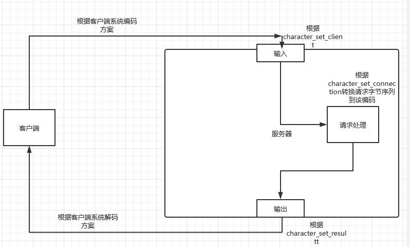


------


### Inndb

页是磁盘和内存的基本交互单位，也是存储空间的基本单位，默认大小为16KB


#### 行格式

##### COMPACT

其中compact分为以下部分

 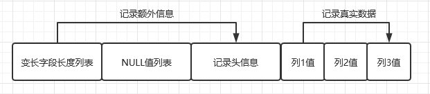

- 变长字段长度列表是存储VARCHAR变长字段的实际长度。那么实际上变长字段的存储需要==变长字段长度和实际数据的存储==。并且mysql中长度列表是逆序存放的。
- Null值列表存储那些允许设置为null值得列，如果值为1那么该列对应的实际数据就为NULL，注意这里也是逆序存放的
- 记录头信息存储的都是之后寻找数据删除数据需要的标记位等
- 存储的真实数据除了列的值以外，还包含了以下表格的值，下面跟事务有关的值对之后非常重要

| row_id       | 不是必须 | 6字节 | 行id     |
| ------------ | -------- | ----- | -------- |
| trx_id       | 是       | 6字节 | 事务id   |
| roll_pointer | 是       | 7字节 | 回滚指针 |


char的存储，在mysql中如果列采用定长编码，那么char的存储就是固定的，如果不是，那么char也是变长字段。==所以如果才用的是定长编码，char的大小一定要设置合理，不然就会浪费空间==


##### REDUNDANT

该格式是MYSQL5.0之前的格式，已经被淘汰

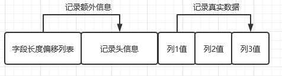

REDUDANT没有了COMPAT的变长变量记录表，对应使用字段长度偏移列表来代替

相应的REDUNDANT存储的是所有列的偏移信息，各列长度也是根据相邻偏移量来计算

NULL值得存储是根据偏移列表的对应二进制第一个bit来看，如果是1那么该列对应为NULL，注意一般用1个字节表示长度，==因为第一个bit用来表示NULL了，所以只有7个bit来表示长度也就是0-127==如果长度大于127就要用2个字节来表示


##### 溢出列

当数据过多时候，一个页只能存储16KB数据也就是16384字节，页装满的时候，页会把真实数据分配到其他页中，==该页相应会把一列用来存储溢出页的地址==，该列称为**溢出列**

COMPACT和REDUNDANT在处理溢出上是相同的，只存储768字节真实内容和额外存储溢出页的地址

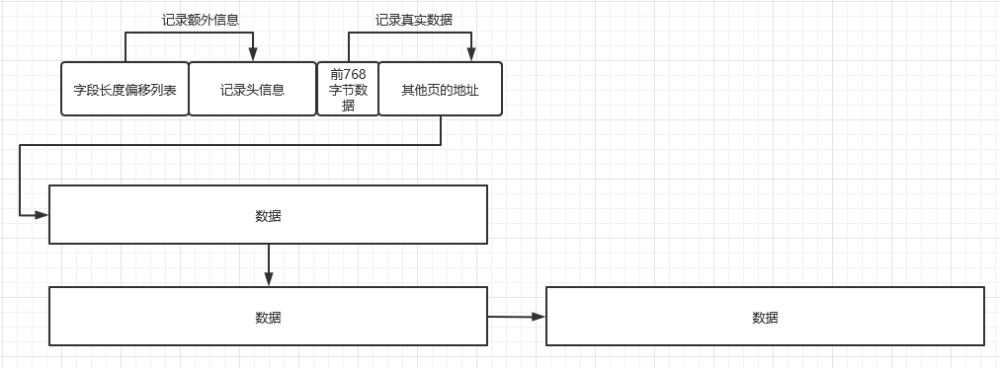


##### DYNAMIC

是MYSQL5.0的默认行格式，与COMPACT几乎一样，只是在处理溢出列时候不一样

DYNAMIC不会把真实数据存储在溢出列中，而只包含了20字节的地址指向和数据长度


##### COMPRESSED

COMPRESSED与上面不同的是采用压缩算法对页面进行压缩，减小存储空间


------


#### Page结构

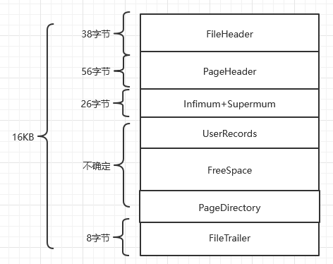

##### UserRecords和FreeSpace

页在刚开始分配空间时候其实是没有UserRecords的，随着记录的添加从FreeSpace中分配空间存储记录这时候UserRecords才慢慢增加

UserRecords中存储的就是我们的数据记录，这里我们以COMPACT行格式存储


###### 头信息字段

我们分析一下记录头信息的字段

| 预留位1      | 没有使用                                                     |
| ------------ | ------------------------------------------------------------ |
| 预留位2      | 没有使用                                                     |
| deleted_flag | 标记记录是否被删除                                           |
| min_rec_flag | B+非叶子节点最小目录项记录被添加该标记                       |
| n_owned      | 一个页面的记录会被分组，n_owned不为0代表是带头大哥，数量指代该分组的记录数 |
| heap_no      | 表明当前记录在页面堆得相对位置                               |
| record_type  | 表明记录类型，0为普通，1表示b+树非叶节点的目录项记录，2表示Infimum记录，3表示Supermum记录 |
| next_record  | 指向下一条记录的相对位置                                     |

 为了对上面的字段有更好理解

这里模拟插入四个记录，查看UserRecord里面存的记录

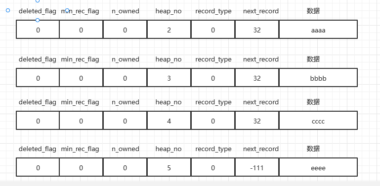

- deleted_flag:为0表示记录没有被删除，为1则为删除，但这里的删除不是真的从磁盘抹去，而是mysql象征性的打了个标志，。并且所有被删除的记录都会连成一个垃圾链表。
- min_rec_flag：暂时不谈
- n_owned：暂时不谈
- heap_no：表示记录排列称为堆，按照相对顺序来排列，以小到大升序，我们看上面的heap_no发现没有0和1，是因为mysql预留了这两个数字给==页面最小记录Infimum和最大记录Supermum==，因为这两条记录是默认创建的，就不放在UserRecords中，而是存放在页的**Infimum和Supermum结构中**
- record_type：一般用户的插入数据记录就为0,Infimum和Supermum就是2和3
- next_record:当前记录到下一条记录的相对位置，正数代表向后查找，负数代表向前查找

下图为从最小记录到最大记录的链表

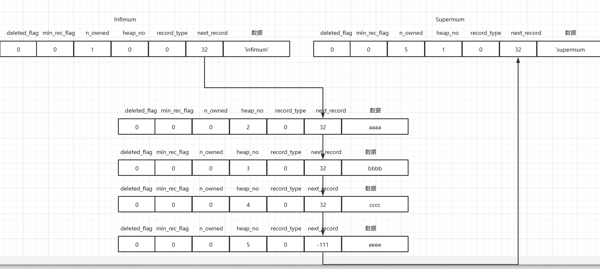


##### PageDirectory

我们会发现当页中记录比较少的时候，我们可以遍历整个页来查找对应记录

可是记录过多的时候会很耗费时间

mysql规定的记录进行分组，我们可以看到上图中的Infimum和Supermum中的n_owned为1，而Supermum为5

分组流程：

1. 将所有记录分成几组
2. 每个组的最后一条记录（也就是heap_no是最大的）作为组的带头大哥对应字段==n_owned==
3. 将带头大哥的偏移量提取出来放在PageDirectory中存到槽，每个槽占用2字节范围为0~65536


我们可以看到下图左边就位PageDirectory的结构包含了两个槽

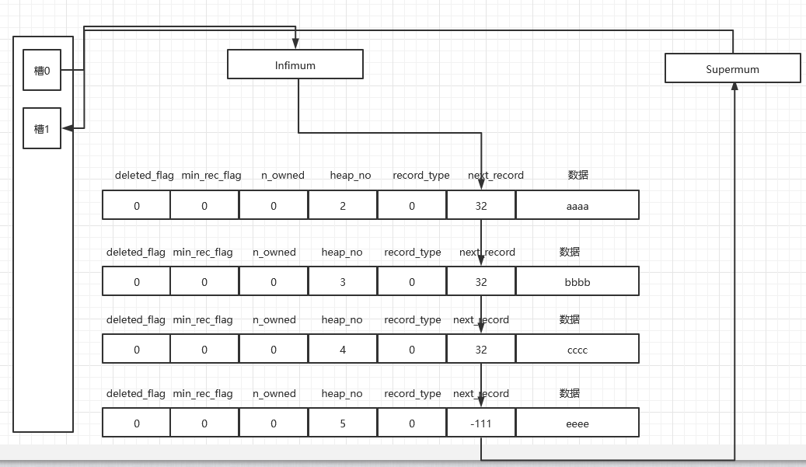


查找主键记录的流程

1. 根据二分查找在槽中查找小于槽对应主键且越接近的
2. 找到对应槽中最小的记录，根据next_record字段遍历槽找到对应主键记录

##### 

##### PageHeader

存储了数据页中的记录的状态信息如存储了多少记录，页目录有多少个槽等

如PAGE_N_DIR_SLOTS何PAGE_LAST_INSERT字段


##### FileHeader

存储了通用于各种页的信息，比如页的编号，上个页和下个页

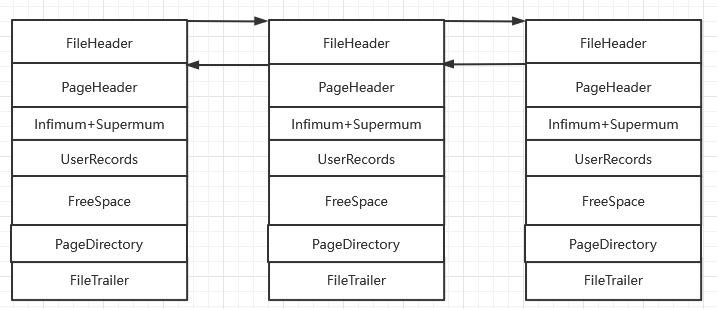

##### FileTailer

与FileHeader配合来保证数据的完整性


#### B+树索引


##### b树和b+树区别：

1. 非叶子节点不存储数据
2. 叶子结点存储数据，并用双向链表连接，支持范围查找
3. 因为非叶子结点不存储数据，所有可以分出更多的子节点，那么深度要低于b树


现在我们知道查找记录时候可以根据主键快速定位记录位置

但是如果用了非主键的列的话只能一个个记录查找


当前还有个问题是查找页中的记录我们是使用PageDirectory的目录二分查找到相关记录的，但是如何找到记录所在的页呢，页只是单纯用双向链表连接，只能==慢慢遍历==，速度可想而知的很慢

==那么能不能也对页建立目录来帮助快速查找呢==

这里我们规定：

1. 前一个数据页最大的记录小于下一个数据页最小的记录
2. 给所有页建立目录项，目录项包含了最小记录数和页号

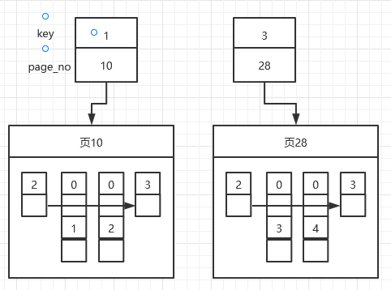

mysql大叔发现这个目录项记录也可以当成用户记录来管理，只不过存储的信息不同而已，Innodb是根据记录的recordtype来区分目录记录和数据记录的，我们回忆以下

==表明记录类型，0为普通，1表示b+树非叶节点的目录项记录，2表示Infimum记录，3表示Supermum记录==

这里的1就是目录项记录

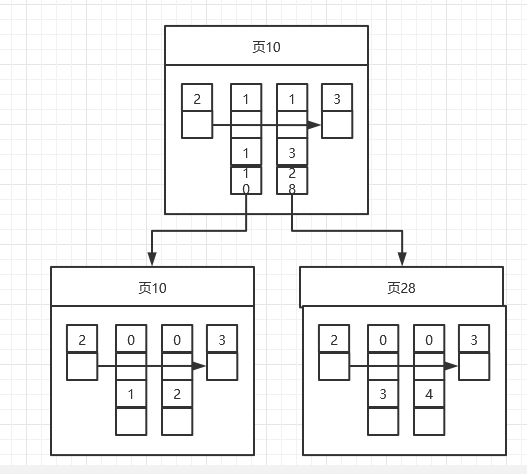

还有就是我们前面提到的<a href="#头信息字段">头信息</a>中还包含了min_rec_flag目录项纪录都为1，普通数据为0


这里我们称上面的结构为B+树结构，存放数据的地方为叶子结点


##### 聚簇索引

具有两个特点：

- 使用记录==主键值==的大小进行排序和分组
- 存储的是完整数据记录

目录项存储的是主键值和页号

##### 二级索引

具有的特点:

- 以==索引列==的大小进行排序和分组
- 存储得不是完整记录，是索引列和主键
- 目录项存储的是索引列、页号还有主键（主键是为了保证唯一性，因为索引列可能不唯一有重复）

二级索引没有保存完整记录是为了节省空间，二级索引需要在叶子结点中找到对应记录的主键，根据主键到聚簇索引中找到完整记录，这个过程叫==回表==


创建和使用索引注意事项

1. 只为用于搜索、排序和分组的列建立索引

2. 索引列类型尽量小，减少不必要空间浪费

3. 尽量使用覆盖索引（索引包含了需要输出的列值），减少回表操作

4. 让索引列单独出现在搜索条件中

5. 为了减少聚簇索引的页面发生分裂，用主键的auto_increment

6. 定位并删除冗余和重复索引，比如本来就有联合索引(key1,key2,key3)，那么就没有必要单独建立一个key1索引了

   
##### 索引面试

###### 最左前缀匹配  

联合索引查询，查询字段必须匹配联合索引最左边才能进行索引查询

   

   

   


#### 表空间

##### 系统表空间

在MYSQL5.57到5.6.5之间，表中的数据会默认存储到系统表空间，名字叫ibdata1

系统表空间在结构上与独立表空间几乎一样，可以先查看独立表空间再回头看系统表空间

==只是在第一个组中会存储一些特殊的页面==，3-7号页面类型如下


| 页号 | 页面类型 | 描述                   |
| ---- | -------- | ---------------------- |
| 3    | SYS      | 存储changebuffer头信息 |
| 4    | INDEX    | 存储changebuffer根页面 |
| 5    | TRX_SYS  | 跟事务系统相关         |
| 6    | SYS      | 第一个回滚段的信息     |
| 7    | SYS      | 数据字典头部信息       |

MYSQL为了更好管理用户的表，创建了一些元信息来管理，这些元信息由内部系统表来记录，他们也是以B+树存储。其中SYS_TABLES,SYS_COLUMNS、SYS_INDEXS、SYS_FIELDS称为基本系统表，我们的用户创建的表信息也会存储在里面。

==这些表的元数据是被硬编码到代码中的，在页号7的页面可以找到这几个表的聚簇索引根页面的页号==


##### 独立表空间

在MYSQL5.6.6之后，每个表都会对应一个独立表空间，名字叫表名.ibd

那么在表对应目录下会有

表名.frm  表的结构

表名.ibd   表的数据


###### 区

我们知道查找数据是由双向链表组成的页和单向链表组成的记录来查找的，如果双向链表连接的页不是在物理上连续的话，那么如果磁盘是机械硬盘的话，每次都需要重新定位磁头，这样会浪费I/O，损耗性能，所以MYSQL为了提高性能，引入了==区==的概念。


解决：区就是在物理上连续的64个页组成的空间，一个页16kB，一个区就是1MB，当表中数据非常多的时候，为某个索引分配空间不再是以页为单位分配了，而是以区为单位分配空间。

同时每256个区成为一个==组==

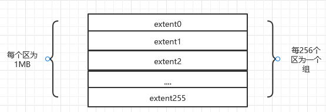


###### 段

同时在B+树查询的时候，如果不区分叶子结点和非叶子节点，所有节点存放在一个区中，那么扫描效果必然会很差。

解决：叶子节点和非叶子结点分开存储，叶子结点存储的位置称为叶子结点==段==，非叶子节点叫非叶子节点==段==，段以区为默认单位申请空间


###### 碎片区

段是以区为单位申请存储空间的，Innodb默认情况下会对一张表分为两个段，当数据量少的时候，几个页就占用了2MB的数据，这里会发现消耗了太多的内存

解决：MYSQL提出了碎片区的概念来解决上面的问题，在碎片区中的页面可以属于段A也可以属于段B，碎片区直属于表空间


==分配策略==：

1. 刚开始向表中插入数据的时候，会在空闲碎片区中以单个页面来分配
2. 但某个段占用了32个碎片页面后，会以完整的区来申请空间


###### 区的分类

- 空闲区：现在还没有用到区中的任何页面
- 有剩余空间的碎片区：碎片区还有没有被分配的页面
- 没有剩余空间的碎片区：碎片区没有可以分配的页面
- 附属于某个段的区

对应四种状态

| 状态名    |         含义         |
| --------- | :------------------: |
| FREE      |        空闲区        |
| FREE_FRAG |  有剩余空间的碎片区  |
| FULL_FRAG | 没有剩余空间的碎片区 |
| FSEG      |   附属于某个段的区   |


当数据量过少的时候，首先查看表空间有没有FREE_FRAG状态的区，有的话就从里面申请页，如果没有，就查找FREE的区，从里面申请页空间，并把区状态设置为FREE_FRAG，之后申请页都从该区分配，直到没有空间分配，是这状态为FULL_FRAG，==那么怎么直到表空间哪些区是FREE_FRAG，哪些是FREE呢？==


MYSQL提出了一个叫XDES Entry的数据结构

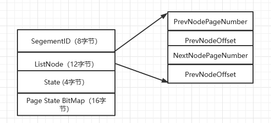

- SegementID：表明该区属于哪个段
- ListNode：指向了前一个XDES Entry和后一个XDES Entry
- State：参见前面区状态
- Page State BitMap：16字节就是128位，一个区64页，每个页对应了2位，第一个位表示了该页是否使用，第二个位还没有用到

回到问题==那么怎么直到表空间哪些区是FREE_FRAG，哪些是FREE呢？==

XDES Entry把相同状态的区连成一个链表

如FREE链表、FREE_FRAG链表、FULL_FRAG链表，==那么这么才能知道链表头结点和尾结点==

在表空间的固定位置会保存了对应链表的头尾节点和链表成长度如下

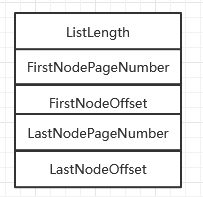

每个段中区对应的XDES Entry结构建立三个链表

- FREE链表
- NOT_FULL链表
- FULL链表

==注意每个索引都会对应两个段==叶子结点和非叶子结点段，每个段3个链表，并且表空间还有3个链表


段的详细结构INODE Entry

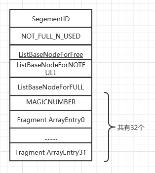

- segementid：段号
- NOT_FULL_N_USED：NOT_FULL_LIST用了多少页面
- 三个链表代表段下属的区
- FragmentArrayEntry是碎片页

这里我们可以看到段就是有==完整的区和零碎的页组成的==，32个页是因为段分配了32个零碎页后就以区为单位分配资源了


###### 页面详解

这里我们详细介绍下各类页面

| FIL_PAGE_TYPE_ALLOCATED | 最新分配，还未使用     |
| ----------------------- | ---------------------- |
| FIL_PAGE_INODE          | 存储段的信息           |
| FIL_PAGE_IBUF_BITMAP    | ChangeBuffer的一些属性 |
| FIL_PAGE_TYPE_FSP_HDR   | 表空间头部信息         |
| FIL_PAGE_TYPE_XDES      | 存储区的一些属性       |
| FIL_PAGE_TYPE_BLOB      | 溢出页                 |
| FIL_PAGE_TYPE_SYS       | 存储系统数据           |
| FIL_PAGE_INDEX          | 数据页                 |


==FIL_PAGE_INDEX==：存储数据的页，这也是我们前面重点介绍了

==FIL_PAGE_TYPE_BLOB==：数据页过多的话就会连接溢出页

==FIL_PAGE_TYPE_FSP_HDR==：该类型只在独立表空间第一个组，页FSP_HDR

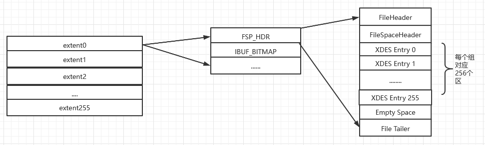

| FileHeader      | 文件头部   | 38    |      页的一些通用信息       |
| --------------- | ---------- | ----- | :-------------------------: |
| FileSpaceHeader | 表空间头部 | 112   |  表空间的一些整体属性信息   |
| XDES Entry      | 区描述信息 | 10240 | 存储本组256个区对应属性信息 |
| EmptySpace      |            |       |            没用             |
| FileTailer      | 文件尾部   | 8     |       校验页是否完整        |

**FileSpaceHeader**存储了直属于表空间的三个链表的基节点、段id的当前最大id数、SEG_INODES_FULL链表和SEG_INODES_FREE链表，存放的是段对应的页（==FIL_PAGE_INODE==）

==FIL_PAGE_TYPE_XDES==：该结构其实跟第一个组的第一个页FSP_HDR很像，但FSP_HDR存储了跟表空间相关的信息，而XDES没有这些，其余基本相同

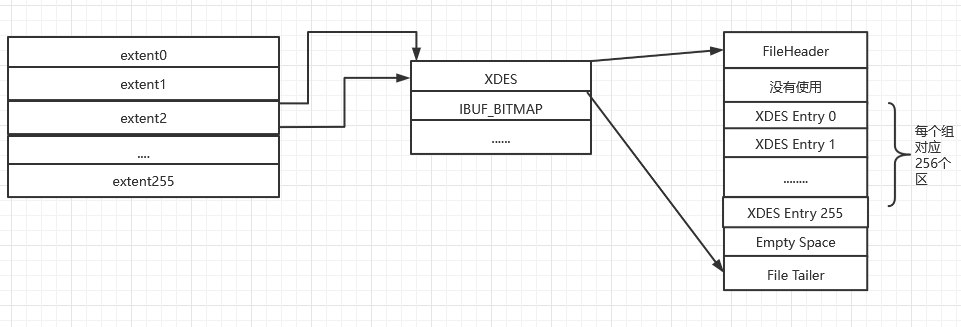

==FIL_PAGE_IBUF_BITMAP==：跟ChangeBuffer相关的页，跟增删改操作相关

==FIL_PAGE_INODE==：为了存储段的INODE Entry结构

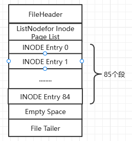

如果一个表空间超过了85个段，那么一个INODE页面就无法存储了，需要新的页面来存储，为了方便管理该类型页面，MYSQL将INODE页面串成了两种类型：

SEG_INODES_FULL链表：INODE类型页面已经没有空闲空间存储额外的INODE Entry结构

SEG_INODES_FREE链表：INODE类型页面还有空闲空间

这两张链表其实对应就是上面FSP_HDR页面下的FileSpcaeHeader中存储的两个链表基节点


#### 单表访问方法

MYSQL会根据优化结果生成一个执行计划，该执行计划表明了应该使用那些索引进行查询等


==访问方法==：MYSQL把执行查询语句的方法称为访问方法

| const       | 常量级访问，主键等值查询或者唯一二级索引等值查询             |
| ----------- | ------------------------------------------------------------ |
| ref         | 普通二级索引等值查询，因为可能要回表，并且有重复数据要慢于const |
| ref_or_null | 查询条件多了个NULL                                           |
| range       | 索引扫描区间是一个范围                                       |
| index       | 只需要查询二级索引包含的列，如select选择联合索引(key1_part,key2_part,key3_part)，查询条件是索引中的列 |
| all | 全表扫描                                                     |


##### 多表连接原理

==嵌套循环连接==：选取驱动表，使用与驱动表相关的过滤条件，选取代价最低的单表访问方法来执行对驱动表的查询。把驱动表获得每一个结果记录分别到被驱动表中查询匹配记录。很慢

上面的方法如果记录上百万上千万的话，驱动表中的记录会多次到被驱动表中查询，而被驱动表中因为数据过多而不能都装载在内存中，往往前面的记录在内存后面的记录在磁盘中，而驱动表记录会多次查询导致被驱动表记录频繁从磁盘加载到内存中，增加了I/O操作，所以有了下面的方法。


==基于块的嵌套循环连接==：MYSQL使用==Join Buffer==把驱动表中的记录加载一部分到内存中，他会把这些记录在内存中与被驱动表中的记录一次性来进行匹配，显著较少了I/O代价

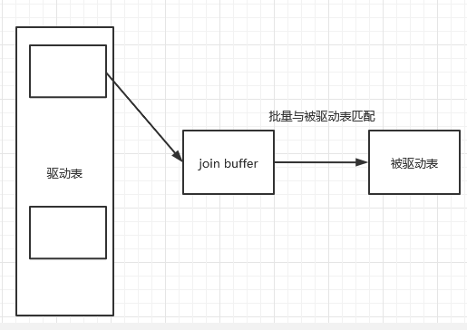


##### 统计数据收集

如下，MYSQL会把表的一些统计信息存到表中，供后续的计算执行计划做准备，其中的字段含义如下

n_rows：代表了该表数据记录数

clustered_index_size：表示聚簇索引占的页面数

sum_of_other_index_sizes：表示其他索引占得页面数

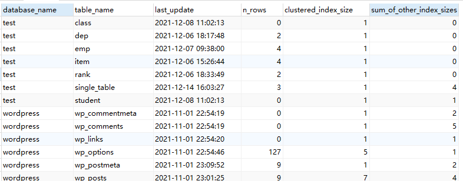


==注意上面的n_rows是估算的==，Innodb会选取几个叶子节点页面，统计页面中的记录数量，然后算一个页面的平均值，之后乘上所有叶子节点的数量


==clustered_index_size和sum_of_other_index_sizes是怎么计算的呢？==

我们知道一个索引对应两个段，分别为叶子节点段和非叶子节点段，那么就需要找到这两个段然后计算段所占的页面

1. 先去系统表的SYS_INDEXS中查找对应索引的根页面信息

2. 然后再该页面的Page_header中找到PAGE_BTY_SEG_LEAF和PAGE_BTR_SEG_TOP，这两个存了段对应的Segement Header信息

3. 然后根据信息找到INODE entry

4. 在段信息里就包含了零碎页面信息和三个链表的基节点(FREE、NOT NULL、FULL）

5. 统计零碎页和三个链表中的区对应的页，一个区对应64个页，就是一个索引的页面数量，如果这里求的是聚簇索引，那么这里就是==clustered_index_size==

6. 把其他索引的页面相加就是==sum_of_other_index_ sizes==15

   


#### Explain详解

下面是用explain输出select语句的信息

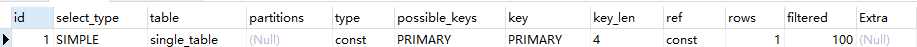

| 列名          | 描述                                                         |
| ------------- | ------------------------------------------------------------ |
| id            | 一个select对应、\|-唯一id                                    |
| select_type   | 查询类型                                                     |
| table         | 表名                                                         |
| partitions    | 匹配的分区信息                                               |
| type          | 针对单表的访问方法                                           |
| possible_keys | 可能用到的索引                                               |
| key           | 实际用到的索引                                               |
| key_len       | 实际使用索引长度                                             |
| ref           | 如果访问方式const、ref这种的话，ref展示了与索引列进行匹配的东西是什么，可以是常数可以是另外一张表的列，也可以是函数 |
| rows          | 预估读取到的记录数                                           |
| filtered      | 经过搜索条件过滤后剩余的记录条数百分比                       |


#### Buffer Pool

当要访问一个页的时候，需要从磁盘加载到内存，才能读写访问，那么每次的I/O读写会很耗时间

**MYSQL**为了缓存页就提出了提前划分一段内存空间来存储部分页数据，叫**Buffer Pool**

结构图如下

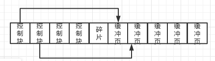

==缓冲页==与页面大小相同为16kb，为了更好管理缓冲页，用了==控制块==来存储该页所属表空间、页号和缓冲页在**Buffer Pool**中的地址等


##### Free链表

但是怎么知道哪些缓冲页被分配了哪些没有呢

**MYSQL**使用了free链表来存储没有被分配的页，并且额外分配了一个内存空间来保存该链表的基节点

每当需要从磁盘加载页到Buffer Pool种时候，就从free链表中取一个空闲节点，并把该节点对应的控制块填入信息，把该节点从链表中删除


##### 缓冲页的hash

当我们要访问某个页面，需要先查看BufferPool中有没有，我们如果是按顺序查找，肯定浪费时间

**MYSQL**使用了哈希来映射

具体**key**为表空间和页号

​		**value**为控制块

所以查找的时候是先通过hash访问到控制块，之后再控制块中查找到对应页所在地址，访问页中的记录


##### flush链表

当有页面被修改的时候，在**BufferPool**没有刷新到磁盘的页为==脏页==

为了保证没有脏页我们可以每次修改后就刷新，但是频繁的修改会影响程序的性能

所以用到flush链表，用来保存被修改的页，然后异步的在一定时间写回到磁盘，结果上与free类似


##### LRU链表

当需要缓存的页占用内存过多的时候，**BufferPool**就没有空间了，当有新的页请求时候，没有空间给他分配，这时候就需要把内存中一些页换下来

那么该换哪些页呢？

**MYSQL**使用的是==最近最频繁策略==（LRU），也就是最近最少使用的页会换下去

- 当该页不在内存时候，就把该页就在到缓冲页中，并把该缓冲页对应控制块放到LRU链表头部
- 当该页在内存，又被访问到了，就把该页对应控制块放到LRU链表头部

同样LRU链表尾部的就是访问较少的页


##### 性能优化

根据主机的IO性能调整Innodb刷脏页的策略

通过设置innodb_io_capacity来告诉，该值对应磁盘IOPS


#### redo日志

假如在事务提交后突然发生了故障，导致内存中的数据丢失，那么这个提交的事务在数据库中做的更改也会丢失，这是我们不能容忍的

这里可以用事务提交之前，就把事务修改的页面刷新到磁盘

问题：

- 刷新一个完整数据页太浪费了，如果只改了1字节数据，却需要刷新16KB的数据到磁盘，浪费时间
- 一个事物包含多个语句，可能修改了多个页面，多个页面并不连续，那么把修改的页面刷新到磁盘需要随机I/O，随机I/O很慢

==这里我们只想要让已经提交的事务修改能永久生效，即使后来崩溃了也能恢复，可以把修改的内容记录下来以便未来恢复==

提出了**redo日志**

1. redo占用空间非常小
2. redo是顺序写入磁盘的


##### 推荐配置

4个文件，每个文件1GB


##### 格式

- type：redo日志类型
- spaceId：表空间id
- page number：页号
- data：redo日志具体内容

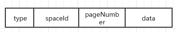


##### Mini-transaction

把底层页面进行一次原子访问的过程称为**mini-transaction**

比如向聚簇索引B+树插入记录，如果涉及到树分裂，就需要创建一颗新树，把记录一部分复制到新树上，并把新纪录插入到一个树中，并且还需要在内节点上指向该新树。这里必须保证原子性，不能创建了一棵树后系统奔溃了，恢复后新树还存在，而分裂没有完成，这是不可容忍的。


可以看到一个事务包含多个语句，一个语句包含多个**mini-transaction**，一个**mtr**包含多个redo记录

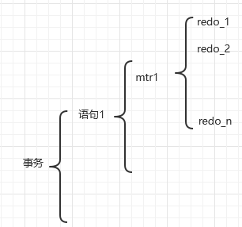

##### 写入过程

为了更好管理**redo**日志，把MTR生成的**redo**日志放到一个512字节的**block**中

可以看到数据内容在中间的**body**中占用496字节，头部占了12字节

- HDR_NO：表示block唯一编号
- DATA_LEN：block已经使用的字节
- FIRST_REC_GROUP：
- CHECK_POINT_NO：checkpoint序号
- CHECKSUM：校验和正确性检验

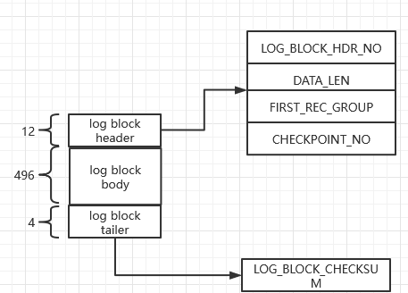

###### 日志缓冲区

**redo**日志同样会在内存中申请空间暂时存储日志记录，待时机合适才会写到磁盘，这个内存叫**log** **buffer**

该空间为连续空间

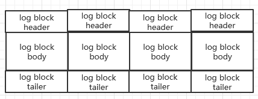

向log buffer写入日志是顺序写入的，那么就需要一个全局变量**buf_free**来指向当前redo日志该写入的block位置


##### **redo**日志文件

在磁盘在中存储**redo**日志的文件不止一个，如下

并且每个**logfile**前四个**block**是管理信息，后面的block才是真的存储redo日志的**block**

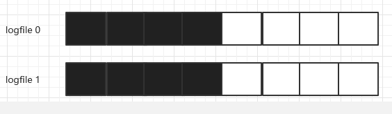

下面就是前四个block，其中checkpoint的属性是

- LOG_CHECKPOINT_NO：checkpoint编号，每执行一个就加1
- LOG_CHECKPOINT_LSN：服务器在结束checkpoint时对应的lsn值
- LOG_CHECKPOINT_OFFSET：lsn值在redo日志文件组的偏移量

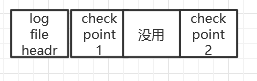

##### LSN

上面我们提到的LSN（log sequence number）也就是个序号而已

默认初始为8704


每一组MTR生成的redo日志都有唯一的lsn值，lsn越小代表日志生成的越早


##### flushed_to_disk_lsn

**mysql**用**flushed_to_disk_lsn**该值表示哪些redo日志被写回了磁盘

从下图可以看到**flush_to_disk**还没有数据写回到磁盘时候，指向了初始位置，并且**logfile****只保存了文件的管理结构**，其余空间为空闲

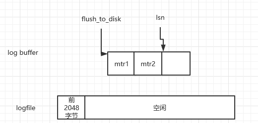

当有新的**redo**记录来的时候，就会更新**lsn**值，**flushed_to_disk_lsn**不变，随着不断有**log** **buffer**的记录刷新到磁盘后，**flushed_to_disk_lsn**才会增长


flush链表的脏页是按照页面的第一次修改时间进行排序的，会对缓冲区中的控制页属性进行修改

- oldest_modification：第一次修改Buffer pool中缓冲页时，将修改页的MTR开始时对应的lsn值给他
- newest_modification：每修改一次页，就把MTR结束时候的lsn值给他，多次更新只会更新该值


##### checkpoint

日志文件的容量有限，不得不选择循环使用日志文件，也就是会把新内容覆盖那些已经写入磁盘的redo日志

**MYSQL**用了**checkpoint_lsn**来记录当前可以被覆盖的redo日志总量，每当页被刷新到磁盘后，该值就会增加


步骤：

1. 计算当前系统可以被覆盖的redo日志对应的lsn最大值
   1. 从flush链表的尾部取出控制块的**oldest_modification**对应的lsn值，**oldest_modification**的值赋值给**checkpoint_lsn**，小于该lsn值得redo日志都可以被覆盖
2. 将**checkpoint_lsn**与对应的redo日志文件组偏移量以及**checkpoint**编号写到日志管理信息的**checkpoint1**或者**checkpoint2**中
   1. **check_no**表示了执行多少次**checkpoint**了
   2. 当**checkpoint_no**是偶数时候存到**checkpoint1**中，奇数到**checkpoint2**中


##### 崩溃恢复

对于小于**check_lsn**值得redo日志可以肯定是被刷新到磁盘了，而对于大于的值就不确定是否刷新到磁盘了，就需要找到**checkpoint_lsn**所在redo日志恢复了

redo日志文件组管理信息有两个block都存储了**checkpoint**，就需要比较他们两个的**checkpoint_no**，找出最大的说明存储了最近的**checkpoint**信息，拿到其中的**checkpoint_lsn**以及它在redo日志文件组的偏移量

那么起点确定了，恢复的终点呢？就是某个log buffer不为512字节的就是终点block了


###### 怎么恢复

redo日志根据表空间和页号作为key，控制页作为value的hashmap来存储，并且把同一个表空间和页号的redo日志放到同一个槽中，用链表来存储，以时间先后顺序排序，==参考java1.7的hashmap==

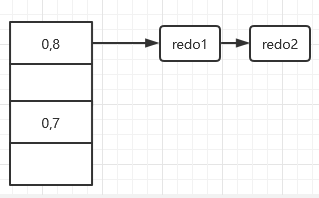

参照这个结构可以发现，对同一页面的恢复很快，可以一次性修复


==如何判定一个大于**checkpoint_lsn**的页是否已经刷新到磁盘==

每个页面都有一个称为File Header的部分，在**FileHeader**中有一个称为**FIL_PAGE_LSN**的属性，该属性记载了最近一次修改页面时对应的lsn值，如果在做了某次**checkpoint**后有脏页刷盘，那么该页对应的**FIL_PAGE_LSN**代表的lsn值肯定大于**checkpoint_lsn**值，凡是符合这种情况的页面就不需要重复执行lsn值小于**checkpoint_lsn**的redo日志了。


#### undo日志

回滚：事务执行过程中可能修改了很多东西，突然发生意外，没有完全执行完事务，为了保证原子性，就需要改回事务之前的样子。

undo日志：为了能成功回滚而记录的日志


##### 事务id

下面为一行记录对应的三个隐藏列

- **row_id**：前面提过就是没有提供主键情况下自动生成的主键
- **trx_id**：是每个事务对应的id
- **roll_pointer**：指向了记录对应的undo日志的位置


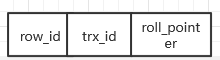

##### undo页


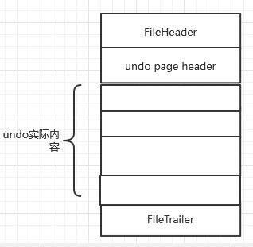

其中的**undo_page_header**结构如下

- type：表示了undo日志类型，主要分为**INSERT**和**UPDATE**类型，第一种日志可以直接删除，第二种不能直接删除，需要为MVCC服务
- start：表示页面存储redo日志开始位置
- free：页面最后一个redo日志的结束位置
- node：表示节点

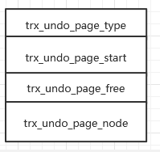

###### undo页面链表

因为一个事务可以有多个语句，每个语句会涉及多条记录更改，每个记录的更改都涉及1-2条undo记录，那么一个事物可能产生很多个undo日志，一个页面可能放不下，就需要多个页面来存放，**MYSQL**使用链表来存储这些页

上面提到的**INSERT**和**UPDATE**两种undo类型是分成两个链表来存储的

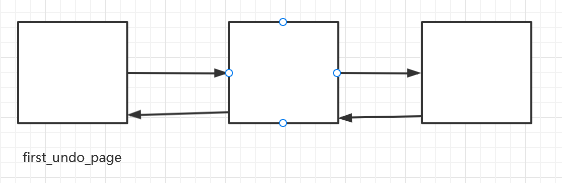


注意第一个节点**fisrt_undo_page**存储了该链表的一些管理信息


##### undo段

回忆一下，之前段的结构对应**INODE_ENTRY**

段是由零碎的页号和连续的区组成的


#### binlog

binlog可以保存全量的数据与redo log不同处

1. redo log是Innodb特有的，binlog是server层特有的，所有引擎都可使用
2. redo log是物理日志，记录的是某个数据页的修改，binlog是逻辑日志，记录的是语句原始逻辑，如给id=2这一行的c字段加1
3. redo log是循环写，空间固定；而binlog追加写入，不会覆盖之前的日志


##### binlog和redolog

两个配合可以实现崩溃恢复

步骤为二阶段提交：

1. redo log进入prepare
2. binlog备份
3. redo log进入commit


Mysql恢复一般是判断redo log有没有commit，有的话直接提交，没有的话看prepare没，如果prepare了就去看binlog完备嘛，完备就提交事务，binlog和redo log是通过XID来连接事务的

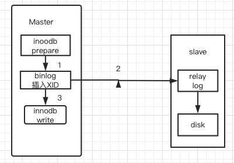


#### MYSQL分布式事务

通过二阶段提交，第一阶段，所有参与事务的节点Prepare，告诉事务管理器准备好提交了，第二阶段，事务管理器告诉节点是ROLLBACK还是COMMIT，如果有一个节点不能COMMIT，所有节点回滚

事务id为`XID`


#### change buffer

当需要更新一个数据页时，如果在内存那么直接更新，如果不在内存，更新操作缓存在change buffer中，之后需要访问该页时从磁盘读到内存然后更新数据，通过使用change buffer，能减少读磁盘，提升语句执行速度，提高内存利用率（减少占用buffer pool）


##### 何时使用

因为如果使用的是唯一索引更新，那么需要判断有没有一样的索引值需要加载到内存中，所以不能使用change buffer

只有普通索引可以，并且change buffer其实使用了一部分的buffer pool的内存

**并且只适用于写多读少的业务上**


##### 与redo log对比

redo log节省的是随机写磁盘的IO消耗

change buffer主要节省随机读磁盘的IO消耗


#### MVCC

每个聚簇索引都有两个隐藏列，一个是事务id，一个是roll_pointer（每次对记录修改时候，都会把旧版写入到undo日志中，该指针就指向之前的信息）


##### 版本链

所有的旧记录串联在一起就形成了版本链，版本链的头节点保存了最新的值


##### ReadView

对于读未提交，只需要读到最新版本就行

串行化通过加锁来实现

而对于读已提交和可重复读必须保证读到事务已经修改并提交的记录

核心问题在于：版本链中哪个版本是该事务可见的？


Mysql提出了ReadView

包含四个内容：

- m_ids：再生成ReadView时候，当前系统中活跃的事务id列表
- min_trx_id：再生成ReadView时候，当前系统活跃的读写事务最小事务id
- max_trx_id：再生成ReadView时候，系统应该分配给下一个事务的事务id
- Creator_trx_id：当前ReadView的事务id


有了ReadView后，在访问某条记录时候就会根据以下规则来判断哪个版本是可见的：

1. 如果被访问版本的trx_id等于Creator_trx_id，那么访问的是当前事务自己修改的记录，是可访问的
2. 当前的trx_id小于min_trx_id，那么表明该版本是已经提交事务所做的修改，可访问
3. 当前trx_id大于或等于max_trx_id，表明该版本的事务才启动，不可被当前事务访问
4. 如果trx_id在min_trx_id和max_trx_id之间，则需要判断trx_id在不在m_ids之中，在的话，事务还未提交，不可访问，不在的话，可以访问


##### 读已提交和可重复读区别

这两个实现的最大区别在于ReadView的生成时机不一样

使用ReadCommited时候，每次查询开始会生成一个独立的ReadView

使用Repetable Read的时候，第一次查询才会生成ReadView，保证了多次查询的结果是同一个版本的


#### 索引

##### 一致性读

事务利用MVCC进行读取操作称为一致性读，不需要进行加锁操作


##### 锁定读

###### 共享锁和独占锁

共享锁称为S锁，读取记录时候，需要获得该锁

独占锁称为拍他锁，X锁，事务修改记录需要获得


​	S和X不兼容

​	S和S是兼容的


Mysql提供两种特殊的Select语句来获得锁定读

获得S锁

```sql
select ... LOCK IN SHARE MODE
```

获得X锁

```sql
select .. FOR UPDATE
```


###### 多粒度锁

前面的锁都称为行级锁，粒度较细

也有表级锁，也分为了S锁和X锁


但表锁有个问题在于给表上X锁，需要保证没有其他的表锁或者行锁，那么我们是遍历所有记录的锁吗？

不是，Mysql提出了意向锁来需要加锁之前添加意向锁，表明自己想要加锁，提醒其他事务

意向锁可以帮助加锁的时候快速判断表中是否有锁


###### Innodb的行级锁

1. Record Lock：给一条记录加锁
2. Gap Lock：间隙锁，为了解决幻读而提出来的，给一条记录前面的间隙加锁
3. Next-key Lock：Record和gap的合并体，锁住当前记录和前面的间隙
4. 隐式锁：根据记录的row_id，当前事务查看row_id是否已经提交，如果是的话，给当前记录创建X锁结构，之后自己进入等待状态。隐式锁起到了延迟生成锁结构的用处


##### 前缀索引

对于邮箱建立前缀索引是不错的

只包含对应列前面的值建立索引

虽然前缀索引占用内存空间小，但前缀索引只包含部分值，使得查询的行数增加了

那如何选择比较好的前缀长度


根据区分度来选择长度

如下面的代码，根据比例选择相对区分度高的


但前缀索引缺点含包括：可能的回表，如果需要输出该索引列的值，不管前缀有没有包含该索引的全部长度，MYSQL无法判断所以必须回一次表查找该索引列的值
