# 11.29周笔记

本来是在aisca平台上测试，改为了用ASCAD上没有超参数寻优cnn模型，但显卡经常挂掉，超参数寻优时间又长，怕训练一半挂掉。但后面发现没有超参数寻优的固定其余变量的对比是不合理的，本周在实验上的工作量是不足的

卷积和池化步长都2，池化使用最大池化

卷积核大小32/11/11/11

==抖动50==

下图fc代表包括输出层由3个全连接

rmfc2删除第二个全连接

rmfcall删除两个全连接

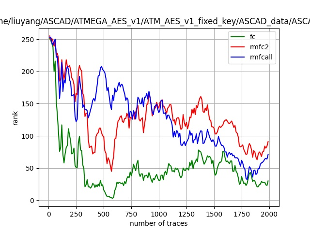

ASCAD准确度不高的问题

猜测熵求的是正确密钥在密钥概率分布的位置的平均排名

比如三次的正确密钥排名为0 2 4那么最终猜测熵为（0+2+4）/3 =2

而平均准确度为 因为只有一次猜对了（1+0+0）/3=0.33333  相当于分类中必须要分类正确一样

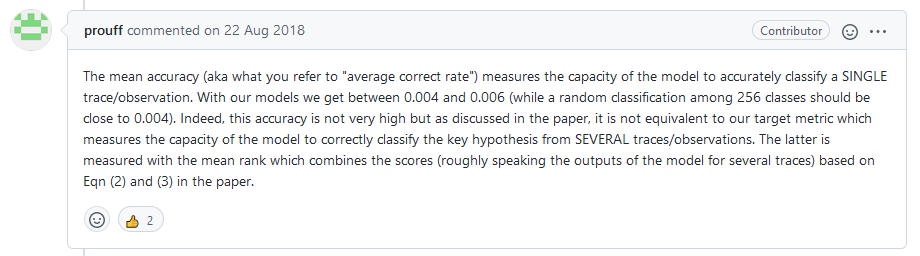

## 能量模型

在能量分析攻击中，通常将操作数映射为能量消耗值，这是一种对设备的能量仿真。

## 能量迹

能量迹可以分为四个部分：

​	操作依赖分量，数据依赖分量

​	电子噪声，每次采样都不同

​	常量部分，由晶体管转换活动造成的

其中前三个分量最重要
$$
P_{total}= P_{op}+P_{data}+P_{noise}+P_{const}
$$

其中Pexp为可利用信息，Pnoise为转换噪声
$$
P_{op}+P_{data}=P_{exp}+P_{sw.noise}
$$

下图为对一个时间多次取样后的能量分布，可以看到能量分布是服从高斯分布的

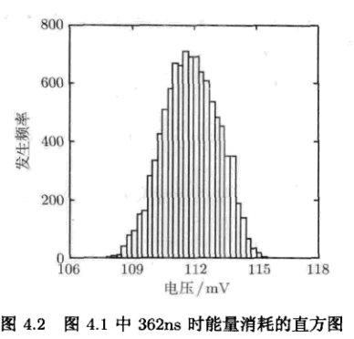

事实上，因为对同一操作做了相同的多次试验，那么这三个操作分量的方差应该为0
$$
Var(P_{op})=Var(P_{data})=Var(P_{const})=0
$$
那么其实可以说只剩下噪声方差组成高斯分布的方差了，噪声服从高斯分布
$$
P_{noise}\sim N(0,\delta)
$$

### 信噪比

SNR量化了能量迹中单点泄露的泄漏量，SNR越高，泄露信息越多

$$
SNR=\frac{Var（signal）}{Var(noise)}
$$
方差信号量化了可利用的信号造成能量迹变化的大小

### 能量迹多点特征

相邻点之间的电子噪声一般是相关的，下图为相邻点之间的相关性图

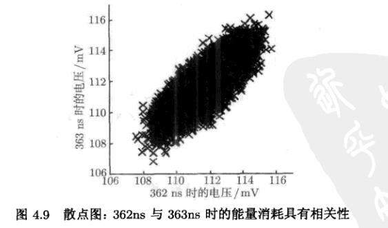

从统计学角度出发，可以基于协方差或相关系数来刻画能量迹两点之间的线性关系，协方差量化了偏离均值的程度
$$
Cov(X,Y)=E((X-E(X))\cdot(Y-E(Y)))
$$
相关性系数可以用协方差来度量两个值线性
$$
\rho(X,Y)=\frac{Cov(X,Y)}{\sqrt{Var(X)\cdot Var(Y)}}
$$
为了考虑点的相关性，需要通过多元高斯分布来对能迹进行建模

**On the Performance of Convolutional Neural Networks for Side-channel Analysis** *--*Stjepan Picek, Ioannis Samiotis, Annelie Heuser, Jaehun Kim, Shivam Bhasin, Axel Legay  2019

**1、提出了什么问题**

当前提出的神经网络模型在侧信道攻击中是否优于其他机器学习方法，或者在哪些特定情况下优于机器学习的

**2、解决了什么问题**

表明当前只考虑精度情况，卷积神经网络模型确实优于实验中的机器学习

**3、用了什么样的方法**

本文没有使用精度作为指标是因为其在数据不平衡的情况下，高精度仅仅意味着分类器将所有测量类归为主导类

作者先用精度来测试机器学习模型与CNN模型在DPAV2、DPAV4和带随机时延的数据比较

下面是用三个数据集的模型比较，我们可以看到CNN模型在精度指标下是优于机器学习的

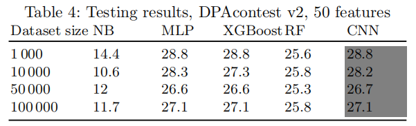

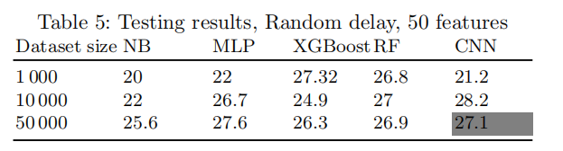

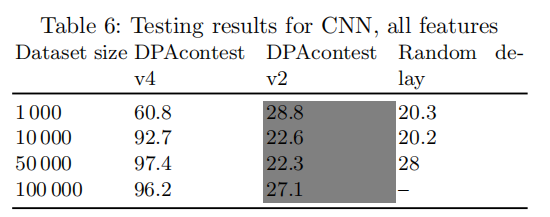

但是在GE和SR指标下，我们会发现CNN模型并没有想象中那么优秀，作者提出相对于cnn模型那一点的性能提高，其计算的复杂度真的是值得的吗

文中还提出在提到CNN时不应该只关心深度还有Cagli指出的数据增强方法来提高CNN性能，数据增强在图像处理中用来防止过拟合

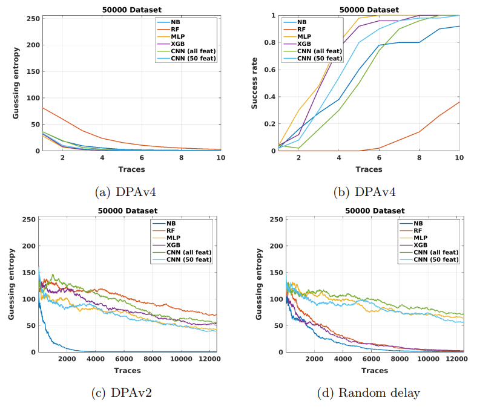

当然CNN模型在特点场景下表现良好，噪声水平低，测量数量大，特征数量多的场景下，在本文没有提到的研究中，对抖动防御的攻击上CNN有着天然的优势

下面文章中CNN模型的超参数和模型架构

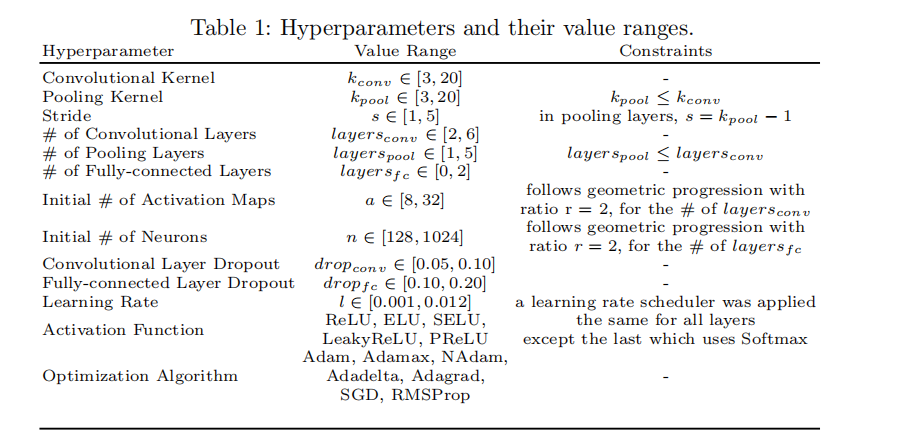

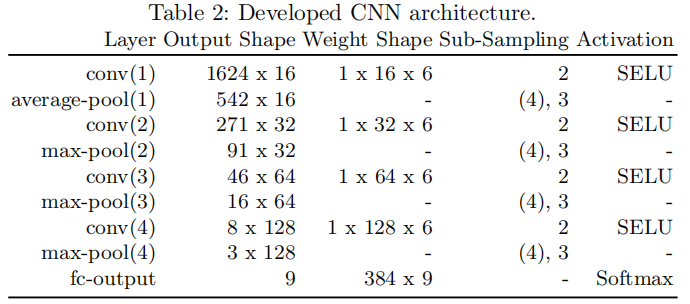

**Study of Deep Learning Techniques for Side-Channel Analysis and Introduction to** 

**ASCAD Database**  *--*Ryad Benadjila1 , Emmanuel Prouffff1 , Rémi Strullu1 , Eleonora Cagli2 and 

Cécile Dumas2 2016

**1、提出了什么问题**

前人用深度学习进行侧信道攻击时候只提到了自己的思路和想法，并没有提供准确的参数，使得后来的人不知道准确参数选择加大了复现的难度

**2、解决了什么问题**

解决复现难度高的问题，参考MNIST数据集制作了适用侧信道攻击的数据集ASCAD，并且该数据及专门用来训练深度学习模型，在此基础上训练了CNNbest和MLPbest模型

ASCAD数据集是基于AES加掩实现的，并且带有非同步（抖动）。抖动定义为N个点随机移动到了左边的位置，ASCAD包括了0,50,100的随机点移动。

**3、用了什么样的方法**

ASCAD分为训练和攻击，分为50000和10000数据

​		traces数据中包括了700个兴趣范围，大致在45400-46100点中

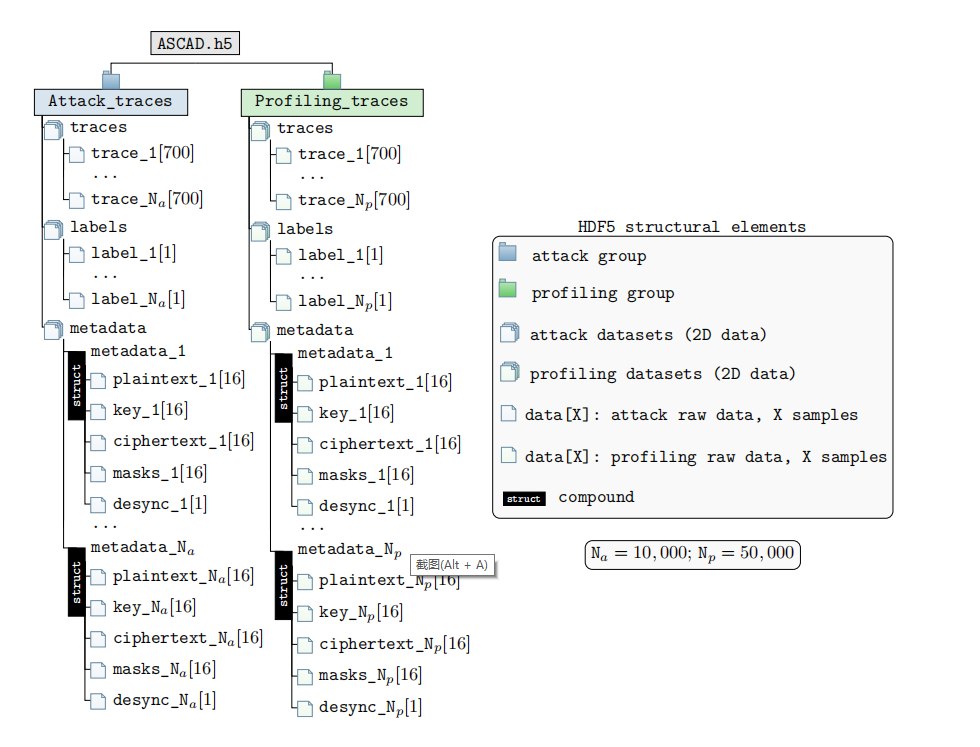

本文最大的贡献在于提高了ASCAD数据库为后面的人提供了大量的数据作为训练，但是作者在对超参数选择的时候都是基于控制变量法，每次只改变一个超参数，那么很显然作者是不会寻找到比较优秀的模型的，因为超参数与超参数之间的联系绝对不是独立存在的而是相互联系的。可以根据经验和超参数寻优来解决但肯定的是消耗时间和计算量是巨大的

## RNN

CNN模型预测的结果一般与上一次的结果和输入无关，而主语言和视频，因为每个数据都不是孤立存在的，那么就用到RNN了

RNN的每一个单元的输出都与两个变量有关
$$
S_t = f(S_{t-1}\cdot W,U\cdot X_t)
$$

### LSTM

长短期记忆解决了传统RNN在句子很长情况下不能存储最开始的内容的问题

1. 输入门：决定有没有数据输入到记忆单元
2. 遗忘门：决定记忆单元数据会不会被清楚
3. 输出门：决定记忆单元信息被输出出去

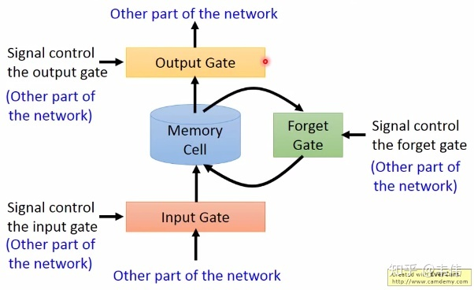

下图为上图的更具体结构

其中圆圈代表了激活函数

Z的激活函数是tanh，其代表了真正的输入

Zi，Zo和Zf代表了sigmoid，其作为三个门控装置，1代表了通过，0代表关闭

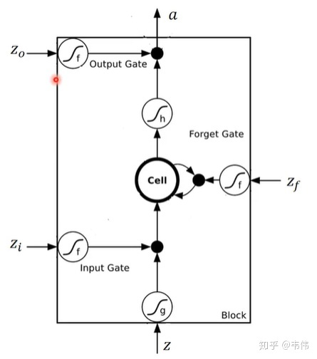

## 集成学习

### bagging

他是从数据集中有放回的选择数据，那么其拥有的数据平均来说是原数据集的63%，剩下的就是没有重复的数据可以作为验证集。

当其作为回归时候，把所有基模型的输出结果平均

当其作为分类时候，采用投票机制，投票最多的类为输出类

随机森林就是一种bagging，他把决策树作为基模型

下面为bagging的事例代码

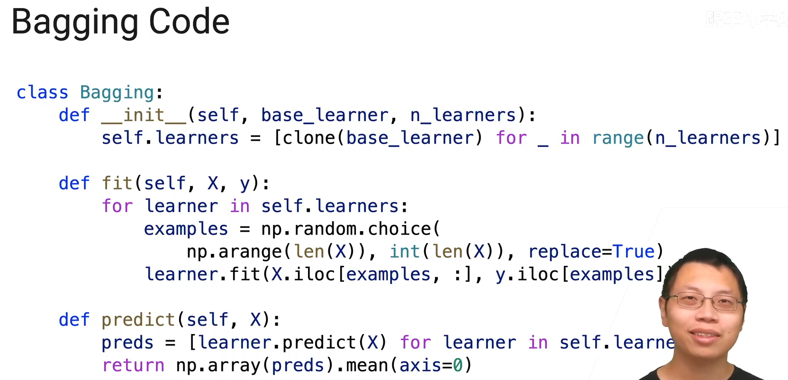

**特点**

在统计上采样1次和采样n次取平均，它的均值是不会发生变化的就bias是不会发生变化的，唯一下降的是方差，采样的越多，方差相对来说变得越小。 bagging可以用来对付不稳定模型（方差大）

### Boosting

boosting是一次训练一个模型依次训练

每个模型会训练前一个模型训练的出的残差

并且在预测的时候，不是求模型均值，而是把各个模型预测值加起来乘以学习率

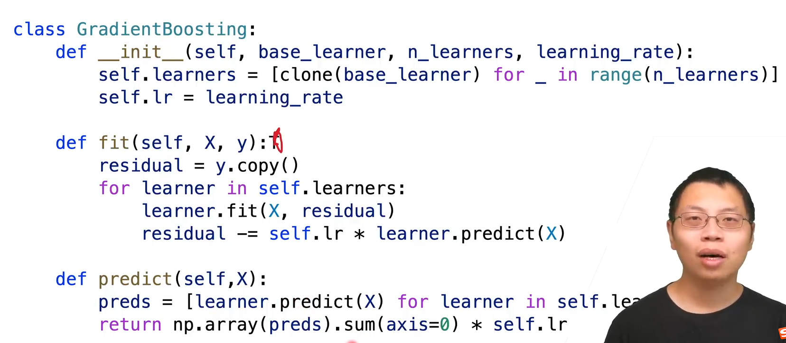

**特点**

降低偏差

结合各个弱模型来组合成强模型，降低偏差